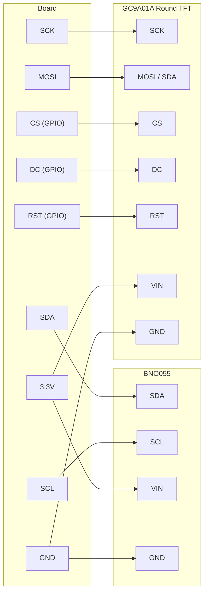

# Digital Compass

!!! info "Works with"
    Any CircuitPython board with I2C and SPI — QT Py ESP32-S2, Feather boards with display

A compass needle that rotates in real time as you turn the board. The BNO055 IMU sensor gives you a heading in degrees; a small round GC9A01A display draws the needle pointing toward magnetic north. Flip the board and the needle follows. This project is based on the Adafruit "QT Py S2 Round Display Compass" guide.

---

## What you'll build

A program that reads the current heading from a BNO055 9-DOF IMU over I2C, converts the heading angle to x/y coordinates using trigonometry, and draws a compass needle on a 240x240 round TFT display. The needle updates continuously as you move the board.

---

## What you'll need

- A CircuitPython board with both I2C and SPI (QT Py ESP32-S2 is ideal; Feather boards work well too)
- Adafruit BNO055 absolute orientation sensor breakout
- Adafruit round GC9A01A 240x240 TFT display (1.28")
- Jumper wires

---

## Wiring

The BNO055 uses I2C. The round GC9A01A display uses SPI. Both connect to the same board simultaneously.



---

## The code

```python
import math
import time
import board
import busio
import displayio
import adafruit_bno055
import adafruit_gc9a01a
from adafruit_display_shapes.line import Line
from adafruit_display_shapes.circle import Circle

# --- Display setup ---
displayio.release_displays()

spi = busio.SPI(clock=board.SCK, MOSI=board.MOSI)
display_bus = displayio.FourWire(spi, command=board.D5, chip_select=board.D6, reset=board.D9)
display = adafruit_gc9a01a.GC9A01A(display_bus, width=240, height=240)

# --- IMU setup ---
i2c = busio.I2C(board.SCL, board.SDA)
sensor = adafruit_bno055.BNO055_I2C(i2c)

# Display center and needle length
CX = 120
CY = 120
NEEDLE_LEN = 90

splash = displayio.Group()
display.root_group = splash

# Background circle
bg = Circle(CX, CY, 119, fill=0x001020, outline=0x0055AA)
splash.append(bg)

# Center dot
dot = Circle(CX, CY, 5, fill=0xFF0000)
splash.append(dot)

# Initial needle — will be replaced each update
needle = Line(CX, CY, CX, CY - NEEDLE_LEN, color=0xFF0000)
splash.append(needle)

def heading_to_xy(heading_deg, length):
    """Convert compass heading (0=N, clockwise) to endpoint x, y."""
    # Compass: 0 is north (up), increases clockwise
    # Math angles: 0 is right (east), increases counter-clockwise
    # Convert: math_angle = 90 - heading
    rad = math.radians(90 - heading_deg)
    x = int(CX + length * math.cos(rad))
    y = int(CY - length * math.sin(rad))
    return x, y

while True:
    euler = sensor.euler
    if euler is not None and euler[0] is not None:
        heading = euler[0]  # degrees, 0–360, 0 = North

        # Remove old needle and add a new one
        splash.remove(needle)
        tx, ty = heading_to_xy(heading, NEEDLE_LEN)
        needle = Line(CX, CY, tx, ty, color=0xFF4444)
        splash.insert(len(splash) - 1, needle)  # keep dot on top

    time.sleep(0.05)
```

---

## How it works

**How a magnetometer gives heading.** The BNO055 contains a 3-axis magnetometer that measures the strength of the Earth's magnetic field along three axes. By comparing those three readings, it calculates the direction of magnetic north relative to the sensor. The BNO055 goes further than a bare magnetometer: it also contains an accelerometer and gyroscope, and its onboard fusion processor combines all three to produce stable Euler angles — heading, roll, and pitch — even when the board is tilted. That fusion is done in hardware, so your Python code just reads the result.

**Euler angles from BNO055.** The `sensor.euler` property returns a tuple of `(heading, roll, pitch)` in degrees. Heading ranges from 0 to 360, where 0 (and 360) is magnetic north, 90 is east, 180 is south, and 270 is west. This convention — north at zero, increasing clockwise — matches a traditional compass. Roll and pitch describe tilt; they are useful for leveling applications or for correcting heading errors when the board is not held flat, but for a basic compass on a flat surface, only the heading value is needed.

**Translating heading angle to x/y coordinates for drawing.** Screen coordinates in `displayio` have their origin at the top-left, with x increasing to the right and y increasing downward. Math angles (as used by `math.sin` and `math.cos`) have their origin pointing right, with angles increasing counter-clockwise. A compass heading has its origin pointing up (north), with angles increasing clockwise. To bridge these conventions, the code converts a heading to a math angle with `90 - heading`, then uses standard polar-to-Cartesian conversion: `x = cx + r * cos(angle)`, `y = cy - r * sin(angle)` (note the minus sign on y to flip the vertical axis). The result is the pixel coordinates of the needle's tip.

---

## Installing libraries

Copy the following to the `lib/` folder on your `CIRCUITPY` drive. Get them from the [Adafruit CircuitPython Bundle](https://circuitpython.org/libraries).

- `adafruit_bno055.mpy`
- `adafruit_gc9a01a.mpy`
- `adafruit_display_shapes/` (folder)
- `adafruit_bus_device/` (folder)
- `adafruit_register/` (folder) — required by `adafruit_bno055`

---

## Remix it

!!! tip "Remix idea"
    Use the roll and pitch data from the BNO055 to add tilt correction or a bubble-level indicator. The [BNO055 reference](../../reference/sensors/motion/bno055.md) explains all the fusion output modes and how to enable tilt-compensated heading.

!!! tip "Remix idea"
    Replace the round TFT with a NeoPixel ring. Map the heading to a single lit pixel on the ring to show direction. The [First NeoPixel](../lights/starter-first-neopixel.md) project covers NeoPixel basics and animation patterns.

!!! tip "Remix idea"
    Log heading and location data to Adafruit IO over WiFi to track which direction something is pointing over time. The [Adafruit IO Basics](../wireless/wifi/starter-adafruit-io-basics.md) project covers sending sensor data to the cloud.

---

## Go deeper

- [BNO055 reference](../../reference/sensors/motion/bno055.md)
- [QT Py S2 Round Display Compass](https://learn.adafruit.com/qt-py-s2-round-display-compass) — *Credit: Adafruit Learning System*
