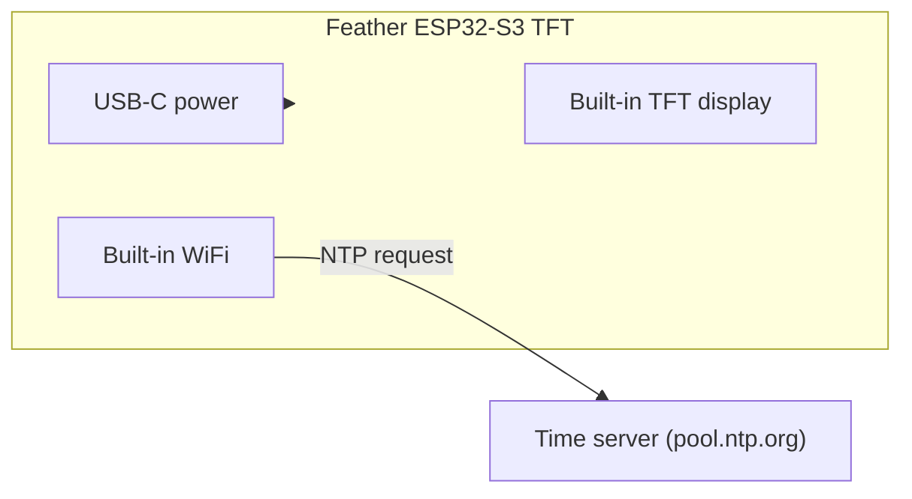

# Countdown Clock

!!! info "Works with"
    WiFi-capable boards — Feather ESP32-S3 TFT, PyPortal, Pico W with display

A clock that always knows the correct time, without a coin cell battery or a separate RTC chip. This project connects your board to WiFi, asks an NTP server for the current time, calculates how long until a target date, and displays the countdown on screen. It updates automatically every minute — no drift, no manual resetting.

This project is based on the Adafruit "Feather ESP32-S3 TFT CircuitPython Day Countdown Clock" guide.

---

## What you'll build

A program that syncs time over WiFi using NTP, computes the days, hours, and minutes remaining until a target date you choose, and displays the result on a TFT screen using `displayio`. The display refreshes every 60 seconds with a fresh time fetch.

---

## What you'll need

- A WiFi-capable CircuitPython board
- A color TFT display (the Feather ESP32-S3 TFT has one built in — no wiring needed for that board)
- Your WiFi network name and password
- A `settings.toml` file on your board with credentials

---

## Wiring

If you are using a Feather ESP32-S3 TFT or PyPortal, the display is built in. No wiring required beyond USB power.

If you are using a separate display with a Pico W or similar board, wire your TFT over SPI as described in [Drawing on a Color TFT Screen](builder-tft-graphics.md), then return here for the WiFi and NTP code.



---

## The code

Create a `settings.toml` file on your `CIRCUITPY` drive with your WiFi credentials:

```toml
CIRCUITPY_WIFI_SSID = "YourNetworkName"
CIRCUITPY_WIFI_PASSWORD = "YourPassword"
```

Then add this as your `code.py`:

```python
import os
import time
import board
import wifi
import socketpool
import adafruit_ntp
import displayio
import terminalio
from adafruit_display_text import label

# --- Configuration ---
TARGET_YEAR   = 2026
TARGET_MONTH  = 9
TARGET_DAY    = 1
REFRESH_INTERVAL = 60  # seconds between NTP syncs

# --- Connect to WiFi ---
wifi.radio.connect(
    os.getenv("CIRCUITPY_WIFI_SSID"),
    os.getenv("CIRCUITPY_WIFI_PASSWORD")
)
print("Connected:", wifi.radio.ipv4_address)

# --- NTP setup ---
pool = socketpool.SocketPool(wifi.radio)
ntp  = adafruit_ntp.NTP(pool, tz_offset=-5)  # adjust for your timezone

# --- Display setup (Feather ESP32-S3 TFT built-in) ---
display = board.DISPLAY

splash = displayio.Group()
display.root_group = splash

title = label.Label(terminalio.FONT, text="Countdown", color=0x00AAFF, x=10, y=20, scale=2)
days_label   = label.Label(terminalio.FONT, text="-- days",    color=0xFFFFFF, x=10, y=60, scale=2)
detail_label = label.Label(terminalio.FONT, text="-- hr -- min", color=0xAAAAAA, x=10, y=90)

splash.append(title)
splash.append(days_label)
splash.append(detail_label)

def get_countdown():
    now    = ntp.datetime
    target = time.struct_time((TARGET_YEAR, TARGET_MONTH, TARGET_DAY, 0, 0, 0, 0, 0, -1))
    diff   = time.mktime(target) - time.mktime(now)
    if diff < 0:
        return 0, 0, 0
    days    = diff // 86400
    hours   = (diff % 86400) // 3600
    minutes = (diff % 3600) // 60
    return days, hours, minutes

# --- Main loop ---
last_sync = 0
while True:
    now_mono = time.monotonic()
    if now_mono - last_sync >= REFRESH_INTERVAL:
        try:
            days, hours, minutes = get_countdown()
            days_label.text   = f"{days} days"
            detail_label.text = f"{hours} hr {minutes} min"
            last_sync = now_mono
        except Exception as e:
            detail_label.text = "sync error"
            print("NTP error:", e)
    time.sleep(1)
```

---

## How it works

**NTP — getting the current time from an internet server.** Network Time Protocol (NTP) is a standard used by computers worldwide to synchronize their clocks. Your board sends a short UDP packet to a time server (by default, one in the `pool.ntp.org` network), and the server responds with the current UTC time accurate to within milliseconds. The `adafruit_ntp` library handles the request and converts the response into a `time.struct_time` object — the same format CircuitPython uses everywhere for time. The `tz_offset` parameter shifts the result to your local timezone.

**`time.struct_time` and calculating differences.** A `time.struct_time` is a tuple-like object with fields for year, month, day, hour, minute, second, and more. To calculate the time remaining until a future date, you convert both the current time and the target date to seconds-since-epoch using `time.mktime()`, then subtract. The result is a plain integer in seconds, which you can divide and modulo into days, hours, and minutes with basic arithmetic. No external date math library needed.

**Updating the display in the main loop.** Rather than fetching the time on every iteration — which would hammer the NTP server and waste battery — the code tracks the last sync time using `time.monotonic()` (a clock that counts seconds since boot, unaffected by time changes). Every 60 seconds it fetches a fresh time, recalculates the countdown, and updates the label text. Because `displayio` labels update immediately when you set `.text`, the screen reflects the new value without any explicit redraw call.

---

## Installing libraries

Copy the following to the `lib/` folder on your `CIRCUITPY` drive. Get them from the [Adafruit CircuitPython Bundle](https://circuitpython.org/libraries).

- `adafruit_ntp.mpy`
- `adafruit_display_text/` (folder)
- `adafruit_bus_device/` (folder)

For boards without a built-in display, also add the appropriate display driver (see [Drawing on a Color TFT Screen](builder-tft-graphics.md)).

---

## Remix it

!!! tip "Remix idea"
    Swap the countdown for current weather conditions. The [Weather Lamp](../wireless/wifi/builder-weather-lamp.md) project shows how to fetch a weather API — display the temperature and conditions on your TFT instead.

!!! tip "Remix idea"
    Add an alarm that fires when the countdown reaches zero. The [Make It Sound](../sound/starter-make-it-sound.md) project covers audio output — trigger a tone or a melody when your target date arrives.

!!! tip "Remix idea"
    Show multiple time zones simultaneously. The [NTP reference](../../reference/wireless/wifi/ntp.md) explains how to handle timezone offsets and DST so you can display clocks for several cities at once.

---

## Go deeper

- [NTP reference](../../reference/wireless/wifi/ntp.md)
- [Feather ESP32-S3 TFT CircuitPython Day 2024 Countdown Clock](https://learn.adafruit.com/feather-esp32-s3-tft-circuitpython-day-2024-countdown-clock) — *Credit: Adafruit Learning System*
