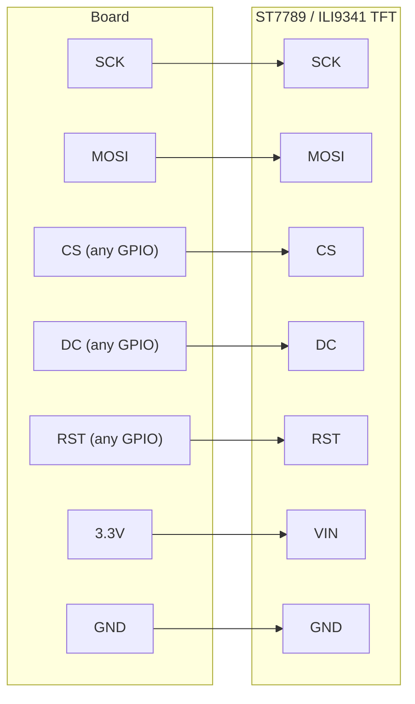

# Drawing on a Color TFT Screen

!!! info "Works with"
    Any CircuitPython board with SPI — Feather M0/M4, ItsyBitsy, RP2040 boards, ESP32 boards

Full color, sharp text, and smooth graphics — all from a display that costs under fifteen dollars. In this project you will wire a color TFT display over SPI, draw rectangles and circles with the `adafruit_display_shapes` library, and add a styled text label on top. The result is a real graphical interface, built entirely in CircuitPython.

---

## What you'll build

A program that sets up a color TFT display, draws a background rectangle, overlays a circle and some additional shapes, and renders a text label in a custom color. The final screen looks like the start of a real UI.

---

## What you'll need

- A CircuitPython board with SPI pins (SCK, MOSI, and at least two GPIO pins for CS and DC)
- Adafruit ST7789 1.14" or 2.0" TFT breakout — or an ILI9341-based display
- Jumper wires
- Breadboard

---

## Wiring

TFT displays over SPI require more pins than I2C. In addition to the clock and data lines, you need Chip Select (CS) to address this specific device, and Data/Command (DC) to tell the display whether incoming bytes are data or control commands. RST resets the display on startup.



Check your board's pinout for the hardware SPI pins — using hardware SPI is significantly faster than bit-banging software SPI. On Feather boards, SCK is typically `board.SCK` and MOSI is `board.MOSI`.

---

## The code

```python
import board
import busio
import displayio
import terminalio
from adafruit_display_text import label
from adafruit_display_shapes.rect import Rect
from adafruit_display_shapes.circle import Circle
import adafruit_st7789

# Release any prior display state
displayio.release_displays()

# Set up SPI bus
spi = busio.SPI(clock=board.SCK, MOSI=board.MOSI)

# Configure display pins — adjust these to match your wiring
tft_cs  = board.D5
tft_dc  = board.D6
tft_rst = board.D9

# Create the display
display_bus = displayio.FourWire(spi, command=tft_dc, chip_select=tft_cs, reset=tft_rst)
display = adafruit_st7789.ST7789(display_bus, width=240, height=135, rowstart=40, colstart=53)

# Root group
splash = displayio.Group()
display.root_group = splash

# Background rectangle — full screen, dark blue
bg = Rect(0, 0, 240, 135, fill=0x003060)
splash.append(bg)

# A white circle near the center
circle = Circle(120, 67, 40, fill=0xFFFFFF, outline=0x00AAFF)
splash.append(circle)

# A smaller accent rectangle
accent = Rect(10, 10, 60, 20, fill=0xFF6600)
splash.append(accent)

# Text label on top of everything
text_area = label.Label(
    terminalio.FONT,
    text="CircuitPython",
    color=0xFFFF00,
    x=70,
    y=10,
)
splash.append(text_area)

while True:
    pass
```

Adjust `rowstart` and `colstart` to match your specific display module. The 1.14" ST7789 from Adafruit uses the values shown above; a 2.0" version uses `rowstart=0, colstart=0`.

---

## How it works

**SPI vs I2C for displays — speed matters.** I2C is a shared bus designed for low-speed communication with many devices. Its maximum speed of 400 kHz (or 1 MHz in fast mode) is fine for a small OLED with 1,024 pixels. A 240x135 color TFT has 32,400 pixels, each requiring 16 bits of color data. Refreshing that screen over I2C would be painfully slow. SPI can run at 24 MHz or higher, making it fast enough to push full frames at usable frame rates. This is why color TFTs almost always use SPI.

**The displayio Group and TileGrid system.** In `displayio`, everything on screen lives inside a hierarchy of `Group` objects. A `Group` can contain other groups, `TileGrid` objects (for sprite sheets and tilemaps), `Label` objects, or shapes from `adafruit_display_shapes`. Objects are drawn in order — items appended later appear on top of items appended earlier, just like layers in a graphics editor. Moving an object is as simple as changing its `x` and `y` properties; `displayio` handles the redraw.

**Blitting vs drawing.** When you update a shape or label, `displayio` does not redraw the entire screen from scratch. Instead, it marks the changed region as dirty and pushes only those pixels to the display on the next refresh cycle. This technique — sometimes called blitting — is what makes `displayio` fast enough for animations and real-time data display. If you need even more control, you can write directly to a `displayio.Bitmap`, which is a raw pixel buffer you can manipulate at the byte level.

---

## Installing libraries

Copy the following to the `lib/` folder on your `CIRCUITPY` drive. Get them from the [Adafruit CircuitPython Bundle](https://circuitpython.org/libraries).

- `adafruit_st7789.mpy` (or `adafruit_ili9341.mpy` for ILI9341 displays)
- `adafruit_display_shapes/` (folder)
- `adafruit_display_text/` (folder)
- `adafruit_bus_device/` (folder)

---

## Remix it

!!! tip "Remix idea"
    Replace the static shapes with live sensor readings. The [Color Matcher](../sensors/builder-color-matcher.md) project reads from a color sensor and visualizes the result — use your TFT to display a live color swatch and the RGB values beneath it.

!!! tip "Remix idea"
    Load a background image from an SD card instead of drawing a rectangle. The [SD card reference](../../reference/storage/sdcard.md) covers how to mount a card and read bitmap files into a `displayio.OnDiskBitmap`.

!!! tip "Remix idea"
    Turn this into a full information dashboard. The [IoT Dashboard with PyPortal](hacker-pyportal-dashboard.md) shows a more complete example of combining multiple display elements with live data.

---

## Go deeper

- [ST7789 reference](../../reference/displays/st7789.md)
- [adafruit_display_shapes reference](../../reference/displays/display-shapes.md)
- [CircuitPython Display Support Using displayio](https://learn.adafruit.com/circuitpython-display-support-using-displayio) — *Credit: Adafruit Learning System*
