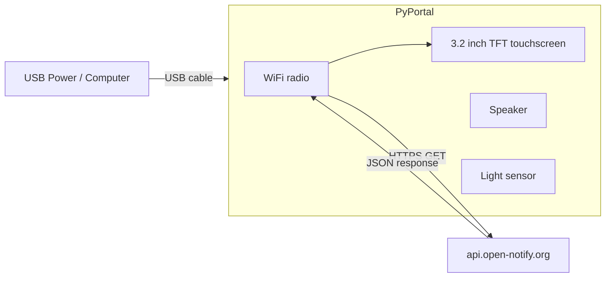

# IoT Dashboard with PyPortal

!!! info "Works with"
    PyPortal, PyPortal Titano, PyPortal Pynt — or any WiFi board with a color TFT display

The PyPortal is a self-contained internet display. It has a WiFi radio, a full-color 3.2" touchscreen, a speaker, a light sensor, and a microcontroller all on one board. In this project you will use it to fetch live data from a public internet API, parse the JSON response, and display the results — with a background image and formatted text — on the touchscreen.

This project is based on the Adafruit "PyPortal Astronauts in Space" guide.

---

## What you'll build

A PyPortal dashboard that fetches live data from [Open Notify](http://api.open-notify.org/astros.json) — a free API that returns the names and count of people currently aboard the International Space Station. The display shows the current count, the names of the crew, and a space-themed background image. The data refreshes every few minutes automatically.

---

## What you'll need

- Adafruit PyPortal, PyPortal Titano, or PyPortal Pynt
- USB cable for power (or LiPo battery)
- A WiFi network with internet access
- A background image (320x240 BMP for standard PyPortal) on the `CIRCUITPY` drive
- A `settings.toml` file with your WiFi credentials

---

## Wiring

The PyPortal has everything built in. No wiring required — just plug in USB.



---

## The code

Create `settings.toml` on your `CIRCUITPY` drive:

```toml
CIRCUITPY_WIFI_SSID     = "YourNetworkName"
CIRCUITPY_WIFI_PASSWORD = "YourPassword"
```

Save a 320x240 BMP image named `background.bmp` to the root of `CIRCUITPY`. Then use this as `code.py`:

```python
import time
import board
from adafruit_pyportal import PyPortal

# The URL and JSON path to the data we want
DATA_SOURCE = "http://api.open-notify.org/astros.json"
DATA_LOCATION = ["number"]  # path into the JSON to the astronaut count

# The PyPortal object manages WiFi, display, and data fetching
pyportal = PyPortal(
    url=DATA_SOURCE,
    json_path=DATA_LOCATION,
    status_neopixel=board.NEOPIXEL,
    default_bg="background.bmp",
)

# Position where the count will be displayed
pyportal.set_text_color(0xFFFFFF)
pyportal.set_text(0, text_position=(120, 100), text_scale=3)

REFRESH_INTERVAL = 300  # seconds (5 minutes)

while True:
    try:
        value = pyportal.fetch()
        print("People in space:", value)
        pyportal.set_text(str(value))
    except Exception as e:
        print("Fetch error:", e)

    time.sleep(REFRESH_INTERVAL)
```

For a richer display that shows the crew names, fetch the full JSON and parse the `people` array:

```python
import time
import board
import wifi
import socketpool
import ssl
import adafruit_requests
import displayio
import terminalio
from adafruit_display_text import label
import os

# Connect to WiFi
wifi.radio.connect(
    os.getenv("CIRCUITPY_WIFI_SSID"),
    os.getenv("CIRCUITPY_WIFI_PASSWORD")
)

pool    = socketpool.SocketPool(wifi.radio)
session = adafruit_requests.Session(pool, ssl.create_default_context())

display = board.DISPLAY
splash  = displayio.Group()
display.root_group = splash

title = label.Label(terminalio.FONT, text="In Space Right Now", color=0x00CCFF,
                    x=10, y=15, scale=2)
splash.append(title)

name_labels = []
for i in range(8):  # space for up to 8 names
    lbl = label.Label(terminalio.FONT, text="", color=0xFFFFFF, x=10, y=50 + i * 22)
    splash.append(lbl)
    name_labels.append(lbl)

count_label = label.Label(terminalio.FONT, text="", color=0xFFAA00,
                           x=10, y=210, scale=2)
splash.append(count_label)

def update_display():
    response = session.get("http://api.open-notify.org/astros.json")
    data     = response.json()
    response.close()

    people = data.get("people", [])
    count  = data.get("number", 0)

    count_label.text = f"{count} people aboard"

    for i, lbl in enumerate(name_labels):
        if i < len(people):
            lbl.text = people[i]["name"]
        else:
            lbl.text = ""

while True:
    try:
        update_display()
    except Exception as e:
        print("Error:", e)
    time.sleep(300)
```

---

## How it works

**What the PyPortal is and how it has everything built in.** The PyPortal is built around an ATSAMD51 microcontroller paired with an ESP32 WiFi co-processor. The main chip runs your CircuitPython code and drives the display; the ESP32 handles all WiFi and SSL/TLS work and acts as a modem, communicating with the SAMD51 over SPI. Because both chips and the display are pre-integrated on one board, there is nothing to wire — you write code and plug in USB. The `adafruit_pyportal` library wraps the WiFi, display, and data-fetching pipeline into a single high-level object for simple use cases, but you can also use `adafruit_requests` directly for full control over HTTP.

**Fetching and parsing JSON.** JSON (JavaScript Object Notation) is the standard data format for web APIs. A GET request to a URL returns a string of JSON text; calling `.json()` on the response object parses that text into a Python dictionary. From there, you navigate the data using standard dictionary and list syntax — `data["number"]` gives the astronaut count, `data["people"][0]["name"]` gives the first person's name. The `adafruit_requests` library handles the HTTP request, the SSL handshake, and the initial parsing, all within CircuitPython's memory constraints.

**The pyportal library handling WiFi, display, and touch in one abstraction.** For projects that fit its pattern — fetch a URL, extract a JSON value, display it at a position — `adafruit_pyportal` offers a very concise API. You specify the URL, the JSON path to the value you want, a background image, and a text position, and the library takes care of connecting to WiFi, making the request, parsing the response, and updating the screen. For more complex layouts or custom logic, you can use the lower-level building blocks (`adafruit_requests`, `displayio`, `adafruit_touchscreen`) directly. The PyPortal hardware works fine with either approach.

---

## Installing libraries

Copy the following to the `lib/` folder on your `CIRCUITPY` drive. Get them from the [Adafruit CircuitPython Bundle](https://circuitpython.org/libraries).

- `adafruit_pyportal/` (folder) — includes its own dependencies
- `adafruit_requests.mpy`
- `adafruit_display_text/` (folder)
- `adafruit_bus_device/` (folder)
- `adafruit_esp32spi/` (folder) — for lower-level WiFi control
- `adafruit_io/` (folder) — if you add Adafruit IO integration

The full PyPortal library bundle is large. If you run low on flash space, use the lower-level `adafruit_requests` approach from the second code example, which has a smaller dependency footprint.

---

## Remix it

!!! tip "Remix idea"
    Instead of fetching data from the internet, push your own sensor data up to Adafruit IO and display it. The [Adafruit IO Basics](../wireless/wifi/starter-adafruit-io-basics.md) project covers publishing and subscribing to feeds — display a live feed value on the PyPortal screen.

!!! tip "Remix idea"
    Add touch controls to change what the dashboard displays. The [Customizing USB](../usb-tricks/builder-customizing-usb.md) project does not cover touch, but the PyPortal's `adafruit_touchscreen` library works alongside `displayio` — detect taps on different screen regions to switch between data sources.

!!! tip "Remix idea"
    Display BLE sensor data from a nearby device instead of pulling from the internet. The [Heart Rate Monitor](../wireless/ble/builder-heart-rate.md) project shows how to receive BLE advertisements — combine that with the PyPortal's display to build a local wireless sensor dashboard.

---

## Go deeper

- [adafruit_requests reference](../../reference/wireless/wifi/requests.md)
- [PyPortal Astronauts in Space](https://learn.adafruit.com/pyportal-astronauts-in-space) — *Credit: Adafruit Learning System*
- [Adafruit PyPortal Overview](https://learn.adafruit.com/adafruit-pyportal) — *Credit: Adafruit Learning System*
