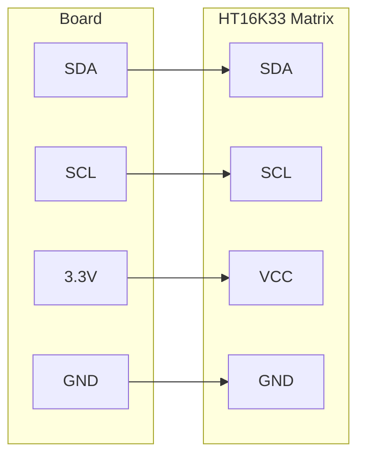

# Scrolling Text on an LED Matrix

!!! info "Works with"
    Any CircuitPython board with I2C

Sixty-four LEDs arranged in an 8x8 grid, controlled over two wires. The HT16K33 LED matrix breakout is one of the most satisfying beginner display projects because the output is big, bright, and immediately visible across a room. In this project you will scroll a message across the matrix and light individual pixels on demand.

---

## What you'll build

A program that initializes an HT16K33 8x8 LED matrix, displays a static pixel pattern, then scrolls a text message across the screen in a continuous loop.

---

## What you'll need

- A CircuitPython board with I2C pins
- Adafruit HT16K33 8x8 LED matrix backpack breakout
- Four jumper wires
- Breadboard

---

## Wiring

The HT16K33 matrix uses I2C — the same two-wire bus as the SSD1306 OLED.



The I2C address defaults to `0x70`. If you have multiple HT16K33 devices on the same bus, use the A0/A1/A2 solder jumpers on the backpack to change the address.

---

## The code

```python
import board
import busio
import time
from adafruit_ht16k33 import matrix

# Initialize I2C and the matrix
i2c = busio.I2C(board.SCL, board.SDA)
display = matrix.Matrix8x8(i2c)

# Set brightness (0.0 to 1.0)
display.brightness = 0.5

# Light individual pixels: matrix[col, row] = 1 (on) or 0 (off)
display.fill(0)          # Clear all pixels
display[0, 0] = 1        # Top-left corner
display[7, 7] = 1        # Bottom-right corner
display[3, 3] = 1        # Center-ish
time.sleep(2)

# Scroll a message across the display
message = "HELLO WORLD "

while True:
    for char in message:
        display.set_text(char)
        time.sleep(0.15)
```

For a true scrolling effect with pixel-level control, the `adafruit_ht16k33` library provides a `scroll` method and bitmap-level access. See the library documentation linked below for advanced usage.

---

## How it works

**How the HT16K33 drives 64 LEDs with just 2 wires.** An 8x8 matrix has 64 individual LEDs. Controlling them each with a separate wire would require a board with 64 output pins — not practical. The HT16K33 is a dedicated LED driver chip that handles all the multiplexing internally. Your board sends compact I2C commands telling the chip which LEDs to turn on or off, and the chip handles the continuous refresh cycle that keeps them lit. The result is 64 LEDs controlled with just SDA, SCL, VCC, and GND.

**Row and column addressing.** The 8x8 grid is addressed with two coordinates: column (x) and row (y), both ranging from 0 to 7, with the origin at the top-left corner. Setting `display[col, row] = 1` turns that LED on; setting it to `0` turns it off. `display.fill(1)` lights every pixel at once; `display.fill(0)` clears the screen. The matrix holds its state between updates, so you only need to write the pixels you want to change.

**Brightness control.** The HT16K33 supports 16 brightness levels controlled via I2C. The `adafruit_ht16k33` library exposes this as a `brightness` property that accepts a float from `0.0` (minimum) to `1.0` (maximum). You can change brightness at any time during your program — useful for dimming the display at night or making it pulse in response to sensor data.

---

## Installing libraries

Copy the following to the `lib/` folder on your `CIRCUITPY` drive. Get them from the [Adafruit CircuitPython Bundle](https://circuitpython.org/libraries).

- `adafruit_ht16k33/` (folder)

---

## Remix it

!!! tip "Remix idea"
    Display a live sensor value on the matrix instead of a fixed message. The [Distance Alert](../sensors/starter-distance-alert.md) project reads from an ultrasonic sensor — show the distance in centimeters as a scrolling number on the matrix.

!!! tip "Remix idea"
    Pull data from the internet and display it. The [Adafruit IO Basics](../wireless/wifi/starter-adafruit-io-basics.md) project shows how to receive messages over WiFi — scroll an incoming feed value across the matrix.

!!! tip "Remix idea"
    Once you want color and more pixels, step up to a TFT screen. The [Drawing on a Color TFT Screen](builder-tft-graphics.md) project builds on the same display concepts with a much larger canvas.

---

## Go deeper

- [HT16K33 reference](../../reference/displays/ht16k33.md)
- [Adafruit LED Backpack with CircuitPython](https://learn.adafruit.com/adafruit-led-backpack/circuitpython) — *Credit: Adafruit Learning System*
