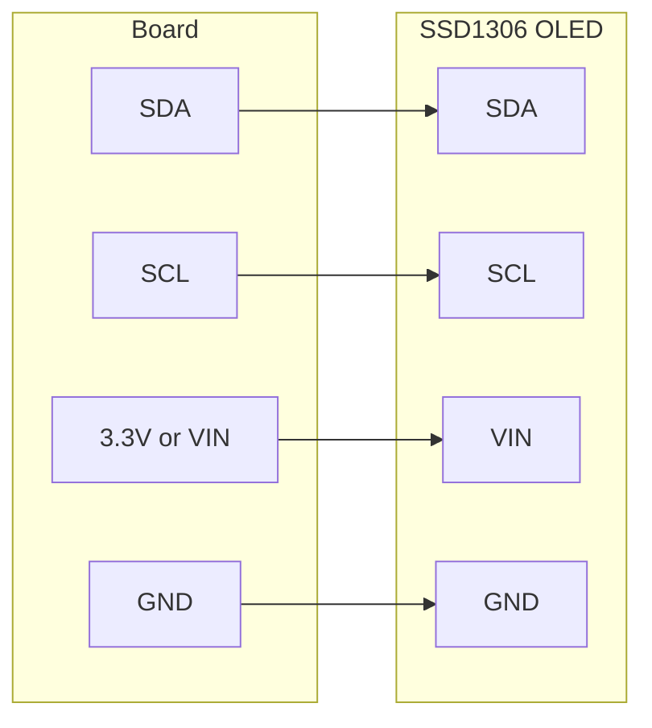

# OLED Hello World

!!! info "Works with"
    Any CircuitPython board with I2C — Trinket M0, Feather, Circuit Playground, Pico W

Your first display project. You will wire up a 128x64 OLED screen, write a few lines of code, and see your text appear on a crisp white-on-black display. This is the foundation for every more complex display project in this wiki.

---

## What you'll build

A program that initializes an SSD1306 OLED display over I2C and renders a text label to the screen. Once it works, you will understand the `displayio` pipeline well enough to go in almost any direction — sensor readouts, menus, mini dashboards.

---

## What you'll need

- A CircuitPython board with I2C pins (SDA and SCL)
- Adafruit SSD1306 128x64 OLED breakout (or any SSD1306-based 128x64 board)
- Four jumper wires
- Breadboard

---

## Wiring

Connect the OLED to your board's I2C bus. Most boards label the pins SDA and SCL; check your board's pinout page if you are unsure.



Most SSD1306 breakouts run on 3.3 V. If your board only exposes a 5 V power pin, check the breakout's datasheet — many have an onboard regulator and accept both voltages.

---

## The code

```python
import board
import busio
import displayio
import terminalio
from adafruit_display_text import label
import adafruit_displayio_ssd1306

# Release any previously initialized displays
displayio.release_displays()

# Set up the I2C bus
i2c = busio.I2C(board.SCL, board.SDA)

# Create the display bus and display object
display_bus = displayio.I2CDisplay(i2c, device_address=0x3C)
display = adafruit_displayio_ssd1306.SSD1306(display_bus, width=128, height=64)

# Create a display group — the root container for everything on screen
splash = displayio.Group()
display.root_group = splash

# Create a text label
text_area = label.Label(
    terminalio.FONT,
    text="Hello, world!",
    color=0xFFFFFF,
    x=10,
    y=20,
)

# Add the label to the group so it appears on screen
splash.append(text_area)

# Keep the program running
while True:
    pass
```

---

## How it works

**What displayio is.** CircuitPython's `displayio` module is a hardware-accelerated display system built into the firmware. Instead of drawing pixels one at a time, you build a scene graph — a tree of objects that the firmware composites and pushes to the display. This approach means your Python code stays clean and readable, while the low-level pixel operations happen in C underneath. Calling `displayio.release_displays()` at the top of your script clears any display state left over from a previous run, which prevents confusing errors when you reset the board.

**Creating a display group and label.** A `displayio.Group` is a container. You add visual objects to it — labels, shapes, tilemaps — and assign the group as the display's `root_group`. Everything in the group gets rendered to the screen. The `label.Label` object takes a font, a string, a color (as a 24-bit hex integer), and x/y coordinates measured in pixels from the top-left corner of the display. When you `append` the label to the group, it appears immediately.

**Why fonts are separate files.** `terminalio.FONT` is a small fixed-width bitmap font built directly into CircuitPython's firmware — it is always available without any extra files. For any other font, CircuitPython uses `.bdf` font files (or precompiled versions) stored on the board's filesystem. Keeping fonts separate from the library code means you can swap typefaces without changing your code, and you only use flash storage for the fonts you actually need.

---

## Installing libraries

Copy the following to the `lib/` folder on your `CIRCUITPY` drive. Get them from the [Adafruit CircuitPython Bundle](https://circuitpython.org/libraries).

- `adafruit_displayio_ssd1306.mpy`
- `adafruit_display_text/` (folder)
- `adafruit_bus_device/` (folder)

---

## Remix it

!!! tip "Remix idea"
    Once your display is working, try showing a live sensor reading instead of a static string. The [Temperature Lamp](../sensors/starter-temperature-lamp.md) project reads from a temperature sensor — route the value into a `label.Label` and update `text_area.text` inside the loop.

!!! tip "Remix idea"
    Add shapes to your display. The [Drawing on a Color TFT Screen](builder-tft-graphics.md) project introduces `adafruit_display_shapes` — many of the same techniques work on an OLED with one-bit color.

!!! tip "Remix idea"
    Combine sensor data, shapes, and multiple labels into a complete information panel. The [IoT Dashboard with PyPortal](hacker-pyportal-dashboard.md) shows how to structure a multi-element display layout.

---

## Go deeper

- [SSD1306 reference](../../reference/displays/ssd1306.md)
- [adafruit_display_text reference](../../reference/displays/display-text.md)
- [CircuitPython Display Support Using displayio](https://learn.adafruit.com/circuitpython-display-support-using-displayio) — *Credit: Adafruit Learning System*
