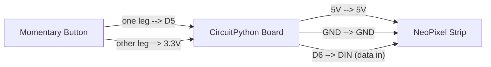

# LED Animations

!!! info "Works with"
    Any CircuitPython board with NeoPixels or DotStars

---

## What you'll build

A light strip that cycles through a sequence of animation effects — comet, chase, pulse, and rainbow — and advances to the next effect when you press a button. The `adafruit_led_animation` library handles all the math, so the code stays short even as the effects get more impressive.

---

## What you'll need

- CircuitPython board
- NeoPixel or DotStar strip (30 pixels is a good starting length)
- Momentary push button
- 10k ohm pull-down resistor
- Jumper wires
- 5V power supply for longer strips

---

## Wiring



The NeoPixel data line connects to any available digital output pin — D6 is used here but any will work. The button is wired with an internal pull-down: connect one leg to the pin and the other to 3.3V, then enable `pull=Pull.DOWN` in the code.

---

## The code

```python
import board
import neopixel
import time
from digitalio import DigitalInOut, Direction, Pull

from adafruit_led_animation.animation.comet import Comet
from adafruit_led_animation.animation.chase import Chase
from adafruit_led_animation.animation.pulse import Pulse
from adafruit_led_animation.animation.rainbow import Rainbow
from adafruit_led_animation.sequence import AnimationSequence
from adafruit_led_animation.color import PURPLE, AMBER, JADE, RED

# -- Hardware setup --
NUM_PIXELS = 30
pixels = neopixel.NeoPixel(board.D6, NUM_PIXELS, brightness=0.3, auto_write=False)

button = DigitalInOut(board.D5)
button.direction = Direction.INPUT
button.pull = Pull.DOWN

# -- Animation objects --
comet = Comet(pixels, speed=0.02, color=PURPLE, tail_length=10, bounce=True)
chase = Chase(pixels, speed=0.1, size=3, spacing=6, color=AMBER)
pulse = Pulse(pixels, speed=0.05, color=JADE, period=3)
rainbow = Rainbow(pixels, speed=0.1, period=2)

# -- Sequence --
animations = AnimationSequence(
    comet,
    chase,
    pulse,
    rainbow,
    advance_interval=5,     # auto-advance every 5 seconds
    auto_clear=True,
)

# -- Main loop --
last_button = False

while True:
    animations.animate()

    pressed = button.value
    if pressed and not last_button:
        animations.next()
    last_button = pressed
```

---

## How it works

**Animation objects.** Each animation — `Comet`, `Chase`, `Pulse`, `Rainbow` — is an object from the `adafruit_led_animation` library. When you create one, you tell it which pixel strip to control, how fast to run, and what color to use. The object keeps track of its own internal state (position, phase, timing), so you do not need to manage any of that yourself.

**AnimationSequence.** `AnimationSequence` holds a list of animations and plays them one at a time. With `advance_interval=5`, it automatically moves to the next animation every 5 seconds. You can also call `animations.next()` manually — that is what the button press does here. `auto_clear=True` blanks the strip when switching animations so effects do not bleed into each other.

**The animate() call.** Inside the loop, `animations.animate()` does all the work. It checks whether enough time has passed to advance the animation by one frame, updates the pixel colors if so, and calls `show()` on the strip. Because it uses non-blocking timing (not `time.sleep`), the loop keeps running fast enough to check the button on every iteration.

---

## Installing the library

You need two items from the CircuitPython Library Bundle:

- `adafruit_led_animation/` (entire folder)
- `adafruit_pixelbuf.mpy`

Copy both into the `lib/` folder on your CIRCUITPY drive.

Download the bundle at [circuitpython.org/libraries](https://circuitpython.org/libraries), or use CircUp:

```
circup install adafruit_led_animation
```

---

## Remix it

!!! tip "Remix idea"
    Take animations into wearables territory — [Stomp-Reactive Light-Up Wearable](hacker-reactive-wearable.md) uses an accelerometer to trigger animation bursts in response to movement, building directly on the `adafruit_led_animation` library used here.

!!! tip "Remix idea"
    Want to draw shapes and scrolling text instead of effects? [Pixel Graphics on an LED Matrix](builder-pixel-graphics.md) uses `adafruit_pixel_framebuf` to treat a grid of LEDs as a tiny screen.

!!! tip "Remix idea"
    Dig into the color mixing math behind animations — the [FancyLED reference](../../reference/lights/fancyled.md) covers gamma correction, color palettes, and how to make animations look more natural.

---

## Go deeper

- Reference: [LED Animation](../../reference/lights/led-animation.md)
- Adafruit LED Animations guide: [learn.adafruit.com/circuitpython-led-animations/overview](https://learn.adafruit.com/circuitpython-led-animations/overview)
  *Credit: Adafruit Learning System*
