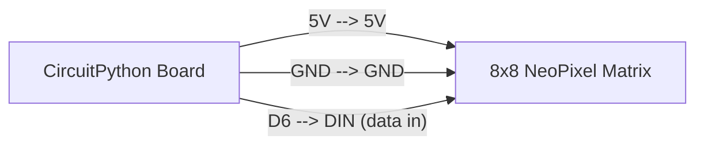

# Pixel Graphics on an LED Matrix

!!! info "Works with"
    Any CircuitPython board — works with NeoPixel matrices, DotStar matrices, and IS31FL3731 LED matrices

---

## What you'll build

A small LED matrix that draws lines, rectangles, circles, and scrolling text — treating the grid of LEDs like a tiny screen. The `adafruit_pixel_framebuf` library gives you drawing functions so you work in x/y coordinates instead of pixel indices.

---

## What you'll need

- CircuitPython board
- NeoPixel matrix (such as the Adafruit 8x8 NeoPixel matrix) or 8x8 DotStar matrix
- Jumper wires
- 5V power supply (the 8x8 matrix at full brightness draws more current than USB can safely supply)

---

## Wiring



For a DotStar matrix, add a second wire from the board's SCK pin to the matrix's clock input. Everything else is the same.

---

## The code

```python
import board
import neopixel
from adafruit_pixel_framebuf import PixelFramebuffer, HORIZONTAL

# 8x8 NeoPixel matrix wired to D6
pixels = neopixel.NeoPixel(
    board.D6,
    8 * 8,
    brightness=0.1,
    auto_write=False,
)

fb = PixelFramebuffer(pixels, 8, 8, orientation=HORIZONTAL)

# -- Fill the whole display --
fb.fill(0xFF0000)  # red (colors are 0xRRGGBB hex)
fb.display()

import time
time.sleep(1)

# -- Draw a rectangle outline --
fb.fill(0x000000)
fb.rect(1, 1, 6, 6, 0x00FF00)  # x, y, width, height, color
fb.display()
time.sleep(1)

# -- Draw a line --
fb.fill(0x000000)
fb.line(0, 0, 7, 7, 0x0000FF)  # x0, y0, x1, y1, color
fb.display()
time.sleep(1)

# -- Scrolling text --
fb.fill(0x000000)

message = "LWHS "
scroll_x = 8  # start just off the right edge

while True:
    fb.fill(0x000000)
    fb.text(message, scroll_x, 0, 0xFFAA00)
    fb.display()
    scroll_x -= 1
    if scroll_x < -(len(message) * 6):
        scroll_x = 8
    time.sleep(0.05)
```

Colors are passed as 24-bit hex integers in `0xRRGGBB` format rather than RGB tuples. `0xFF0000` is red, `0x00FF00` is green, `0x0000FF` is blue.

---

## How it works

**What a framebuffer is.** Normally, to light up a specific pixel on a matrix, you have to calculate its index in the strip — which requires knowing how the pixels are wired together (serpentine or progressive, row-first or column-first). A framebuffer is a layer that hides that math. You describe what you want on a 2D grid using x and y coordinates, and the framebuffer translates that into the right pixel indices for you.

**How pixel_framebuf maps coordinates to pixels.** When you create a `PixelFramebuffer`, you tell it the width, height, and wiring orientation of the matrix. The library uses that information to build a lookup table from (x, y) coordinates to pixel indices. After that, calls like `fb.line()` and `fb.rect()` use standard drawing algorithms and set individual pixels through the lookup table. You never have to think about the physical layout again.

**The show() call.** The `PixelFramebuffer` draws into an in-memory buffer first, then pushes all the changes to the hardware at once when you call `fb.display()`. This is equivalent to calling `pixels.show()` on a regular NeoPixel strip. If you set `auto_write=False` on the pixel object (which the examples above do), nothing appears on the matrix until `fb.display()` is called — this prevents partial frames from flickering on screen mid-draw.

---

## Installing the library

Copy the following from the CircuitPython Library Bundle into the `lib/` folder on your CIRCUITPY drive:

- `adafruit_pixel_framebuf.mpy`
- `adafruit_pixelbuf.mpy`
- `neopixel.mpy` (if not already present)

Download the bundle at [circuitpython.org/libraries](https://circuitpython.org/libraries), or use CircUp:

```
circup install adafruit_pixel_framebuf
```

---

## Remix it

!!! tip "Remix idea"
    Add a distance sensor so objects approaching the matrix change what's drawn on screen — [Distance Alert](../sensors/starter-distance-alert.md) shows how to read an HC-SR04 or VL53L0X sensor that you could wire up to trigger graphics changes.

!!! tip "Remix idea"
    Pull text from the internet and scroll it across the matrix — [Adafruit IO Basics](../wireless/wifi/starter-adafruit-io-basics.md) shows how to fetch data over Wi-Fi, which you can pipe straight into the scrolling text loop above.

!!! tip "Remix idea"
    Want to go further with NeoPixel control and color theory? The [NeoPixel reference](../../reference/lights/neopixel.md) covers brightness, gamma correction, and color space conversions that make graphics look sharper on LED matrices.

---

## Go deeper

- Reference: [Pixel Framebuf](../../reference/lights/pixel-framebuf.md)
- Adafruit guide: [learn.adafruit.com/easy-neopixel-graphics-with-the-circuitpython-pixel-framebuf-library/overview](https://learn.adafruit.com/easy-neopixel-graphics-with-the-circuitpython-pixel-framebuf-library/overview)
  *Credit: Adafruit Learning System*
