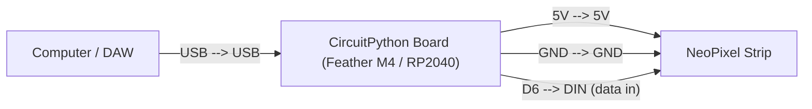

# MIDI-Synchronized Light Show

!!! info "Works with"
    Any CircuitPython board with USB MIDI support — Feather M4, Grand Central, RP2040 boards, ItsyBitsy M4

---

## What you'll build

NeoPixels that light up, change color, and respond to brightness in sync with MIDI notes played on a keyboard, pad controller, or DAW. Each note triggers a specific pixel or group of pixels, and the velocity (how hard the key was pressed) controls brightness. Based on the Adafruit "Close Encounters of the MIDI NeoPixel Visualizer" project.

---

## What you'll need

- CircuitPython board with USB MIDI support (Feather M4 Express, ItsyBitsy M4, or any RP2040 board)
- NeoPixel strip or matrix (60 pixels recommended; more gives you a wider note range)
- MIDI keyboard, pad controller, or a DAW sending MIDI over USB
- USB cable (the board appears as both a MIDI device and a serial device simultaneously)
- 470 ohm resistor on the NeoPixel data line

---

## Wiring



No additional MIDI hardware is required. When the board is connected over USB, CircuitPython exposes it as a USB MIDI device automatically. Open your DAW or plug in a MIDI keyboard and the board shows up as a MIDI input/output target.

---

## The code

```python
import board
import neopixel
import usb_midi
import adafruit_midi

from adafruit_midi.note_on import NoteOn
from adafruit_midi.note_off import NoteOff

# -- NeoPixels --
NUM_PIXELS = 60
pixels = neopixel.NeoPixel(board.D6, NUM_PIXELS, brightness=1.0, auto_write=False)

# -- MIDI setup --
# channel=1 means MIDI channel 1 (0-indexed internally: channel=0)
midi = adafruit_midi.MIDI(
    midi_in=usb_midi.ports[0],
    in_channel=0,
)

# -- Color palette: one hue per octave (12 semitones) --
OCTAVE_COLORS = [
    (255, 0, 0),    # C octave  — red
    (255, 80, 0),   # C# octave — orange-red
    (255, 165, 0),  # D octave  — orange
    (200, 200, 0),  # D# octave — yellow
    (0, 255, 0),    # E octave  — green
    (0, 255, 160),  # F octave  — teal
    (0, 200, 255),  # F# octave — cyan
    (0, 80, 255),   # G octave  — blue
    (80, 0, 255),   # G# octave — indigo
    (160, 0, 255),  # A octave  — violet
    (255, 0, 200),  # A# octave — pink
    (255, 0, 80),   # B octave  — rose
]

def note_to_pixel(note_number):
    """Map MIDI note 0-127 to a pixel index 0-(NUM_PIXELS-1)."""
    return int((note_number / 127) * (NUM_PIXELS - 1))

def velocity_to_brightness(velocity):
    """Map MIDI velocity 0-127 to a 0.0-1.0 brightness multiplier."""
    return velocity / 127

def tinted(color, brightness):
    """Scale an RGB tuple by a brightness multiplier."""
    return tuple(int(c * brightness) for c in color)

while True:
    msg = midi.receive()

    if isinstance(msg, NoteOn) and msg.velocity > 0:
        note = msg.note
        velocity = msg.velocity

        pixel_index = note_to_pixel(note)
        pitch_class = note % 12          # 0=C, 1=C#, ... 11=B
        color = OCTAVE_COLORS[pitch_class]
        brightness = velocity_to_brightness(velocity)

        pixels[pixel_index] = tinted(color, brightness)
        pixels.show()

    elif isinstance(msg, NoteOff) or (isinstance(msg, NoteOn) and msg.velocity == 0):
        # Note-off: turn off the corresponding pixel
        pixel_index = note_to_pixel(msg.note)
        pixels[pixel_index] = (0, 0, 0)
        pixels.show()
```

Note: some MIDI devices send `NoteOn` with `velocity=0` as a note-off. The code handles both cases.

---

## How it works

**USB MIDI input.** CircuitPython boards with USB MIDI support enumerate as MIDI devices over the same USB connection used for programming. The `usb_midi` module provides raw MIDI port objects, and `adafruit_midi` wraps them to parse incoming bytes into structured message objects like `NoteOn` and `NoteOff`. No special drivers or MIDI interface hardware is needed on boards that support this.

**The NoteOn/NoteOff message structure.** Every MIDI note message carries three pieces of data: the channel (1–16, for routing to different instruments), the note number (0–127, where middle C is 60), and the velocity (0–127, representing how hard the key was pressed). Note number determines pitch; velocity determines dynamics. The `adafruit_midi` library exposes these as `msg.note`, `msg.velocity`, and `msg.channel`.

**Mapping MIDI note number 0–127 to pixel positions.** MIDI's 128 possible notes span ten-plus octaves. A strip of 60 pixels cannot show each note individually, so this project uses proportional mapping: `note / 127 * (NUM_PIXELS - 1)` spreads the full note range evenly across the strip. The pitch class — the note's position within its octave, from 0 (C) to 11 (B) — determines the color, so the same note always lights the same color regardless of octave. Velocity is multiplied into the brightness so louder notes flash brighter.

---

## Installing the libraries

Copy the following from the CircuitPython Library Bundle into `lib/` on your CIRCUITPY drive:

- `adafruit_midi/` (entire folder)
- `neopixel.mpy`

Use CircUp:

```
circup install adafruit_midi
```

The `usb_midi` module is built into CircuitPython and does not need to be installed separately.

---

## Remix it

!!! tip "Remix idea"
    Control NeoPixels over Bluetooth instead of MIDI — [BLE MIDI Controller](../wireless/ble/hacker-ble-midi-controller.md) shows how to receive MIDI wirelessly so the board does not need to be tethered to a computer.

!!! tip "Remix idea"
    Build the other half of the system — [MIDI Controller](../usb-tricks/builder-midi-controller.md) shows how to turn buttons, knobs, and touch pads on a CircuitPython board into a MIDI instrument that sends the notes this visualizer reacts to.

!!! tip "Remix idea"
    Add a small screen that shows the note name and octave whenever a key is pressed — [OLED Hello World](../displays/starter-oled-hello.md) gets you set up with an SSD1306 display that you can update inside the NoteOn handler above.

---

## Go deeper

- Reference: [MIDI](../../reference/audio/midi.md)
- Reference: [NeoPixel](../../reference/lights/neopixel.md)
- Adafruit guide: [learn.adafruit.com/close-encounters-of-the-midi-neopixel-visualizer-kind](https://learn.adafruit.com/close-encounters-of-the-midi-neopixel-visualizer-kind)
  *Credit: Adafruit Learning System*
