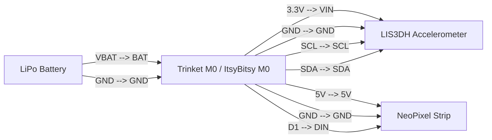

# Stomp-Reactive Light-Up Wearable

!!! info "Works with"
    Any CircuitPython board that fits in a wearable — Trinket M0, Gemma M0, ItsyBitsy M0, Circuit Playground

---

## What you'll build

NeoPixels sewn into a wearable — shoes, a jacket, a bag — that burst into color whenever they detect a stomp or sharp impact. An accelerometer measures movement on three axes in real time, and whenever the magnitude of acceleration crosses a threshold, an animation fires. Based on the Adafruit "Stomp-Reactive Light Up Slippers" project.

---

## What you'll need

- Small CircuitPython board (Trinket M0, Gemma M0, or ItsyBitsy M0 recommended)
- LIS3DH accelerometer breakout (or use the built-in accelerometer on Circuit Playground boards)
- NeoPixel strip or sewable NeoPixels (Flora NeoPixels work well for wearables)
- LiPo battery + LiPo backpack or JST connector
- Conductive thread or flexible wire
- 470 ohm resistor on the NeoPixel data line

---

## Wiring



If you are using a Circuit Playground Express or Bluefruit, the accelerometer is built in — skip the LIS3DH wiring entirely and use `cp.acceleration` directly.

---

## The code

```python
import time
import math
import board
import neopixel
import busio
import adafruit_lis3dh

from adafruit_led_animation.animation.comet import Comet
from adafruit_led_animation.animation.solid import Solid
from adafruit_led_animation.color import RED, ORANGE, YELLOW, WHITE

# -- NeoPixels --
NUM_PIXELS = 10
pixels = neopixel.NeoPixel(board.D1, NUM_PIXELS, brightness=0.4, auto_write=False)

# -- LIS3DH over I2C --
i2c = busio.I2C(board.SCL, board.SDA)
lis3dh = adafruit_lis3dh.LIS3DH_I2C(i2c)
lis3dh.range = adafruit_lis3dh.RANGE_8_G

# -- Animations --
comet = Comet(pixels, speed=0.02, color=ORANGE, tail_length=6, bounce=True)
idle = Solid(pixels, color=(10, 5, 0))  # dim warm glow at rest

# -- Stomp detection settings --
STOMP_THRESHOLD = 20.0   # m/s^2 — tune this for your surface
BURST_DURATION = 0.4     # seconds to run the burst animation
COOLDOWN = 0.2           # minimum seconds between stomps

last_stomp = 0
in_burst = False
burst_start = 0

while True:
    x, y, z = lis3dh.acceleration
    magnitude = math.sqrt(x * x + y * y + z * z)

    now = time.monotonic()

    # Trigger a burst on sharp impact
    if magnitude > STOMP_THRESHOLD and (now - last_stomp) > COOLDOWN:
        in_burst = True
        burst_start = now
        last_stomp = now
        comet.color = (
            int(min(255, magnitude * 8)),   # map magnitude to red channel
            int(min(255, magnitude * 3)),
            0,
        )

    if in_burst:
        comet.animate()
        if now - burst_start > BURST_DURATION:
            in_burst = False
            pixels.fill((0, 0, 0))
            pixels.show()
    else:
        idle.animate()

    time.sleep(0.01)
```

Tune `STOMP_THRESHOLD` for your situation — carpet absorbs impact, hard floors amplify it. Start at 15 and adjust from there.

---

## How it works

**Reading 3-axis acceleration and computing magnitude.** The LIS3DH reports separate acceleration values for the X, Y, and Z axes in meters per second squared (m/s²). Gravity alone registers as roughly 9.8 m/s² on whichever axis is pointing down. To detect a stomp regardless of how the board is oriented, you compute the vector magnitude with the Pythagorean theorem: `sqrt(x² + y² + z²)`. At rest this hovers around 9.8. A sharp stomp spikes it well above 20.

**Threshold detection for stomps.** A simple threshold check — `magnitude > STOMP_THRESHOLD` — catches impact events. The cooldown timer (`COOLDOWN`) prevents a single stomp from triggering multiple bursts as the vibration rings. When a stomp is detected, the burst color is computed from the magnitude itself, so harder stomps produce a more intense flash.

**Using led_animation in reactive mode.** Rather than letting `AnimationSequence` auto-advance, this project calls `comet.animate()` directly and controls when it runs using a timer. The `in_burst` flag keeps the comet running for a fixed window after each stomp, then returns to the idle dim glow. This is a common pattern for sensor-reactive animations: run the library's animation objects manually rather than sequencing them automatically.

---

## Installing the libraries

Copy the following from the CircuitPython Library Bundle into `lib/` on your CIRCUITPY drive:

- `adafruit_led_animation/` (entire folder)
- `adafruit_pixelbuf.mpy`
- `adafruit_lis3dh.mpy`
- `neopixel.mpy`

Use CircUp for convenience:

```
circup install adafruit_led_animation adafruit_lis3dh
```

---

## Remix it

!!! tip "Remix idea"
    Swap stomps for claps or other sounds — [Motion Alarm](../sensors/builder-motion-alarm.md) covers PIR and accelerometer-based detection patterns that translate directly into this project's threshold logic.

!!! tip "Remix idea"
    Add Bluetooth so a phone app can change the resting color or stomp sensitivity on the fly — [Getting Started with BLE](../wireless/ble/starter-getting-started.md) shows how to set up a BLE UART service that you can wire into the color variables above.

!!! tip "Remix idea"
    Go further and build a full light-up costume — [MIDI-Synchronized Light Show](hacker-midi-visualizer.md) uses the same NeoPixel and animation infrastructure but synchronizes to music, which works well as a companion piece to reactive wearables.

---

## Go deeper

- Reference: [LIS3DH](../../reference/sensors/motion/lis3dh.md)
- Reference: [LED Animation](../../reference/lights/led-animation.md)
- Adafruit guide: [learn.adafruit.com/stomp-reactive-light-up-slippers](https://learn.adafruit.com/stomp-reactive-light-up-slippers)
  *Credit: Adafruit Learning System*
