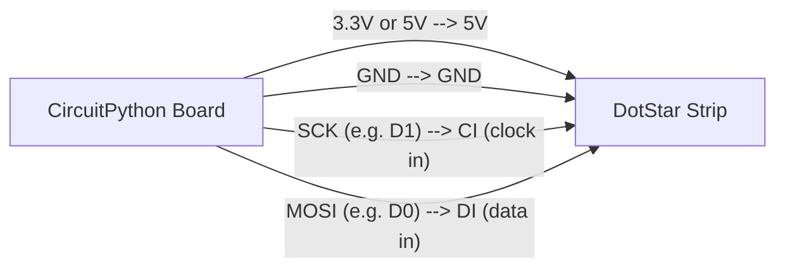

# DotStar LEDs (and your board's built-in light)

!!! info "Works with"
    Any CircuitPython board — the Trinket M0, Gemma M0, ItsyBitsy M0, and Circuit Playground boards have a built-in DotStar or NeoPixel

---

## What you'll build

A DotStar LED that cycles through colors — starting with the one that's already soldered onto your board. No extra hardware required to get started. Once you have that working, the same code scales up to a strip of dozens of LEDs.

---

## What you'll need

**To use the built-in DotStar (no wiring needed):**

- Any Adafruit board with a built-in DotStar (Trinket M0, Gemma M0, ItsyBitsy M0)
- USB cable

**To drive an external DotStar strip:**

- CircuitPython board (any)
- DotStar LED strip
- 4 jumper wires
- 470 ohm resistors on the clock and data lines (recommended)
- 5V power supply if driving more than a few LEDs

---

## Wiring

### Built-in DotStar

If you're using a Trinket M0, Gemma M0, or ItsyBitsy M0, the DotStar is wired internally. The pins are `board.APA102_SCK` (clock) and `board.APA102_MOSI` (data). No external wiring is needed.

### External DotStar strip



Connect the strip's power line to 5V if your board has it, or to 3.3V for short strips. Always share a ground between the board and the strip.

---

## The code

### Built-in DotStar (Trinket M0, Gemma M0, ItsyBitsy M0)

```python
import adafruit_dotstar
import board
import time

# One built-in DotStar
dot = adafruit_dotstar.DotStar(board.APA102_SCK, board.APA102_MOSI, 1)
dot.brightness = 0.3  # range: 0.0–1.0

colors = [
    (255, 0, 0),    # red
    (0, 255, 0),    # green
    (0, 0, 255),    # blue
    (255, 165, 0),  # orange
    (128, 0, 128),  # purple
]

while True:
    for color in colors:
        dot[0] = color
        time.sleep(0.5)
```

### External DotStar strip

```python
import adafruit_dotstar
import board
import time

NUM_PIXELS = 30
pixels = adafruit_dotstar.DotStar(board.SCK, board.MOSI, NUM_PIXELS, brightness=0.3)

# Fill the whole strip red
pixels.fill((255, 0, 0))
time.sleep(1)

# Set individual pixels
pixels[0] = (0, 255, 0)   # first pixel: green
pixels[14] = (0, 0, 255)  # middle pixel: blue
pixels.show()
time.sleep(1)

# Chase animation
while True:
    for i in range(NUM_PIXELS):
        pixels.fill((0, 0, 0))
        pixels[i] = (255, 200, 0)
        time.sleep(0.05)
```

---

## How it works

**What DotStars are.** A DotStar is an addressable RGB LED with a small driver chip built in. Each LED in a strip can be set to any of 16 million colors independently. They come on flexible strips, in grid matrices, and as individual through-hole components. The built-in DotStar on boards like the Trinket M0 is a single LED of this type.

**Two wires instead of one.** NeoPixels use a single data wire with precise timing. DotStars use two wires — a clock line and a data line — which makes them faster and easier to drive reliably. The clock line tells each LED exactly when to sample the data line, so timing is no longer critical. This also means DotStars work on any GPIO pins, not just specific ones.

**The RGB tuple system.** Colors are described as tuples of three numbers, each from 0 to 255: `(red, green, blue)`. `(255, 0, 0)` is pure red, `(0, 0, 255)` is pure blue, and `(255, 255, 255)` is white. Mixing values gives you any color in between. Brightness is a separate multiplier (0.0 to 1.0) that scales all colors down without changing their hue.

---

## Installing the library

Copy `adafruit_dotstar.mpy` from the CircuitPython Library Bundle into the `lib/` folder on your CIRCUITPY drive.

Download the bundle for your CircuitPython version at [circuitpython.org/libraries](https://circuitpython.org/libraries).

If you are using CircUp:

```
circup install adafruit_dotstar
```

---

## Remix it

!!! tip "Remix idea"
    Ready to add motion and animation effects? The [LED Animations](builder-animations.md) page shows how to get chase, comet, and pulse effects running in just a few lines using the `adafruit_led_animation` library — works with your DotStar strip.

!!! tip "Remix idea"
    Coming from NeoPixels or want to compare the two? [Your First NeoPixel](starter-first-neopixel.md) covers the single-wire approach and is a good companion to this page.

!!! tip "Remix idea"
    Make the color respond to the real world — [Temperature Color Lamp](../sensors/starter-temperature-lamp.md) maps a temperature sensor reading directly to the LED color, so the light changes as the room warms up.

---

## Go deeper

- Reference: [DotStar](../../reference/lights/dotstar.md)
- Adafruit DotStar guide: [learn.adafruit.com/adafruit-dotstar-leds/python-circuitpython](https://learn.adafruit.com/adafruit-dotstar-leds/python-circuitpython)
  *Credit: Adafruit Learning System*
