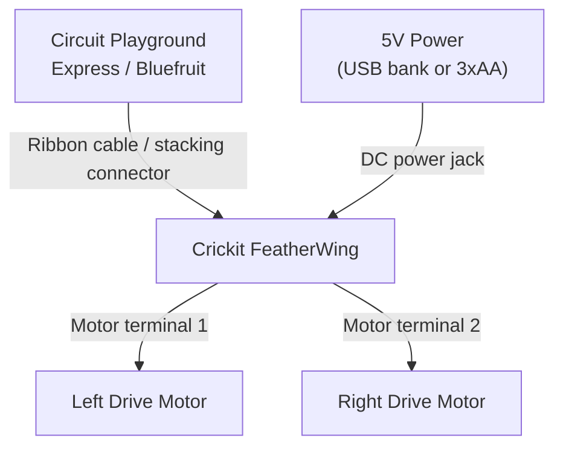

# Robot with Crickit

!!! info "Works with"
    Circuit Playground Express or Circuit Playground Bluefruit with the Crickit FeatherWing

Circuit Playground is already packed with sensors, lights, and sound. Crickit adds the one thing it is missing: motor power. Stack them together and you have a robot platform with two drive motors, four servo ports, a speaker amplifier, and NeoPixels — all controlled through a single, clean library. This project builds a wheeled robot that uses Circuit Playground's on-board light sensor to stop when it detects an obstacle.

## What you'll build

A two-wheeled robot that drives forward until its light sensor reading drops — indicating that something is blocking the light in front of it. When the sensor trips, the robot stops, backs up briefly, turns, and resumes. All the sensing happens on the Circuit Playground itself; Crickit handles everything mechanical.

## What you'll need

- Circuit Playground Express or Circuit Playground Bluefruit
- [Adafruit Crickit FeatherWing for Circuit Playground](https://www.adafruit.com/product/3093)
- Two DC gear motors (the TT motors commonly used in small robot chassis work well)
- A robot chassis or cardboard body with two drive wheels and a caster
- A 5V power source for Crickit's motors (a USB power bank or 3xAA pack via the CRICKIT's DC jack)

## Wiring

Crickit plugs directly under Circuit Playground using a ribbon cable or stacking connector — no soldering required for the board-to-board connection. Motors connect to Crickit's screw terminals. The Crickit takes power from its own jack and passes regulated voltage back to Circuit Playground, so one power connection runs the whole system.



| Connection | Details |
|---|---|
| Circuit Playground to Crickit | Ribbon cable (included) |
| Motor battery | Crickit DC power jack or 5V pin |
| Left motor | Motor 1 terminals (M1A, M1B) |
| Right motor | Motor 2 terminals (M2A, M2B) |

Swapping the two wires on one motor reverses its direction — useful if your robot spins in place instead of going straight.

## The code

```python
import time
import board
from adafruit_crickit import crickit
from analogio import AnalogIn

# Light sensor on Circuit Playground
light_sensor = AnalogIn(board.LIGHT)

# Motor speed: 1.0 = full forward, -1.0 = full reverse, 0 = stop
DRIVE_SPEED = 0.6
OBSTACLE_THRESHOLD = 5000  # lower reading = darker = obstacle nearby

def drive_forward():
    crickit.dc_motor_1.throttle = DRIVE_SPEED
    crickit.dc_motor_2.throttle = DRIVE_SPEED

def drive_backward():
    crickit.dc_motor_1.throttle = -DRIVE_SPEED
    crickit.dc_motor_2.throttle = -DRIVE_SPEED

def turn_right():
    crickit.dc_motor_1.throttle = DRIVE_SPEED
    crickit.dc_motor_2.throttle = -DRIVE_SPEED

def stop():
    crickit.dc_motor_1.throttle = 0
    crickit.dc_motor_2.throttle = 0

while True:
    light_level = light_sensor.value

    if light_level < OBSTACLE_THRESHOLD:
        # Something is blocking the sensor
        stop()
        time.sleep(0.3)
        drive_backward()
        time.sleep(0.5)
        turn_right()
        time.sleep(0.4)
        stop()
        time.sleep(0.1)
    else:
        drive_forward()

    time.sleep(0.05)
```

Adjust `OBSTACLE_THRESHOLD` by printing `light_sensor.value` in a loop and observing the reading when an object is held in front of the sensor. The right threshold depends on your lighting conditions.

## How it works

**What Crickit is.** Crickit stands for Creative Robotic Interactive Construction Kit. It is a FeatherWing — a stackable add-on board — that speaks to Circuit Playground over a protocol called SEESAW. SEESAW lets Crickit expose its motor drivers, servo ports, capacitive touch pads, and NeoPixels through a single I2C connection to Circuit Playground. From your code's perspective, you just import `crickit` and call methods on it. The hardware complexity is completely hidden.

**The crickit library's abstraction.** The `adafruit_crickit` library gives you named objects for everything on the board: `crickit.dc_motor_1`, `crickit.dc_motor_2`, `crickit.servo_1` through `crickit.servo_4`, `crickit.neopixel`, and more. DC motors use the same -1.0 to 1.0 throttle API as the Motor Shield project. Servos use the same `.angle` property as the Servo Sweep project. Because the library shares conventions with the rest of the `adafruit_motor` ecosystem, knowledge transfers between projects.

**Using the on-board light sensor for obstacle avoidance.** Circuit Playground's light sensor is an analog photodiode that returns a 16-bit value — higher values mean more light. When a robot drives toward a wall or object, the object reflects (or blocks) ambient light, changing the sensor reading. The technique is simple and imprecise — it will not work in a dark room or outdoors in direct sun — but it is a great starting point for reactive behavior. More reliable alternatives include ultrasonic distance sensors (HC-SR04) or IR proximity sensors, which you would wire to Crickit's signal inputs rather than reading Circuit Playground's on-board sensor directly.

## Installing libraries

Copy these to the `lib/` folder on your `CIRCUITPY` drive:

```
lib/
  adafruit_crickit.mpy
  adafruit_seesaw/
  adafruit_motor/
```

All are available in the CircuitPython Library Bundle at [circuitpython.org/libraries](https://circuitpython.org/libraries).

## Remix it

!!! tip "Remix idea"
    Add Bluetooth remote control so you can drive the robot from your phone. The [BLE Keyboard project](../wireless/ble/builder-ble-keyboard.md) shows how to receive BLE input on Circuit Playground Bluefruit — swap keyboard events for motor commands.

!!! tip "Remix idea"
    Add NeoPixel headlights that change color based on what the robot is doing. Crickit has a built-in NeoPixel port, and the [LED Animation project](../lights/builder-animations.md) covers the animation library that makes light patterns easy.

!!! tip "Remix idea"
    Need more torque or higher voltage motors? The [Motor Shield project](builder-motor-shield.md) uses the same throttle API but runs on a FeatherWing that handles larger currents and voltages.

## Go deeper

- [Motor reference — adafruit_motor](../../reference/motors/motor.md)
- [Adafruit Crickit with CircuitPython — DC Motors](https://learn.adafruit.com/adafruit-crickit-creative-robotic-interactive-construction-kit/circuitpython-dc-motors) — *Credit: Adafruit Learning System*
