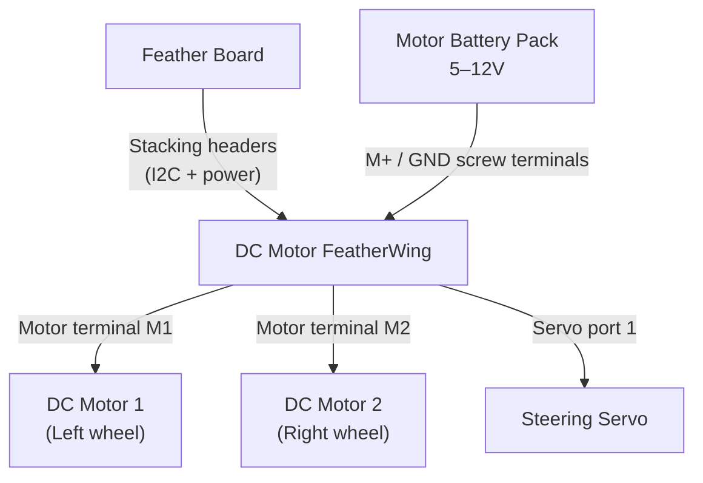

# Motor Shield — DC Motors and Multiple Servos

!!! info "Works with"
    Feather boards with the Adafruit Stepper + DC Motor FeatherWing, or any board with the Motor Shield V2

Once you move beyond a single servo, motor control gets complicated fast. Each DC motor needs a dedicated H-bridge driver. Multiple servos eat up every available PWM pin. External power has to be routed carefully. The Motor Shield and FeatherWing solve all of this at once: one board handles the drivers, the PWM generation, and the power path — leaving your microcontroller free to think.

## What you'll build

A small two-wheeled vehicle with DC drive motors and a steering servo. The DC motors set speed and direction; the servo handles steering. Both are controlled through the `adafruit_motorkit` library using simple, human-readable values — no register writes, no pulse calculations.

## What you'll need

- A Feather board (Feather M4, Feather RP2040, or similar) with stacking headers
- [Adafruit Stepper + DC Motor FeatherWing](https://www.adafruit.com/product/2927), or the [Motor Shield V2](https://www.adafruit.com/product/1438) for non-Feather boards
- Two DC motors (3–6V hobby gearmotors work well)
- One standard hobby servo for steering
- A battery pack providing 5–12V for motor power (fed into the FeatherWing's screw terminal)

## Wiring

The FeatherWing stacks directly onto a Feather board — no jumper wires needed for the control connection. The board communicates with the FeatherWing over I2C (pins SCL and SDA). Motor power comes from an external battery via the screw terminals on the FeatherWing; this power does not pass through the Feather board at all.



| Connection | Details |
|---|---|
| Feather to FeatherWing | Stack directly via stacking headers |
| Motor battery positive | FeatherWing M+ screw terminal |
| Motor battery negative | FeatherWing GND screw terminal |
| Left DC motor | M1 terminals |
| Right DC motor | M2 terminals |
| Steering servo | Servo port 1 (signal/power/GND) |

!!! warning "Two separate power rails"
    The Feather board runs on USB or its own LiPo battery. The FeatherWing's motor terminals are powered by the separate motor battery. They share a ground through the stacking headers. Never connect the motor battery's positive rail to the Feather's power pins.

## The code

```python
import board
import time
from adafruit_motorkit import MotorKit
from adafruit_motor import servo
import pwmio

kit = MotorKit(i2c=board.I2C())

# DC motors: throttle ranges from -1.0 (full reverse) to 1.0 (full forward)
# 0.0 stops the motor; None releases it (coasts)

def drive_forward(speed=0.6):
    kit.motor1.throttle = speed
    kit.motor2.throttle = speed

def drive_backward(speed=0.6):
    kit.motor1.throttle = -speed
    kit.motor2.throttle = -speed

def stop():
    kit.motor1.throttle = 0
    kit.motor2.throttle = 0

# Servo on FeatherWing servo port 1
steering = kit.servo1
steering.angle = 90  # center

while True:
    drive_forward(0.7)
    time.sleep(2)

    stop()
    time.sleep(0.5)

    drive_backward(0.5)
    time.sleep(1)

    stop()
    time.sleep(0.5)
```

`kit.motor1.throttle` accepts any float from -1.0 to 1.0. Setting it to `None` lets the motor coast freely instead of braking. `kit.servo1.angle` works exactly like the standalone servo object from the [Servo Sweep project](starter-servo-sweep.md).

## How it works

**I2C PWM expansion.** Your Feather board has a limited number of hardware PWM pins — often two or four. The FeatherWing contains a PCA9685 chip: a dedicated 16-channel PWM controller that communicates over I2C. When you call `kit.motor1.throttle = 0.7`, the library calculates the right PWM duty cycle and sends it to the PCA9685 over two wires (SDA and SCL). The PCA9685 then generates the actual PWM signal to the H-bridge driver. Your board's own PWM hardware is never involved, which means you can run four DC motors and multiple servos simultaneously without conflict.

**DC motor throttle.** A DC motor needs an H-bridge driver to reverse direction — a circuit that can switch the polarity of the voltage applied to the motor. The FeatherWing's TB6612 H-bridge chips handle this. The `throttle` value from -1.0 to 1.0 maps directly to how the H-bridge switches. Positive values spin one direction, negative values spin the other, zero actively brakes by shorting the motor terminals, and `None` lets the motor coast. This simple API hides a lot of hardware complexity.

**Stacking FeatherWings.** FeatherWings are designed to be stacked. Multiple FeatherWings can sit on a single Feather, each communicating over the same I2C bus but at different addresses. The Motor FeatherWing's I2C address can be changed by soldering address-select jumpers, so you can run two FeatherWings at once for up to eight DC motors. The MotorKit constructor accepts an `address` argument if you need to target a specific board.

## Installing libraries

Copy these to the `lib/` folder on your `CIRCUITPY` drive:

```
lib/
  adafruit_motorkit.mpy
  adafruit_motor/
  adafruit_pca9685.mpy
  adafruit_bus_device/
```

All are available in the CircuitPython Library Bundle at [circuitpython.org/libraries](https://circuitpython.org/libraries).

## Remix it

!!! tip "Remix idea"
    Make the vehicle steer itself. Read a distance sensor or light sensor and use the value to adjust `steering.angle` and the motor throttle. See [Gesture and Sensor Control](../sensors/builder-gesture-control.md) for how to read analog sensors.

!!! tip "Remix idea"
    Add a small OLED display showing speed and direction. The [OLED Hello World project](../../reference/displays/ssd1306.md) covers getting text and graphics on a 128x64 display over the same I2C bus.

!!! tip "Remix idea"
    Swap DC motors for stepper motors when you need precise positioning rather than raw speed. The [Precision Stepper project](hacker-stepper-precision.md) uses the same FeatherWing with the stepper motor API.

## Go deeper

- [MotorKit reference](../../reference/motors/motorkit.md)
- [Adafruit Stepper + DC Motor FeatherWing with CircuitPython](https://learn.adafruit.com/adafruit-stepper-dc-motor-featherwing/circuitpython) — *Credit: Adafruit Learning System*
