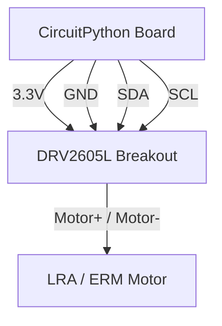

# Haptic Feedback

!!! info "Works with"
    Any CircuitPython board with I2C

Screens show information. Speakers announce it. Haptics let you *feel* it. A sharp click confirms a button press without requiring the user to look at a display. A long rumble signals an error that demands attention. A rapid double-pulse indicates a notification. The DRV2605L haptic controller chip handles all the waveform complexity — you just pick an effect number and fire it. This project wires up the breakout board and builds a small event-feedback system with distinct feelings for different states.

## What you'll build

A device that produces three distinct haptic responses: a crisp confirmation click when something succeeds, a harsh error rumble when something goes wrong, and a repeating alert pulse for notifications. You will learn to browse the 123 built-in waveform library, trigger effects on demand, and sequence multiple effects into a single compound response.

## What you'll need

- Any CircuitPython board with I2C (SDA and SCL pins)
- [Adafruit DRV2605L Haptic Controller Breakout](https://www.adafruit.com/product/2305)
- An LRA (Linear Resonant Actuator) or ERM (Eccentric Rotating Mass) vibration motor compatible with the DRV2605L

!!! info "LRA vs ERM"
    The Adafruit breakout ships configured for LRA motors by default. LRA motors produce sharper, more localized sensations and respond faster. ERM motors are the classic coin-shaped vibrators found in older phones — they are cheaper and produce a broader, buzzier sensation. You can switch the DRV2605L between modes in software; see the library documentation if you are using an ERM.

## Wiring

The DRV2605L communicates over I2C using just two signal wires. The motor connects to two output terminals on the breakout board. No external power supply is needed — the breakout runs from 3.3V and drives small LRA/ERM motors directly.



| DRV2605L pin | Connects to |
|---|---|
| VIN | Board 3.3V |
| GND | Board GND |
| SDA | Board SDA |
| SCL | Board SCL |
| Motor+ | Motor positive lead |
| Motor- | Motor negative lead |

The I2C address is fixed at 0x5A. If you have other I2C devices on the bus, verify there is no address conflict.

## The code

```python
import board
import busio
import time
import adafruit_drv2605

i2c = busio.I2C(board.SCL, board.SDA)
drv = adafruit_drv2605.DRV2605(i2c)

# --- Single effect helpers ---

def confirmation_click():
    """Effect 1 — Sharp click (Strong Click 100%)"""
    drv.sequence[0] = adafruit_drv2605.Effect(1)
    drv.sequence[1] = adafruit_drv2605.Effect(0)  # sentinel: end of sequence
    drv.play()

def error_rumble():
    """Effect 14 — Strong buzz — harsh, attention-grabbing"""
    drv.sequence[0] = adafruit_drv2605.Effect(14)
    drv.sequence[1] = adafruit_drv2605.Effect(0)
    drv.play()

def alert_pulse():
    """Three short pulses with pauses between them"""
    # Effect 12 = 100% click; Effect 0 = stop; use Wait objects for pauses
    drv.sequence[0] = adafruit_drv2605.Effect(12)
    drv.sequence[1] = adafruit_drv2605.Wait(0.1)   # 100 ms pause
    drv.sequence[2] = adafruit_drv2605.Effect(12)
    drv.sequence[3] = adafruit_drv2605.Wait(0.1)
    drv.sequence[4] = adafruit_drv2605.Effect(12)
    drv.sequence[5] = adafruit_drv2605.Effect(0)
    drv.play()

# Demo: cycle through the three feedback types
while True:
    print("Confirmation")
    confirmation_click()
    time.sleep(1.5)

    print("Error")
    error_rumble()
    time.sleep(1.5)

    print("Alert")
    alert_pulse()
    time.sleep(2.0)
```

Change effect numbers to explore different sensations. The full list of 123 effects is in the [DRV2605 datasheet](https://www.ti.com/lit/ds/symlink/drv2605l.pdf), section 11.2. Effects in the 1–10 range are sharp clicks; 11–30 are buzz and strong pulses; 47–60 are transitions and ramps; 118–123 are smoothed clicks.

## How it works

**ERM vs LRA haptic motors.** An ERM (Eccentric Rotating Mass) motor spins a small off-center weight. The imbalance creates vibration. ERM motors are inexpensive and produce a continuous buzzy sensation — think classic phone vibration. An LRA (Linear Resonant Actuator) moves a weighted mass back and forth on a spring at its resonant frequency, usually 150–300 Hz. LRA motors respond much faster (within one or two cycles), produce crisper distinct sensations, and use less power. The DRV2605L actively drives the LRA at its resonant frequency and adjusts in real time — this is why the breakout needs to know which motor type you are using.

**The 123 built-in waveforms.** The DRV2605L stores waveform data from Texas Instruments and the waveform library from Immersion (the company that created most phone haptic patterns). Each numbered effect encodes a complete amplitude envelope — attack, sustain, and decay — tuned for a specific tactile sensation. Effect 1 is a sharp 100% click. Effect 47 is a ramp-up transition. Effect 58 is a long strong buzz. You do not synthesize these; you just reference them by number. This means your code can stay high-level ("play confirmation click") while the chip handles every microsecond of the waveform.

**Sequencing multiple effects.** The DRV2605L has an eight-slot sequence register. Each slot holds either an effect number or a wait time. When you call `drv.play()`, the chip plays all slots in order until it hits a zero (the sentinel) or runs out of slots. This lets you build compound feedback patterns entirely in hardware — your CircuitPython code fires the sequence once and moves on; it does not need to block while the effects play. The `Wait` object in the adafruit_drv2605 library translates a float pause (in seconds) into the chip's internal timing format automatically.

## Installing libraries

Copy this file to the `lib/` folder on your `CIRCUITPY` drive:

```
lib/
  adafruit_drv2605.mpy
```

Available in the CircuitPython Library Bundle at [circuitpython.org/libraries](https://circuitpython.org/libraries).

## Remix it

!!! tip "Remix idea"
    Add haptic confirmation to a capacitive touch keyboard. Every time a touch pad registers a keypress, fire a click effect. See [Touch Keyboard](../sensors/starter-touch-keyboard.md) for the touch input side of this project.

!!! tip "Remix idea"
    Trigger haptic feedback when a sensor crosses a threshold — a buzz when temperature exceeds a limit, a pulse when motion is detected. See [Motion Alarm](../sensors/builder-motion-alarm.md) for how to watch sensor values and act on thresholds.

!!! tip "Remix idea"
    Combine haptics with BLE so your device gives phone-like notification buzzes triggered by a phone or laptop. The [BLE project](../wireless/ble/builder-ble-keyboard.md) covers sending and receiving BLE signals from CircuitPython.

## Go deeper

- [DRV2605L reference](../../reference/motors/drv2605.md)
- [Adafruit DRV2605L Haptic Controller with CircuitPython](https://learn.adafruit.com/adafruit-drv2605-haptic-controller-breakout/python-circuitpython) — *Credit: Adafruit Learning System*
