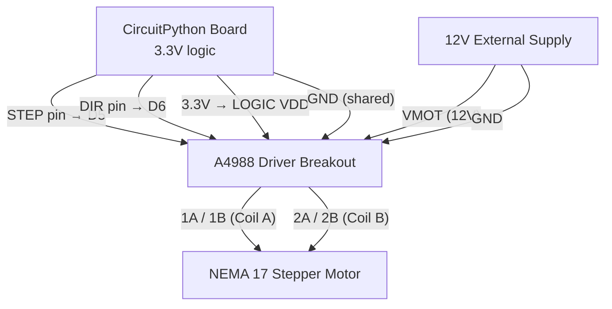

# Precision Stepper Motor Control

!!! info "Works with"
    Any CircuitPython board with SPI or digital pins — Feather M4, RP2040 boards

A DC motor spins when you apply power. A stepper motor does something different: it moves in exact, discrete steps. Each step rotates the shaft by a fixed angle — typically 1.8 degrees, which means 200 steps complete one full revolution. Because every step is countable and repeatable, stepper motors are the backbone of 3D printers, CNC routers, laser cutters, and scientific instruments. If your project needs to know *where* something is, not just that it is moving, you want a stepper.

## What you'll build

A motorized turntable or camera slider that moves an exact number of degrees on command. You will control step count, direction, and stepping mode — and see how each mode affects smoothness and torque. The same code structure applies whether you are positioning a camera, indexing a conveyor belt, or driving a robotic joint.

## What you'll need

- A CircuitPython board with available digital output pins (Feather M4 Express, Feather RP2040, or similar)
- [Adafruit A4988 Stepper Motor Driver Breakout](https://www.adafruit.com/product/4470) (or TMC2209 for quieter operation)
- A NEMA 17 stepper motor (1.8 degree step angle, 12V recommended)
- External 12V DC power supply (or 9V if your motor supports it)
- A turntable disc, slider rail, or any mechanical load

## Wiring

The A4988 driver sits between your board and the motor. Your board sends two signals: STEP (one pulse = one step) and DIR (high = forward, low = reverse). The motor's two coil pairs connect to the driver's output terminals. Motor power comes from the external 12V supply — the board's 3.3V powers only the driver's logic side.



| Connection | Details |
|---|---|
| STEP | Board D5 → A4988 STEP |
| DIR | Board D6 → A4988 DIR |
| LOGIC VDD | Board 3.3V → A4988 VDD |
| Logic GND | Board GND → A4988 GND |
| Motor power | 12V supply → A4988 VMOT |
| Motor power GND | 12V supply GND → A4988 GND |
| Coil A | Motor leads → A4988 1A, 1B |
| Coil B | Motor leads → A4988 2A, 2B |

!!! warning "Set current limit before powering on"
    The A4988 has a small trimmer potentiometer to set the current limit for your motor. If the current is set too high, the motor driver overheats or the motor coils overheat. Check your motor's rated current (printed on the label) and follow the Adafruit guide to set the Vref voltage before connecting motor power. This is the one step beginners most often skip and most often regret.

## The code

```python
import board
import digitalio
import time
from adafruit_motor import stepper

# Set up STEP and DIR pins
step_pin = digitalio.DigitalInOut(board.D5)
step_pin.direction = digitalio.Direction.OUTPUT

dir_pin = digitalio.DigitalInOut(board.D6)
dir_pin.direction = digitalio.Direction.OUTPUT

# adafruit_motor.stepper expects four coil pins for direct coil control.
# When using the A4988 driver, we use its STEP/DIR interface instead.
# This manual step function pulses STEP and controls DIR directly.
STEP_DELAY = 0.002  # seconds between steps (controls speed)

def step(steps, forward=True):
    dir_pin.value = forward
    for _ in range(abs(steps)):
        step_pin.value = True
        time.sleep(STEP_DELAY / 2)
        step_pin.value = False
        time.sleep(STEP_DELAY / 2)

# Move 200 steps forward (one full revolution at 1.8 deg/step)
step(200, forward=True)
time.sleep(1)

# Move 100 steps backward (half revolution)
step(100, forward=False)
time.sleep(1)

# Example: move to a specific angle
def move_to_angle(degrees, forward=True):
    steps = round(degrees / 1.8)
    step(steps, forward=forward)

move_to_angle(90)   # quarter turn
time.sleep(1)
move_to_angle(90, forward=False)  # back
```

To use the `adafruit_motor.stepper` API with direct coil control (bypassing the A4988 STEP/DIR interface), wire the four motor coil outputs directly to four digital output pins and follow the adafruit_motor documentation for `SINGLE`, `DOUBLE`, `INTERLEAVE`, and `MICROSTEP` modes.

## How it works

**How stepper motors work.** A stepper motor has two sets of coils wound around a toothed iron rotor. When you energize a coil, the rotor's teeth align with it — the shaft "steps" to that position and holds there without any feedback sensor. By firing the coils in a sequence, you rotate the shaft in precise increments. The sequence direction determines rotation direction. Because the motor must step through every intermediate position to reach a target, you can count steps to track absolute position — as long as the motor never skips a step.

**Steps vs. microsteps and why it matters.** A standard 1.8 degree per step motor has 200 full steps per revolution. The A4988 driver can further divide each step into 2, 4, 8, or 16 microsteps by partially energizing both coils simultaneously. At 16x microstepping, you get 3200 steps per revolution — finer than 0.12 degrees per step. Microstepping dramatically smooths motor movement (audible buzzing gives way to a quiet hum) and reduces mechanical vibration, which matters for camera motion and precision instruments. The trade-off is torque: microsteps produce less holding force than full steps at the same current.

**Current limiting on the driver.** Stepper motors are rated for a maximum coil current, typically 1–2 A for NEMA 17s. The A4988's current limiter sets a reference voltage that the driver uses to chop the motor current to the rated value. Without it, you are relying on the motor's coil resistance alone to limit current — which may not be enough, especially at low motor speeds where back-EMF is minimal. Correct current setting protects the driver, prevents overheating, and actually improves torque by allowing higher bus voltage (12V into a 2.8V motor) while the chopper limits the current.

## Installing libraries

Copy the `adafruit_motor` folder to the `lib/` folder on your `CIRCUITPY` drive:

```
lib/
  adafruit_motor/
    __init__.py
    servo.py
    motor.py
    stepper.py
```

## Remix it

!!! tip "Remix idea"
    Add limit switches so the motor can find its home position automatically. A switch at each end of travel lets the firmware home reliably at startup. See [Debouncer reference](../../reference/utilities/debouncer.md) for clean switch reading without noise.

!!! tip "Remix idea"
    Control the turntable wirelessly from a phone or laptop. The [BLE Keyboard project](../wireless/ble/builder-ble-keyboard.md) shows how to receive BLE keyboard events — map arrow keys to step forward and backward.

!!! tip "Remix idea"
    Add an OLED display showing current step count and position in degrees. The [OLED Hello World project](../displays/starter-oled-hello.md) covers getting live text on a 128x64 display.

## Go deeper

- [Motor reference — adafruit_motor](../../reference/motors/motor.md)
- [Adafruit A4988 Stepper Motor Driver with CircuitPython](https://learn.adafruit.com/adafruit-a4988-stepper-motor-driver-breakout-board/circuitpython-and-python) — *Credit: Adafruit Learning System*
