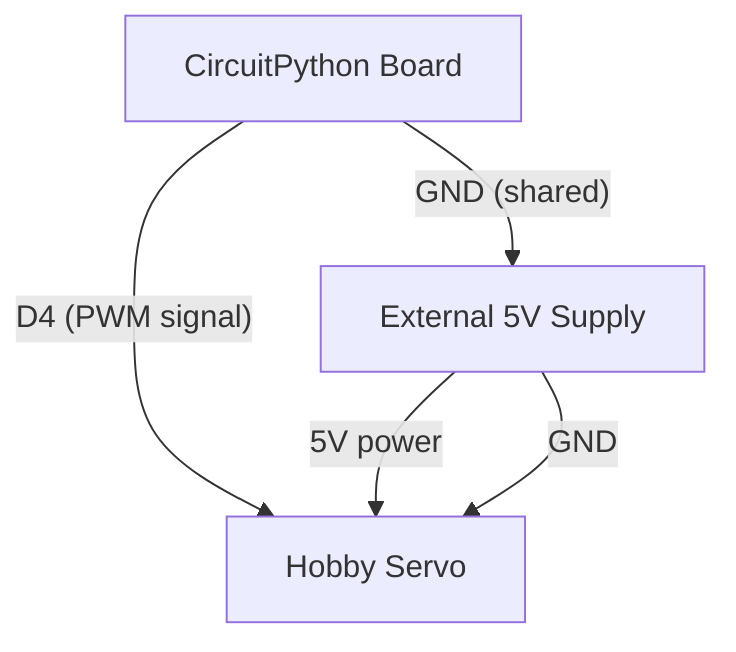

# Servo Sweep

!!! info "Works with"
    Any CircuitPython board with PWM — Trinket M0, Feather, ItsyBitsy, Pico

A servo is the friendliest motor to start with. Send it an angle, it goes there. This project sweeps a servo arm back and forth continuously — a satisfying first step into physical computing.

## What you'll build

A servo arm that sweeps from 0 to 180 degrees and back in a smooth loop. Attach a pointer to the arm and you have a gauge. Attach a pushrod and you have a door latch. Attach a flag and you have a wave machine. The sweep pattern is just the beginning — once you have angle control, you can drive the servo from any sensor or input.

## What you'll need

- A CircuitPython board with at least one PWM-capable pin (Trinket M0, Feather M4, ItsyBitsy M4, Raspberry Pi Pico, or similar)
- A standard 5V hobby servo (SG90 or MG90S are common, inexpensive choices)
- An external 5V power supply for the servo

!!! warning "Power is critical here"
    Most hobby servos are rated for 5V and can draw 500–1000 mA under load — far more than a USB port can safely deliver to a microcontroller *and* a servo at the same time. Do not power the servo directly from your board's 5V or 3V3 pin. Use a dedicated 5V supply (a separate USB power bank, a bench supply, or a 4xAA battery pack) and connect its ground to your board's ground.

## Wiring

The servo has three wires: power (usually red), ground (usually black or brown), and signal (usually orange or yellow). The signal wire carries the PWM pulse from your board. Power and ground go to your external 5V supply — **with the ground also connected to your board's GND**.



| Servo wire | Connects to |
|---|---|
| Signal (orange/yellow) | Board pin D4 (any PWM pin) |
| Power (red) | External 5V |
| Ground (black/brown) | External 5V GND and board GND |

## The code

Install the `adafruit_motor` library first (see [Installing libraries](#installing-libraries) below), then copy this to `code.py` on your board.

```python
import board
import pwmio
from adafruit_motor import servo
import time

pwm = pwmio.PWMOut(board.D4, frequency=50)
my_servo = servo.Servo(pwm)

while True:
    for angle in range(0, 180, 5):
        my_servo.angle = angle
        time.sleep(0.02)
    for angle in range(180, 0, -5):
        my_servo.angle = angle
        time.sleep(0.02)
```

Change `board.D4` to whichever PWM-capable pin you are using. The `range(0, 180, 5)` steps in increments of 5 degrees — shrink that number for smoother motion, increase it for faster sweeps.

## How it works

**PWM and motors.** PWM stands for Pulse Width Modulation. Instead of outputting a steady voltage, a PWM pin rapidly switches between high and low. The ratio of high time to total time is called the duty cycle. For most motor control this duty cycle directly sets motor speed. For servos, it works differently — but the underlying signal is still a pulsing square wave coming from the same `pwmio` module.

**How servos use pulse width.** A servo does not respond to duty cycle — it responds to the *absolute duration* of each pulse. A pulse of 1 ms commands the servo to 0 degrees. A pulse of 2 ms commands it to 180 degrees. Anything in between maps linearly to an angle. The `adafruit_motor.servo.Servo` class handles this math. When you write `my_servo.angle = 90`, the library calculates the correct pulse width and programs the PWM hardware to produce it. You never have to think about microseconds directly.

**The 50 Hz requirement.** Servo control pulses must repeat at 50 Hz — once every 20 milliseconds. This gives the servo's internal electronics time to read the pulse, compare it to the current position, and drive the motor to correct any error. The `frequency=50` argument in `pwmio.PWMOut` sets this. Most boards default to a much higher PWM frequency for LED dimming; forgetting to set 50 Hz is a common first mistake and will cause the servo to twitch erratically or not respond at all.

## Installing libraries

Download the CircuitPython Library Bundle matching your CircuitPython version from [circuitpython.org/libraries](https://circuitpython.org/libraries). Copy the entire `adafruit_motor` folder to the `lib/` folder on your board's `CIRCUITPY` drive.

Your `lib/` folder should contain:

```
lib/
  adafruit_motor/
    __init__.py
    servo.py
    motor.py
    stepper.py
```

## Remix it

!!! tip "Remix idea"
    Control the servo angle with a sensor instead of a fixed sweep. Wire up a potentiometer or light sensor and map its reading to 0–180 degrees. See [Gesture and Sensor Control](../sensors/builder-gesture-control.md) for ideas on reading analog inputs.

!!! tip "Remix idea"
    Drive multiple servos without running out of PWM pins. The [Motor Shield project](builder-motor-shield.md) uses a PCA9685 PWM expander over I2C, giving you 16 servo channels from just two board pins.

!!! tip "Remix idea"
    Build something that moves on its own. The [Crickit Robot project](builder-crickit-robot.md) combines servo control with DC drive motors and on-board sensors in a single stacked board setup.

## Go deeper

- [Motor reference — adafruit_motor](../../reference/motors/motor.md)
- [CircuitPython Essentials: Servo](https://learn.adafruit.com/circuitpython-essentials/circuitpython-servo) — *Credit: Adafruit Learning System*
- [Using Servos with CircuitPython](https://learn.adafruit.com/using-servos-with-circuitpython) — *Credit: Adafruit Learning System*
