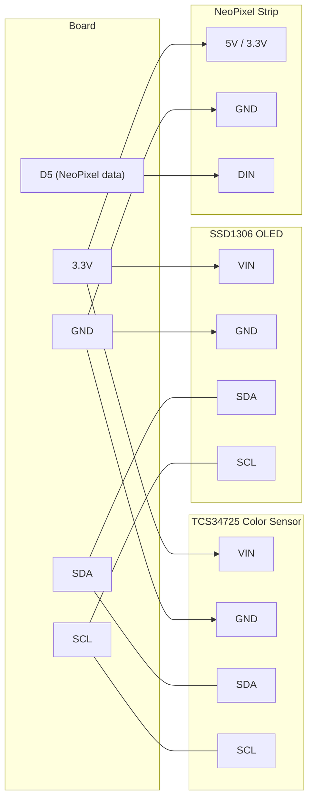

# Color Matcher

!!! info "Works with"
    Any CircuitPython board with I2C

Point the sensor at anything — a crayon, a wall, a leaf — and the device reads the color, names it, shows the RGB values on a small OLED screen, and glows that exact color on a NeoPixel strip. It is a useful calibration tool, a satisfying toy, and a solid introduction to running two I2C devices on the same bus.

---

## What you'll build

A handheld color identification device. The TCS34725 color sensor reads red, green, and blue light levels. The code maps those numbers to the nearest entry in a named color table and displays the name and RGB values on a 128x64 OLED. A NeoPixel strip glows the matched color so you can compare sensor output to real-world appearance side by side.

---

## What you'll need

| Part | Notes |
|------|-------|
| CircuitPython board with I2C | Feather, ItsyBitsy, Trinket M0, Circuit Playground, Pico |
| Adafruit TCS34725 color sensor breakout | [Product page](https://www.adafruit.com/product/1334) |
| SSD1306 128x64 OLED display | I2C version, [product page](https://www.adafruit.com/product/326) |
| NeoPixel strip or ring | 8–30 pixels is plenty |
| Hookup wire or Stemma QT cables | |
| USB cable | Data-capable |

---

## Wiring

All three devices share the I2C bus. The TCS34725 sits at address `0x29`, and the SSD1306 at `0x3C` (or `0x3D` depending on the variant). NeoPixels use a single data pin — pick any available digital output.



!!! note
    SDA and SCL on all I2C devices connect to the same two wires. You are not running separate buses — all devices share one pair of lines. Each device just has a unique address so the board knows who to talk to.

---

## The code

```python
import time
import board
import busio
import neopixel
import adafruit_tcs34725
import adafruit_ssd1306
from adafruit_display_text import label
import terminalio

# I2C bus shared by color sensor and OLED
i2c = busio.I2C(board.SCL, board.SDA)

# Sensor and display
sensor = adafruit_tcs34725.TCS34725(i2c)
sensor.integration_time = 50   # ms, longer = more accurate
sensor.gain = 4                # 1x, 4x, 16x, or 60x

oled = adafruit_ssd1306.SSD1306_I2C(128, 64, i2c)

# NeoPixels
pixels = neopixel.NeoPixel(board.D5, 8, brightness=0.4)

# Small named color lookup table: name -> (r, g, b)
NAMED_COLORS = {
    "Red":     (220,  30,  30),
    "Orange":  (230, 120,  10),
    "Yellow":  (220, 200,   0),
    "Green":   ( 20, 180,  40),
    "Cyan":    (  0, 200, 200),
    "Blue":    ( 10,  50, 220),
    "Violet":  (140,  10, 200),
    "Pink":    (230,  80, 150),
    "White":   (230, 230, 230),
    "Gray":    (130, 130, 130),
    "Black":   ( 20,  20,  20),
}

def nearest_color(r, g, b):
    """Return the name of the closest color in NAMED_COLORS."""
    best_name = "Unknown"
    best_dist = float("inf")
    for name, (cr, cg, cb) in NAMED_COLORS.items():
        dist = (r - cr) ** 2 + (g - cg) ** 2 + (b - cb) ** 2
        if dist < best_dist:
            best_dist = dist
            best_name = name
    return best_name

def clamp(val, lo=0, hi=255):
    return max(lo, min(hi, int(val)))

while True:
    # Read raw color data and normalize to 0-255
    r_raw, g_raw, b_raw, clear = sensor.color_raw
    if clear == 0:
        time.sleep(0.1)
        continue

    scale = 255 / clear
    r = clamp(r_raw * scale)
    g = clamp(g_raw * scale)
    b = clamp(b_raw * scale)

    name = nearest_color(r, g, b)

    # Update NeoPixels
    pixels.fill((r, g, b))

    # Update OLED
    oled.fill(0)
    oled.text(name, 0, 0, 1)
    oled.text(f"R:{r:3d} G:{g:3d} B:{b:3d}", 0, 16, 1)
    oled.show()

    time.sleep(0.2)
```

---

## How it works

**The TCS34725 sensor** sits behind a grid of tiny red, green, blue, and clear photodiodes covered by matching optical filters. When light hits the sensor, each filtered photodiode reports how much energy it absorbed in its color band. The chip converts those currents into 16-bit integers you read over I2C. Integration time controls how long the sensor accumulates light before reporting — longer times give you more precision in dim environments, but the sensor becomes sluggish. Gain multiplies the raw signal, useful in very dark conditions.

**Running multiple I2C devices on the same bus** works because each device has a unique 7-bit address burned into its hardware. When the board sends a message, it starts with that address. Only the matching device responds. SDA and SCL are open-drain lines with pull-up resistors, so multiple devices can share the same two wires without conflict. The CircuitPython `busio.I2C` object handles all of this for you — you just pass the same `i2c` object to both the sensor and the display.

**The color distance calculation** treats RGB values as coordinates in a 3D space. The nearest named color is the one whose coordinates are closest to the measured color, using the standard Euclidean distance formula: the square root of the sum of squared differences across R, G, and B channels. Taking the square root is optional when you only care about which distance is smallest, so the code skips it to keep things fast. The lookup table is small and simple — you can expand it with as many named colors as you want.

---

## Installing the libraries

Download the [CircuitPython Library Bundle](https://circuitpython.org/libraries) that matches your CircuitPython version. Copy these to the `lib/` folder on your `CIRCUITPY` drive:

- `adafruit_tcs34725.mpy`
- `adafruit_ssd1306.mpy`
- `adafruit_displayio_ssd1306.mpy` (if using displayio)
- `adafruit_display_text/` (entire folder)
- `neopixel.mpy`
- `adafruit_bus_device/` (entire folder)

---

## Remix it

!!! tip "Remix idea"
    Log every color reading with a timestamp to Adafruit IO. Leave the sensor pointing at a window and watch how the color of daylight changes throughout the day.
    See [Adafruit IO Basics](../wireless/wifi/starter-adafruit-io-basics.md) for the WiFi and data logging pattern.

!!! tip "Remix idea"
    Add a servo and a hopper of small colored objects. When the sensor reads a color, the servo switches a gate to route the object into the matching bin. A color-sorting machine.
    See [Servo Sweep](../motors/starter-servo-sweep.md) to get a servo moving first.

!!! tip "Remix idea"
    Swap the TCS34725 for the AS7341, which measures 10 spectral channels instead of 3. You can distinguish between objects that look identical to the human eye.
    See the [AS7341 reference](../../reference/sensors/light-color/as7341.md) for setup details.

---

## Go deeper

- [TCS34725 sensor reference](../../reference/sensors/light-color/tcs34725.md)
- [Adafruit color sensors CircuitPython tutorial](https://learn.adafruit.com/adafruit-color-sensors/python-circuitpython) — *Credit: Adafruit Learning System*
