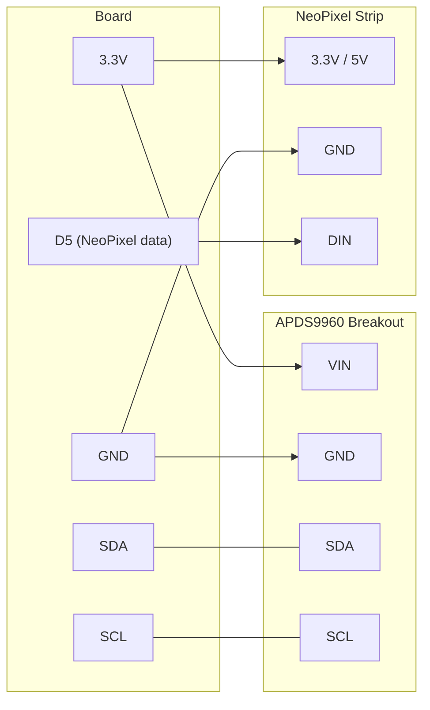

# Gesture Control

!!! info "Works with"
    Any CircuitPython board with I2C

Wave your hand and something happens. The APDS9960 sensor detects swipe direction — up, down, left, right — without any physical contact. Use gestures to cycle through NeoPixel animations, move a servo, or control any output you can wire up. It is an unusual input method that consistently surprises people who try it.

---

## What you'll build

A gesture-driven controller. Swipe left or right to cycle through NeoPixel color animations. Swipe up or down to change animation speed or brightness. The same pattern works with any output: servos, sounds, display pages, or wireless messages.

---

## What you'll need

| Part | Notes |
|------|-------|
| CircuitPython board with I2C | Feather, ItsyBitsy, Trinket M0, Pico, Circuit Playground |
| Adafruit APDS9960 breakout | Gesture, proximity, light, and color — [product page](https://www.adafruit.com/product/3595) |
| NeoPixel strip or ring | For visual feedback — 8 pixels or more |
| Servo (optional) | Swap in place of or alongside NeoPixels |
| Hookup wire or Stemma QT cables | |
| USB cable | Data-capable |

---

## Wiring

The APDS9960 is an I2C device at address `0x39`. NeoPixels use a single digital output pin.



!!! warning
    Keep your hand 5–15 cm from the sensor when swiping. Too close and the sensor saturates; too far and there is not enough signal. The sweet spot is about the width of a sheet of paper away.

---

## The code

```python
import time
import board
import busio
import neopixel
from adafruit_apds9960.apds9960 import APDS9960

# I2C and sensor setup
i2c = busio.I2C(board.SCL, board.SDA)
apds = APDS9960(i2c)
apds.enable_proximity = True
apds.enable_gesture = True

# NeoPixels
NUM_PIXELS = 8
pixels = neopixel.NeoPixel(board.D5, NUM_PIXELS, brightness=0.3, auto_write=False)

# Animation palette — cycle through these on left/right swipe
PALETTES = [
    (255,   0,   0),   # Red
    (  0, 255,   0),   # Green
    (  0,   0, 255),   # Blue
    (255, 165,   0),   # Orange
    (128,   0, 128),   # Purple
]

palette_index = 0
brightness = 0.3

def set_palette(index):
    color = PALETTES[index % len(PALETTES)]
    pixels.fill(color)
    pixels.show()

set_palette(palette_index)

while True:
    gesture = apds.gesture()

    if gesture == 1:   # Up — increase brightness
        brightness = min(1.0, brightness + 0.2)
        pixels.brightness = brightness
        pixels.show()
        print("Gesture: UP — brightness", round(brightness, 1))

    elif gesture == 2:  # Down — decrease brightness
        brightness = max(0.05, brightness - 0.2)
        pixels.brightness = brightness
        pixels.show()
        print("Gesture: DOWN — brightness", round(brightness, 1))

    elif gesture == 3:  # Left — previous palette
        palette_index = (palette_index - 1) % len(PALETTES)
        set_palette(palette_index)
        print("Gesture: LEFT — palette", palette_index)

    elif gesture == 4:  # Right — next palette
        palette_index = (palette_index + 1) % len(PALETTES)
        set_palette(palette_index)
        print("Gesture: RIGHT — palette", palette_index)

    time.sleep(0.05)
```

---

## How it works

**The APDS9960 detects gesture direction** using four directional photodiodes arranged in a cross pattern — one each for up, down, left, and right. When you swipe your hand past the sensor, your hand briefly blocks and then unblocks each diode in sequence. A right-to-left swipe, for example, covers the right diode first and the left diode last. The chip's built-in processor tracks that timing pattern and reports a gesture code: 1 for up, 2 for down, 3 for left, 4 for right. You read that code with a single call to `apds.gesture()`.

**The gesture reading API** returns `0` when no gesture is detected and a non-zero integer when one is. The call is non-blocking — if nothing happened, it returns immediately. This means you can call it in a tight loop without sleeping, and the rest of your code runs uninterrupted. When a gesture does come in, the value is only valid on the first call after detection; subsequent calls return `0` until the next gesture. The library handles all the low-level gesture engine configuration for you.

**Gestures sometimes fail** for a few reasons. If ambient light is very bright, it overwhelms the photodiodes and the sensor cannot see your hand's shadow at all. If you move too quickly, the timing difference between diodes is too small to interpret. If you move too slowly, the sensor may time out. You can tune sensitivity by adjusting `apds.gesture_gain` (default is `2`, range `0`–`3`) and `apds.gesture_proximity_threshold` (how close your hand needs to be before gesture mode activates). Start with the defaults and only adjust if you are getting missed detections or false positives.

---

## Installing the libraries

Download the [CircuitPython Library Bundle](https://circuitpython.org/libraries) that matches your CircuitPython version. Copy these to the `lib/` folder on your `CIRCUITPY` drive:

- `adafruit_apds9960/` (entire folder)
- `neopixel.mpy`
- `adafruit_bus_device/` (entire folder)
- `adafruit_register/` (entire folder, required by apds9960)

---

## Remix it

!!! tip "Remix idea"
    Wire up a DFPlayer Mini or a board with built-in audio and map each swipe direction to a different sound file. Swipe to skip tracks on a custom soundboard.
    See [Soundboard](../sound/builder-soundboard.md) for the audio playback pattern.

!!! tip "Remix idea"
    Replace the NeoPixels with two drive motors. Swipe forward to move, back to reverse, left and right to steer. Hands-free robot control.
    See [CRICKIT Robot](../motors/builder-crickit-robot.md) for the motor driver setup.

!!! tip "Remix idea"
    Combine the gesture sensor with a BLE-capable board. Send gesture codes as BLE keyboard events to control a phone or laptop presentation from across the room.
    See [BLE Keyboard](../wireless/ble/builder-ble-keyboard.md) for the BLE HID pattern.

---

## Go deeper

- [APDS9960 sensor reference](../../reference/sensors/motion/apds9960.md)
- [Adafruit APDS9960 breakout guide](https://learn.adafruit.com/adafruit-apds9960-breakout) — *Credit: Adafruit Learning System*
