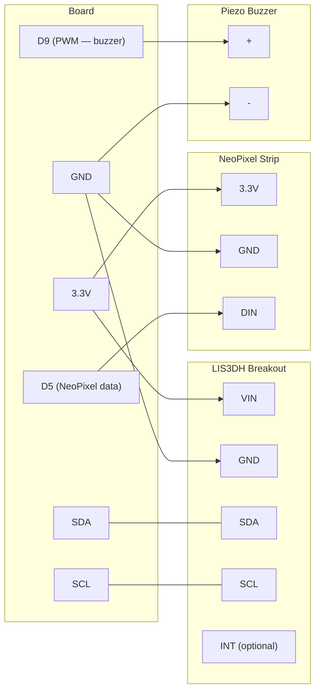

# Motion Alarm

!!! info "Works with"
    Any CircuitPython board with I2C

Attach this to a box, a door, a backpack, or anything you want to protect. The LIS3DH accelerometer detects taps and shakes at the hardware level — no polling, no missed events. When something moves, NeoPixels flash and a piezo buzzer fires. A small project with a lot of practical uses.

---

## What you'll build

A motion-triggered alarm unit. The LIS3DH is configured to detect single or double taps using its built-in interrupt hardware. When the tap interrupt fires, CircuitPython triggers a NeoPixel flash sequence and a buzzer tone. The alarm resets automatically, ready for the next event.

---

## What you'll need

| Part | Notes |
|------|-------|
| CircuitPython board with I2C | Feather, ItsyBitsy, Pico, Metro, Trinket M0 |
| Adafruit LIS3DH accelerometer breakout | [Product page](https://www.adafruit.com/product/2809) |
| NeoPixel strip or ring | 8 pixels is plenty |
| Piezo buzzer | Passive (not active) — you need PWM control over frequency |
| Hookup wire | |
| USB cable or battery | Battery makes it portable |

---

## Wiring

The LIS3DH connects over I2C. The buzzer connects to any PWM-capable digital pin. NeoPixels connect to a separate digital output.



!!! note
    The INT pin on the LIS3DH is optional here. This project polls the tap flag in software. If you want a true hardware interrupt that wakes a sleeping microcontroller, connect INT to any interrupt-capable pin and use `countio` or `alarm`.

---

## The code

```python
import time
import board
import busio
import neopixel
import pwmio
import adafruit_lis3dh

# I2C and accelerometer
i2c = busio.I2C(board.SCL, board.SDA)
lis3dh = adafruit_lis3dh.LIS3DH_I2C(i2c)

# Configure tap detection
# Arguments: tap type (1=single, 2=double), threshold (0-127)
lis3dh.set_tap(1, 80)

# NeoPixels
pixels = neopixel.NeoPixel(board.D5, 8, brightness=0.5, auto_write=False)

# PWM buzzer
buzzer = pwmio.PWMOut(board.D9, variable_frequency=True)
buzzer.duty_cycle = 0

def sound_alarm():
    """Flash NeoPixels and sound buzzer for alarm effect."""
    for _ in range(4):
        # Flash red
        pixels.fill((255, 0, 0))
        pixels.show()

        # Buzzer on at 880 Hz
        buzzer.frequency = 880
        buzzer.duty_cycle = 32768  # 50% duty cycle

        time.sleep(0.1)

        # Flash off
        pixels.fill((0, 0, 0))
        pixels.show()

        # Buzzer off
        buzzer.duty_cycle = 0

        time.sleep(0.1)

def standby():
    """Dim green pulse to show system is armed and waiting."""
    pixels.fill((0, 20, 0))
    pixels.show()

standby()
print("Alarm armed. Waiting for tap...")

while True:
    if lis3dh.tapped:
        print("Tap detected!")
        sound_alarm()
        standby()

    time.sleep(0.01)
```

---

## How it works

**Accelerometers measure acceleration** by tracking the movement of a tiny suspended mass inside the chip. In normal operation sitting on a table, the sensor reads approximately 1g on whichever axis points down — that is gravity. When the device is tapped or shaken, additional acceleration spikes appear on top of that baseline. The LIS3DH is a 3-axis sensor, so it can detect motion in any direction simultaneously and reports values in units of g-force.

**Tap detection uses a hardware threshold** built into the LIS3DH itself, which is what makes it efficient. You configure a threshold value and a time window, and the chip's internal logic watches the accelerometer data continuously. When a spike crosses the threshold within the time window, the chip sets an internal tap flag. Your code only needs to read that flag — it does not need to sample and analyze raw acceleration data on every loop iteration. This is important for battery-powered projects where you might want to sleep the microcontroller and only wake it on a tap event.

**Combining two outputs** — lights and sound — makes the alarm more effective and also demonstrates a common pattern in physical computing: the same event drives multiple independent subsystems. The NeoPixels and the buzzer are updated in sequence inside `sound_alarm()`. Because the flashes and tones are short (100 ms each), the whole alarm cycle finishes quickly and the system returns to monitoring. If you wanted the alarm to persist until a button press, you would wrap the loop in a flag variable and only clear it on user input.

---

## Installing the libraries

Download the [CircuitPython Library Bundle](https://circuitpython.org/libraries) that matches your CircuitPython version. Copy these to the `lib/` folder on your `CIRCUITPY` drive:

- `adafruit_lis3dh.mpy`
- `neopixel.mpy`
- `adafruit_bus_device/` (entire folder)

---

## Remix it

!!! tip "Remix idea"
    Add a BLE-capable board and send a notification to your phone when the tap fires. Walk away from the protected object and get an alert if it moves.
    See [BLE Keyboard](../wireless/ble/builder-ble-keyboard.md) for the BLE output pattern — the same approach works for sending notification strings.

!!! tip "Remix idea"
    Log every tap event with a timestamp to Adafruit IO. Leave it running for a day and chart when and how often something was disturbed.
    See [Adafruit IO Basics](../wireless/wifi/starter-adafruit-io-basics.md) for the WiFi data-logging setup.

!!! tip "Remix idea"
    Sew the LIS3DH and NeoPixels onto a jacket. The alarm becomes a reactive wearable that flashes when you move. Swap the buzzer for a small vibration motor to keep it silent.
    See [Reactive Wearable](../lights/hacker-reactive-wearable.md) for the wearable build pattern.

---

## Go deeper

- [LIS3DH sensor reference](../../reference/sensors/motion/lis3dh.md)
- [Adafruit LIS3DH breakout guide](https://learn.adafruit.com/adafruit-lis3dh-triple-axis-accelerometer-breakout) — *Credit: Adafruit Learning System*
