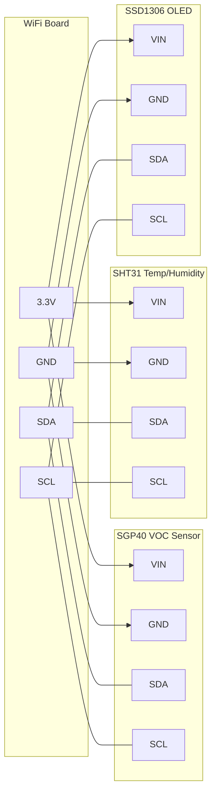

# Air Quality Dashboard

!!! info "Works with"
    WiFi-capable boards — Feather ESP32-S2/S3, PyPortal, Pico W, Metro M4 AirLift

Your classroom, bedroom, or workshop may have worse air than you think. This project reads volatile organic compound (VOC) levels alongside temperature and humidity, shows live values on a local OLED display, and streams everything to an Adafruit IO dashboard you can check from anywhere. Leave it running for a week and you will learn something about the air you breathe.

---

## What you'll build

A networked air quality monitor with two outputs. A local SSD1306 OLED shows current VOC index, temperature, and humidity in real time. The same values are uploaded to Adafruit IO feeds every 30 seconds, where you can build charts, gauges, and threshold alerts without writing any server code.

---

## What you'll need

| Part | Notes |
|------|-------|
| WiFi-capable CircuitPython board | Feather ESP32-S2, Feather ESP32-S3, PyPortal, Pico W with AirLift, Metro M4 AirLift |
| Adafruit SGP40 VOC sensor breakout | [Product page](https://www.adafruit.com/product/4829) |
| Adafruit SHT31-D temperature/humidity sensor | [Product page](https://www.adafruit.com/product/2857) — also provides compensation data for the SGP40 |
| SSD1306 128x64 OLED (I2C) | [Product page](https://www.adafruit.com/product/326) |
| Hookup wire or Stemma QT cables | QT cables make daisy-chaining I2C trivial |
| USB cable or power adapter | For continuous deployment |

You will also need a free [Adafruit IO](https://io.adafruit.com) account. Create three feeds: `voc-index`, `temperature`, and `humidity`.

---

## Wiring

All three sensor/display devices share the I2C bus. Addresses: SGP40 at `0x59`, SHT31 at `0x44`, SSD1306 at `0x3C`.



!!! tip
    If you have Stemma QT cables, you can daisy-chain all three devices without any soldering. Each breakout has two Stemma QT ports — plug them in series and all devices share the bus automatically.

---

## The code

Create a `settings.toml` file in the root of your `CIRCUITPY` drive with your credentials:

```toml
CIRCUITPY_WIFI_SSID = "your_wifi_network"
CIRCUITPY_WIFI_PASSWORD = "your_wifi_password"
AIO_USERNAME = "your_adafruit_io_username"
AIO_KEY = "your_adafruit_io_key"
```

Then write your `code.py`:

```python
import time
import os
import ssl
import wifi
import socketpool
import board
import busio
import adafruit_sht31d
import adafruit_sgp40
import adafruit_ssd1306
import adafruit_requests
from adafruit_io.adafruit_io import IO_HTTP, AdafruitIO_RequestError

# Connect to WiFi
print("Connecting to WiFi...")
wifi.radio.connect(
    os.getenv("CIRCUITPY_WIFI_SSID"),
    os.getenv("CIRCUITPY_WIFI_PASSWORD")
)
print("Connected:", wifi.radio.ipv4_address)

# HTTP session for Adafruit IO
pool = socketpool.SocketPool(wifi.radio)
requests = adafruit_requests.Session(pool, ssl.create_default_context())

AIO_USERNAME = os.getenv("AIO_USERNAME")
AIO_KEY = os.getenv("AIO_KEY")
io = IO_HTTP(AIO_USERNAME, AIO_KEY, requests)

# I2C bus and sensors
i2c = busio.I2C(board.SCL, board.SDA)
sht = adafruit_sht31d.SHT31D(i2c)
sgp = adafruit_sgp40.SGP40(i2c)
oled = adafruit_ssd1306.SSD1306_I2C(128, 64, i2c)

UPLOAD_INTERVAL = 30  # seconds between Adafruit IO uploads
last_upload = time.monotonic() - UPLOAD_INTERVAL

while True:
    # Read sensors
    temperature = sht.temperature          # degrees C
    humidity = sht.relative_humidity       # percent RH

    # SGP40 uses temperature and humidity for compensation
    voc_raw = sgp.measure_raw(
        temperature=temperature,
        relative_humidity=humidity
    )

    # Convert raw to VOC index (0-500, lower is better)
    # adafruit_sgp40 provides voc_index if the vocAlgorithm is included
    # Fallback: use raw value normalized for display
    try:
        voc_index = sgp.measure_index(
            temperature=temperature,
            relative_humidity=humidity
        )
    except AttributeError:
        # Older library version — display raw value
        voc_index = voc_raw

    # Update OLED display
    oled.fill(0)
    oled.text("Air Quality", 20, 0, 1)
    oled.text(f"VOC:  {voc_index:4d}", 0, 16, 1)
    oled.text(f"Temp: {temperature:.1f} C", 0, 32, 1)
    oled.text(f"RH:   {humidity:.1f} %", 0, 48, 1)
    oled.show()

    # Upload to Adafruit IO every UPLOAD_INTERVAL seconds
    now = time.monotonic()
    if now - last_upload >= UPLOAD_INTERVAL:
        try:
            io.send_data("voc-index", voc_index)
            io.send_data("temperature", round(temperature, 1))
            io.send_data("humidity", round(humidity, 1))
            last_upload = now
            print(f"Uploaded: VOC={voc_index} T={temperature:.1f} RH={humidity:.1f}")
        except AdafruitIO_RequestError as e:
            print("Adafruit IO error:", e)

    time.sleep(5)
```

---

## How it works

**The SGP40 measures VOC index** using a metal-oxide semiconductor (MOX) element. When volatile organic compounds — solvents, cleaning products, off-gassing plastics, human breath — contact the heated element, they change its electrical resistance. The chip's built-in Sensirion VOC algorithm converts that resistance into a VOC index from 0 to 500, where values above 150 indicate elevated levels. Crucially, the algorithm requires current temperature and humidity to compensate for how those conditions affect the sensor's baseline resistance. That is why the SHT31 is not optional — it is part of the measurement, not just bonus data.

**Sending data to Adafruit IO feeds** works through a simple HTTP POST to their REST API. The `adafruit_io` library wraps those HTTP calls so you just call `io.send_data("feed-name", value)`. Each feed stores a time-series of values that Adafruit IO's dashboard can display as a line chart, gauge, or stream block. The free tier allows up to 10 feeds and 30 data points per minute — more than enough for this project. The 30-second upload interval keeps you well inside that limit while giving you fine-grained data over time.

**Building the dashboard on io.adafruit.com** requires no code. Log in, go to your dashboard, click the plus button to add blocks, and connect each block to one of your feeds. A line chart on `voc-index` over 24 hours will immediately show you patterns: cooking, cleaning, opening windows, sleeping. A gauge block on `temperature` gives you a live readout. You can set up triggers to send an email or a webhook when a feed value crosses a threshold — useful for alerting you when air quality drops.

---

## Installing the libraries

Download the [CircuitPython Library Bundle](https://circuitpython.org/libraries) that matches your CircuitPython version. Copy these to the `lib/` folder on your `CIRCUITPY` drive:

- `adafruit_sgp40.mpy`
- `adafruit_sht31d.mpy`
- `adafruit_ssd1306.mpy`
- `adafruit_io/` (entire folder)
- `adafruit_requests.mpy`
- `adafruit_bus_device/` (entire folder)
- `adafruit_register/` (entire folder)

---

## Remix it

!!! tip "Remix idea"
    Add an SCD41 CO2 sensor to the same I2C bus. Carbon dioxide is the most common indoor air quality problem — high CO2 makes rooms feel stuffy and impairs concentration. Log it alongside VOC and humidity for a complete picture.
    See the [SCD4x reference](../../reference/sensors/environmental/scd4x.md) for wiring and library details.

!!! tip "Remix idea"
    Connect the dashboard to Home Assistant over MQTT instead of Adafruit IO. You get local processing, no internet dependency, and integration with automations — turn on a fan automatically when VOC index climbs above 200.
    See [MQTT and Home Assistant](../wireless/wifi/builder-mqtt-home-assistant.md) for the MQTT publishing pattern.

!!! tip "Remix idea"
    Add a NeoPixel and map VOC index to a color gradient: green for clean air, yellow for moderate, red for poor. A single glanceable indicator is more useful than a number when you are not staring at the display.
    See [First NeoPixel](../lights/starter-first-neopixel.md) to get a NeoPixel running, then map the index range to RGB values.

---

## Go deeper

- [SGP40 sensor reference](../../reference/sensors/environmental/sgp40.md)
- [Adafruit IO WiFi reference](../../reference/wireless/wifi/adafruit-io.md)
- [Welcome to Adafruit IO — CircuitPython guide](https://learn.adafruit.com/welcome-to-adafruit-io/circuitpython-and-adafruit-io) — *Credit: Adafruit Learning System*
