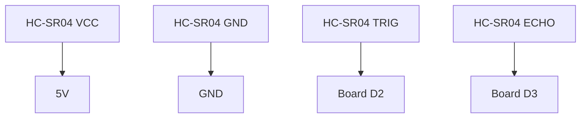

# Distance Alert

!!! info "Works with"
    Any CircuitPython board with 2 free digital pins

**Level:** Starter
**Input:** HC-SR04 ultrasonic distance sensor
**Output:** LED blink rate changes based on how close something is

---

## What you'll build

A sensor that watches the space in front of it — the closer something gets, the faster a light blinks. Point it at a doorway, under a desk, or at a bowl of candy. It knows when something is there.

This is the same basic idea behind parking sensors, automatic doors, and robotic obstacle avoidance. The sensor is cheap and simple; what you do with the reading is up to you.

## What you'll need

- Any CircuitPython board
- HC-SR04 ultrasonic distance sensor
- An LED and a 220 ohm resistor (or use the board's built-in LED)
- Jumper wires

!!! warning "Voltage note"
    The HC-SR04 runs on 5V logic. If your board operates at 3.3V (Trinket M0, Feather, most modern boards), use the **HC-SR04P** variant instead — it supports 3.3V. Using a 5V sensor with a 3.3V board without level shifting can damage the board's input pin.

## Wiring



The TRIG pin receives a short pulse from the board to start a measurement. The ECHO pin goes high for exactly as long as it takes the ultrasonic pulse to travel out and return. The library times that duration and converts it to centimeters.

## The code

```python
import board
import time
import digitalio
import adafruit_hcsr04

sonar = adafruit_hcsr04.HCSR04(trigger_pin=board.D2, echo_pin=board.D3)

led = digitalio.DigitalInOut(board.LED)
led.direction = digitalio.Direction.OUTPUT

while True:
    try:
        distance = sonar.distance  # in centimeters
        print(f"Distance: {distance:.1f} cm")
        # Blink faster when closer
        blink_time = max(0.05, distance / 200)
        led.value = True
        time.sleep(blink_time)
        led.value = False
        time.sleep(blink_time)
    except RuntimeError:
        # Sensor can error if nothing is in range — just keep going
        print("Out of range")
        time.sleep(0.1)
```

## How it works

The HC-SR04 works by sending out a burst of ultrasonic sound (40kHz — well above what humans can hear) and timing how long the echo takes to return. The speed of sound through air is known, so the round-trip time directly gives you distance. The library handles all of this — `sonar.distance` gives you centimeters.

The `try/except` block catches `RuntimeError` — when nothing is in range, or something is too close or too far, the sensor sometimes fails to get a clean reading. Catching the error means your program keeps running instead of crashing with a traceback. This is good defensive programming: sensors are physical things, and physical things occasionally fail.

The `blink_time` calculation maps distance to speed: dividing by 200 scales the centimeter reading down to a reasonable fraction of a second, and `max(0.05, ...)` caps the minimum so the LED doesn't blink faster than you can see — or faster than the loop can keep up with.

## Installing the library

Copy `adafruit_hcsr04.mpy` from the CircuitPython library bundle to your board's `lib/` folder.

Not sure how to get the bundle? See [Installing Libraries](../../reference/getting-started/installing-libraries.md).

## Remix it

!!! tip "Remix idea"
    What if it changed NeoPixel color instead of blinking an LED?
    → [Your First NeoPixel](../lights/starter-first-neopixel.md) shows how to set colors from code.

!!! tip "Remix idea"
    What if it played a tone that got higher as something got closer — like a parking sensor?
    → [Simple Tones](../sound/starter-make-it-sound.md) shows how to generate tones at different frequencies.

!!! tip "Remix idea"
    What if you used a more precise laser-based distance sensor?
    → [VL53L0X Reference](../../reference/sensors/distance/vl53l0x.md) covers a time-of-flight sensor accurate to millimeters.

## Go deeper

- [HC-SR04 Reference](../../reference/sensors/distance/hcsr04.md) — sensor details, range limits, and library options
- [Ultrasonic Sonar Distance Sensors](https://learn.adafruit.com/ultrasonic-sonar-distance-sensors/python-circuitpython) — wiring and code guide. *Credit: Adafruit Learning System*
