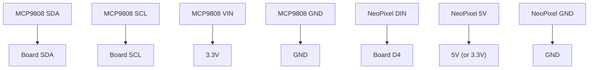

# Temperature Lamp

!!! info "Works with"
    Any CircuitPython board with I2C (SDA/SCL pins)

**Level:** Starter
**Input:** MCP9808 temperature sensor
**Output:** NeoPixel strip that changes color based on temperature

---

## What you'll build

A lamp that glows cool blue when it's cold, shifts through green, and turns warm red when it's hot. Reading the temperature becomes something you can see across a room. Leave it on your desk and you'll start to notice patterns — how the room warms up in the morning, or how it cools down when the window's open.

## What you'll need

- Any CircuitPython board with I2C (SDA and SCL pins)
- MCP9808 temperature sensor breakout (Adafruit)
- NeoPixel strip or ring (at least 1 pixel)
- Jumper wires

## Wiring



The MCP9808 and any other I2C sensors can share the same SDA and SCL lines — that's one of the advantages of I2C. Each device has its own address so there's no conflict.

## The code

```python
import board
import busio
import neopixel
import adafruit_mcp9808

# Set up I2C and the temperature sensor
i2c = busio.I2C(board.SCL, board.SDA)
sensor = adafruit_mcp9808.MCP9808(i2c)

# Set up NeoPixels
pixels = neopixel.NeoPixel(board.D4, 8, brightness=0.3)

def temp_to_color(temp_c):
    # Map temperature range 15°C–35°C to blue→green→red
    temp_c = max(15, min(35, temp_c))
    t = (temp_c - 15) / 20.0  # 0.0 to 1.0
    r = int(t * 255)
    b = int((1 - t) * 255)
    g = int((1 - abs(t - 0.5) * 2) * 180)
    return (r, g, b)

while True:
    temp = sensor.temperature
    color = temp_to_color(temp)
    pixels.fill(color)
    print(f"Temperature: {temp:.1f}°C → color {color}")
```

## How it works

The MCP9808 uses I2C — a two-wire protocol that lets many sensors share the same two pins (SDA and SCL). You create a `busio.I2C` object and pass it to the sensor driver. The driver handles the low-level communication so you never have to think about it.

`sensor.temperature` returns degrees Celsius as a float. That's it — one line to get the reading. The MCP9808 is a precision sensor, accurate to ±0.25°C, which is why it shows up in so many real-world projects.

The `temp_to_color()` function maps a number range to a color range. The variable `t` slides from 0.0 to 1.0 as temperature goes from 15°C to 35°C, and that value drives the red and blue channels in opposite directions. This pattern — mapping one range of numbers to another — comes up constantly in CircuitPython projects. Learn it here and you'll use it everywhere.

## Installing the libraries

Copy `neopixel.mpy` and `adafruit_mcp9808.mpy` from the CircuitPython library bundle to your board's `lib/` folder. Also copy the `adafruit_bus_device` folder — it's a dependency needed for I2C communication behind the scenes.

Not sure how to get the bundle? See [Installing Libraries](../../reference/getting-started/installing-libraries.md).

## Remix it

!!! tip "Remix idea"
    What if it displayed the temperature as a number instead of a color?
    → [OLED Hello World](../displays/starter-oled-hello.md) shows how to put text on a small screen.

!!! tip "Remix idea"
    What if it beeped when the temperature got too high?
    → [Simple Tones](../sound/starter-make-it-sound.md) shows how to make your board produce sound.

!!! tip "Remix idea"
    What if it logged temperature readings to the internet over time?
    → [Adafruit IO Basics](../wireless/wifi/starter-adafruit-io-basics.md) shows how to send data to a dashboard.

## Go deeper

- [MCP9808 Reference](../../reference/sensors/environmental/mcp9808.md) — other things this sensor can do, including interrupt pins and shutdown mode
- [NeoPixel Reference](../../reference/lights/neopixel.md) — brightness, animation, and addressing individual pixels
- [Adafruit MCP9808 Guide](https://learn.adafruit.com/adafruit-mcp9808-precision-i2c-temperature-sensor-guide) — wiring diagrams and more examples. *Credit: Adafruit Learning System*
