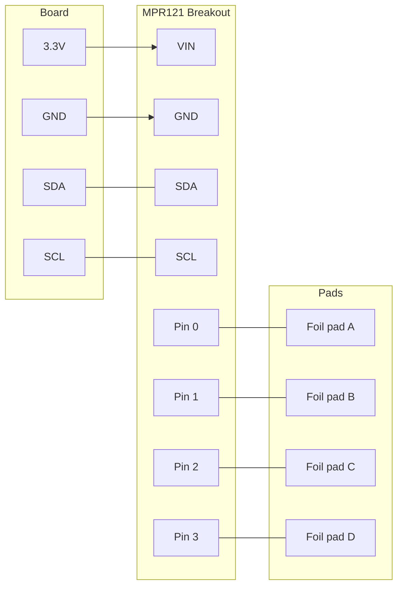

# Touch Keyboard

!!! info "Works with"
    Any CircuitPython board with I2C and native USB — Trinket M0, Feather, ItsyBitsy, Circuit Playground

Turn everyday objects into keys. With an MPR121 capacitive touch sensor, a few pieces of aluminum foil, and a handful of lines of CircuitPython, you can build a keyboard that types letters, fires shortcuts, or plays notes — all by touching a banana.

---

## What you'll build

A USB HID keyboard driven by 12 capacitive touch pads. Each pad is mapped to a key. Touch a pad, a keypress fires. The pads can be foil, fruit, wire, or anything conductive. Your computer sees it as a real keyboard — no driver installation needed.

---

## What you'll need

| Part | Notes |
|------|-------|
| CircuitPython board with native USB | Trinket M0, ItsyBitsy M0/M4, Feather M0/M4, Circuit Playground Express/Bluefruit |
| Adafruit MPR121 12-key capacitive touch breakout | [Product page](https://www.adafruit.com/product/1982) |
| Conductive pads | Aluminum foil strips, alligator clips, fruit, bare wire |
| Alligator clip cables or hookup wire | For connecting pads to the MPR121 |
| USB cable | Data-capable, not charge-only |

---

## Wiring

The MPR121 talks over I2C. Connect it to your board's SDA and SCL pins, then clip or wire your conductive pads to pins 0–11.



!!! note
    The default I2C address for the MPR121 is `0x5A`. If you need multiple MPR121 boards on the same bus, tie the ADDR pin high or to SDA/SCL to change the address.

---

## The code

```python
import board
import busio
import usb_hid
from adafruit_hid.keyboard import Keyboard
from adafruit_hid.keycode import Keycode
import adafruit_mpr121

# Set up I2C and the MPR121
i2c = busio.I2C(board.SCL, board.SDA)
mpr121 = adafruit_mpr121.MPR121(i2c)

# Set up the USB HID keyboard
kbd = Keyboard(usb_hid.devices)

# Map each touch pad (0-11) to a keycode
KEY_MAP = {
    0:  Keycode.A,
    1:  Keycode.B,
    2:  Keycode.C,
    3:  Keycode.D,
    4:  Keycode.E,
    5:  Keycode.F,
    6:  Keycode.G,
    7:  Keycode.H,
    8:  Keycode.I,
    9:  Keycode.J,
    10: Keycode.K,
    11: Keycode.L,
}

# Track which pads were touched last loop
last_touched = mpr121.touched_pins

while True:
    current_touched = mpr121.touched_pins

    for i in range(12):
        # Pad just pressed
        if current_touched[i] and not last_touched[i]:
            if i in KEY_MAP:
                kbd.press(KEY_MAP[i])
        # Pad just released
        if not current_touched[i] and last_touched[i]:
            if i in KEY_MAP:
                kbd.release(KEY_MAP[i])

    last_touched = current_touched
```

Swap any `Keycode.A` for `Keycode.CONTROL`, `Keycode.SPACE`, or a media key to build shortcuts instead of letters.

---

## How it works

The MPR121 measures the capacitance at each of its 12 pins many times per second. When you touch a pad, your body adds capacitance to that pin and the reading changes. The chip compares that change against a configurable threshold and sets a touch flag. Your code reads those flags over I2C — you never have to sample raw capacitance yourself.

The `adafruit_hid` library makes your board pretend to be a USB keyboard at the hardware level. When you call `kbd.press()`, the board sends a standard USB HID report to your computer, which responds exactly as it would to a physical keypress. No special software needed on the host side.

The loop tracks which pads were touched on the last iteration and compares to the current state. A keypress fires on the transition from not-touched to touched; a release fires on the reverse transition. This prevents the keyboard from auto-repeating while you hold a pad.

---

## Installing the libraries

Download the [CircuitPython Library Bundle](https://circuitpython.org/libraries) that matches your CircuitPython version. Copy these to the `lib/` folder on your `CIRCUITPY` drive:

- `adafruit_mpr121.mpy`
- `adafruit_hid/` (entire folder)
- `adafruit_bus_device/` (entire folder)

---

## Remix it

!!! tip "Remix idea"
    Instead of typing letters, map each pad to a MIDI note number and send MIDI messages over USB. Build a playable instrument out of fruit.
    See [MIDI Foot Pedal](../sound/builder-midi-foot-pedal.md) for the MIDI output pattern.

!!! tip "Remix idea"
    Add a NeoPixel strip and light up a different color for each pad you touch. Instant visual feedback and it looks great in a dark room.
    See [First NeoPixel](../lights/starter-first-neopixel.md) to get NeoPixels running first.

!!! tip "Remix idea"
    Wire all 12 pads to labeled keys and put them in a laser-cut or 3D-printed enclosure. You now have a custom macropad for your desk.
    See [Customizing USB](../usb-tricks/builder-customizing-usb.md) to give it a custom name and VID/PID.

---

## Go deeper

- [MPR121 sensor reference](../../reference/sensors/touch/mpr121.md)
- [USB HID reference](../../reference/usb/hid.md)
- [Adafruit MPR121 CircuitPython tutorial](https://learn.adafruit.com/adafruit-mpr121-12-key-capacitive-touch-sensor-breakout-tutorial/python-circuitpython) — *Credit: Adafruit Learning System*
