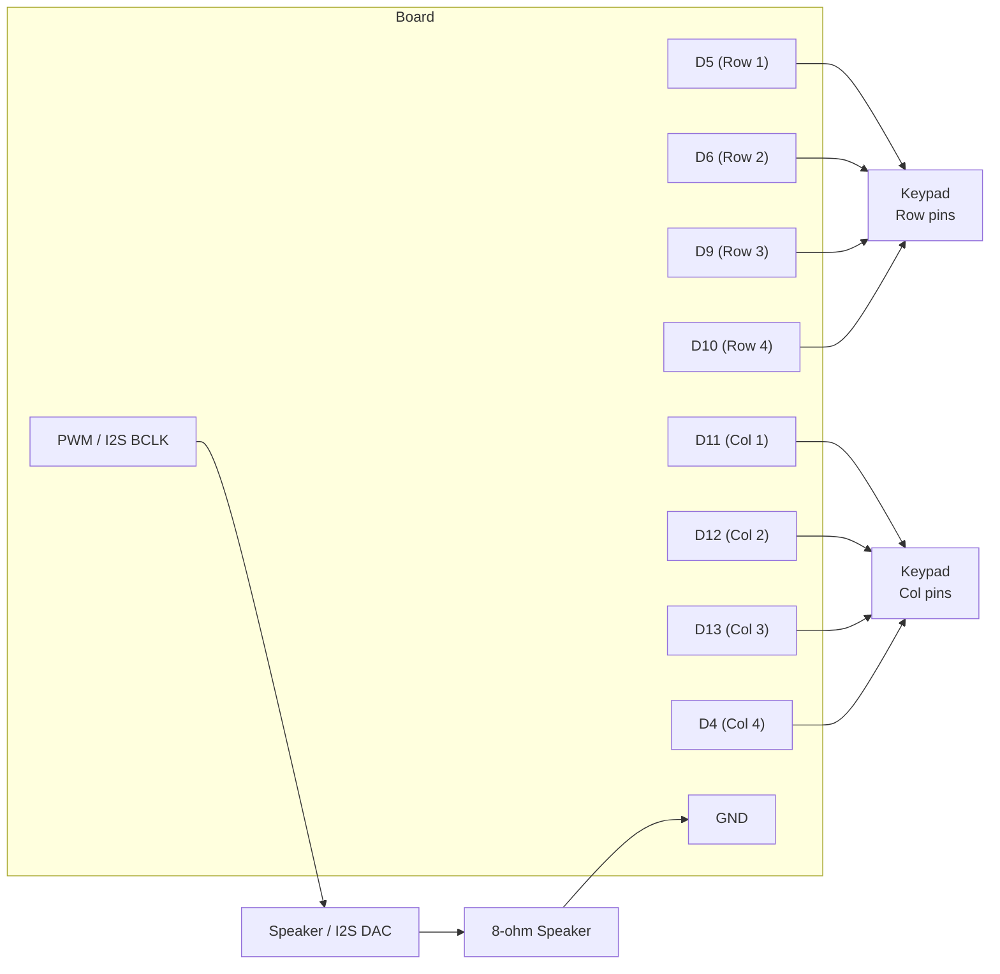

# Touch Tone Dial-a-Song

!!! info "Works with"
    Any CircuitPython board with PWM audio output — Feather RP2040, QT Py RP2040, ItsyBitsy RP2040

**Level: Builder**

Before streaming music existed, Nokia phones came preloaded with monophonic ringtones encoded as plain text strings — a format called RTTTL (Ring Tone Text Transfer Language). Those strings are still floating around the internet by the thousands. This project wires up a 4x4 telephone-style keypad and plays a different RTTTL tune for each key, all through a speaker, with no audio files on the board at all.

## What you'll build

A retro-styled box with a matrix keypad. Pressing a key plays the corresponding ringtone melody through a small speaker. It is a surprisingly entertaining prop — and a real demonstration of how much you can do with a simple text format and a PWM output.

## What you'll need

- Feather RP2040, QT Py RP2040, or ItsyBitsy RP2040 (any board with PWM)
- 4x4 matrix keypad (the cheap membrane kind works perfectly)
- Small 8-ohm speaker **or** I2S DAC breakout (MAX98357A) + speaker
- 100-ohm resistor if wiring directly to a speaker (protects the PWM pin)
- Breadboard and jumper wires

Using an I2S DAC gives noticeably better volume and sound quality, but PWM direct to a small speaker is simpler to start with.

## Wiring

The keypad has 8 pins: 4 row pins and 4 column pins. The speaker or DAC connects to the audio output pin(s).



For I2S, connect BCLK, LRCLK, and DATA to the appropriate pins on your board — check the Feather RP2040 pinout diagram for the exact labels.

## The code

```python
import board
import time
import pwmio
import adafruit_rtttl

# Matrix keypad setup (rows output, cols input with pull-up)
import digitalio

ROW_PINS = [board.D5, board.D6, board.D9, board.D10]
COL_PINS = [board.D11, board.D12, board.D13, board.D4]

rows = []
for pin in ROW_PINS:
    r = digitalio.DigitalInOut(pin)
    r.direction = digitalio.Direction.OUTPUT
    r.value = True
    rows.append(r)

cols = []
for pin in COL_PINS:
    c = digitalio.DigitalInOut(pin)
    c.direction = digitalio.Direction.INPUT
    c.pull = digitalio.Pull.UP
    cols.append(c)

KEYMAP = [
    ["1", "2", "3", "A"],
    ["4", "5", "6", "B"],
    ["7", "8", "9", "C"],
    ["*", "0", "#", "D"],
]

# RTTTL strings — each key maps to a tune
SONGS = {
    "1": "TakeOnMe:d=4,o=5,b=160:8f#,8f#,8f#,8d,8p,8b4,8p,8e,8p,8e,8p,8e,8g#,8g#,8a,8b",
    "2": "Nokia:d=4,o=5,b=225:8e6,8d6,f#,g#,8c#6,8b,d,e,8b,8a,c#,e,2a",
    "3": "Jingle:d=4,o=5,b=200:8e,8e,e,8e,8e,e,8e,8g,8c,8d,2e",
    "4": "Smoke:d=4,o=5,b=112:4a,d6,4c#6,a,f,8a,f,8d,2a4",
    "0": "Scale:d=8,o=5,b=140:c,d,e,f,g,a,b,c6",
}

# PWM audio output pin
AUDIO_PIN = board.A0

def scan_keypad():
    for r_idx, row in enumerate(rows):
        row.value = False
        for c_idx, col in enumerate(cols):
            if not col.value:
                row.value = True
                time.sleep(0.05)  # debounce
                return KEYMAP[r_idx][c_idx]
        row.value = True
    return None

while True:
    key = scan_keypad()
    if key and key in SONGS:
        adafruit_rtttl.play(AUDIO_PIN, SONGS[key])
    time.sleep(0.02)
```

Add or replace entries in `SONGS` with any RTTTL string you find online — there are enormous archives of them.

## How it works

**What RTTTL is and where ringtones come from.** RTTTL was designed by Nokia in the late 1990s to encode monophonic ringtones as short text strings that could be transmitted via SMS. The format specifies a name, default tempo and octave, then a comma-separated list of notes in the form `duration note octave`. Because the strings are tiny, they spread widely online. Sites like picaxe.com and various fan archives still host thousands of tunes ranging from video game themes to classical pieces. The `adafruit_rtttl` library parses these strings and drives a PWM pin to produce the right frequency for each note.

**Reading a matrix keypad.** A 4x4 keypad has 16 keys but only 8 pins — 4 rows and 4 columns. Rather than dedicating a pin per button, the keypad uses a scanning technique: the code drives each row low one at a time, then checks which column pins read low. If row 2 is driven low and column 3 reads low, key (2,3) is pressed. This is efficient: 8 pins cover 16 keys, and the same approach scales to much larger keypads.

**I2S vs PWM audio.** PWM audio works by rapidly switching a pin on and off; a small capacitor or the speaker's own inductance smooths this into an analog waveform. It is simple and requires no extra hardware, but the output is noisy and relatively quiet. I2S (Inter-IC Sound) is a digital audio protocol where the microcontroller sends precise 16-bit or 32-bit samples to a dedicated amplifier chip. The amplifier handles the analog conversion and driving the speaker. For RTTTL tunes, PWM is fine. For WAV files or synthesized audio, I2S is worth the extra two wires and one breakout board.

## Installing the libraries

You need `adafruit_rtttl.mpy` from the Adafruit CircuitPython Bundle. Download the bundle for your CircuitPython version from [circuitpython.org/libraries](https://circuitpython.org/libraries) and copy `adafruit_rtttl.mpy` into the `lib` folder on your CIRCUITPY drive.

## Remix ideas

!!! tip "Remix idea"
    Turn it into a musical instrument using capacitive touch pads instead of a keypad. The [Touch Keyboard](../sensors/starter-touch-keyboard.md) project shows how to wire bare copper pads and use `touchio` — combine it with `adafruit_rtttl` or `simpleio.tone()` to play notes.

!!! tip "Remix idea"
    Add NeoPixel visual feedback that lights up in the key's color while a tune plays. See [First NeoPixel](../lights/starter-first-neopixel.md) for setup, then trigger a color change at the start of each `adafruit_rtttl.play()` call.

!!! tip "Remix idea"
    Upgrade to full WAV and MP3 file playback with button triggers. The [Soundboard Speaker](builder-soundboard.md) project covers loading audio files from the CIRCUITPY drive and playing them through an I2S amplifier.

## Go deeper

- [RTTTL reference](../../reference/audio/rtttl.md)
- Adafruit guide: [https://learn.adafruit.com/touch-tone-phone-dial-a-song](https://learn.adafruit.com/touch-tone-phone-dial-a-song)

*Credit: Adafruit Learning System*
