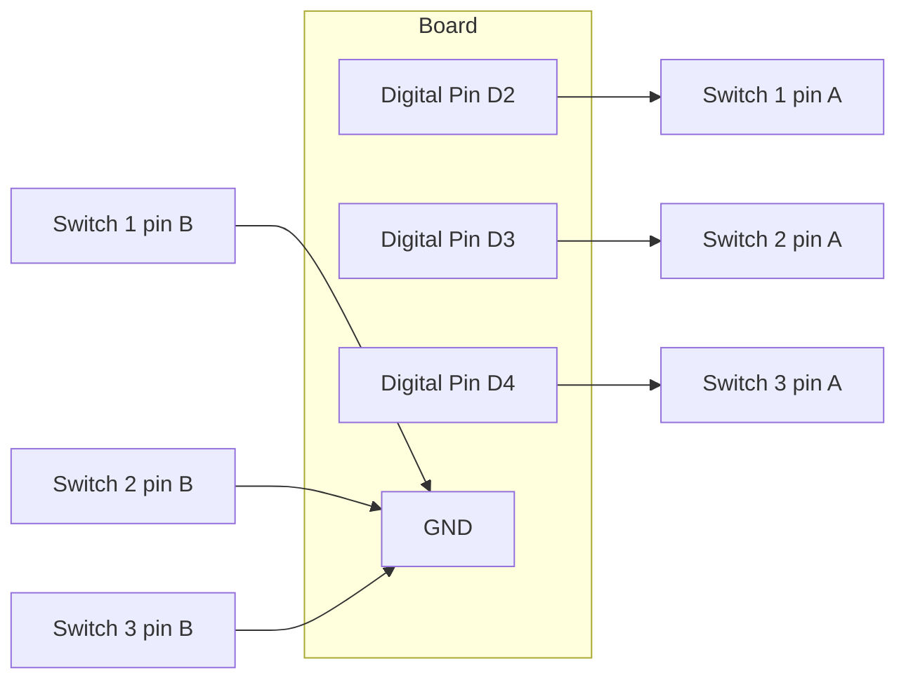

# USB MIDI Foot Pedal

!!! info "Works with"
    Any CircuitPython board with native USB — Trinket M0, Feather M0/M4, RP2040 boards, ItsyBitsy

**Level: Builder**

Your board can appear to a computer as a MIDI device — no drivers, no configuration, just plug it in and it shows up in Ableton, GarageBand, Logic, VCV Rack, or any other DAW. This project builds a hands-free foot pedal that sends MIDI CC (Control Change) messages and Note On/Off events to whatever software you have open.

## What you'll build

A USB foot pedal with one or more momentary switches. Each switch sends a configurable MIDI message. Press one switch to trigger a loop, press another to send a sustain pedal message, press a third to advance to the next scene — the mapping is entirely up to you and your software.

## What you'll need

- Any CircuitPython board with native USB and `usb_midi` support
- One or more momentary foot switches or push buttons
- Optional: project enclosure (a small plastic box works well)
- Breadboard and jumper wires for prototyping

The Trinket M0, ItsyBitsy M0/M4, Feather M0/M4, and RP2040 boards all support native USB MIDI out of the box. The Raspberry Pi Pico (non-W) also works.

## Wiring

Each button connects between a digital input pin and GND. No external resistors needed — the internal pull-ups handle it.



## The code

```python
import board
import time
import digitalio
import usb_midi
import adafruit_midi
from adafruit_midi.control_change import ControlChange
from adafruit_midi.note_on import NoteOn
from adafruit_midi.note_off import NoteOff

midi = adafruit_midi.MIDI(midi_out=usb_midi.ports[1], out_channel=0)

# Configure buttons
BUTTON_PINS = [board.D2, board.D3, board.D4]
buttons = []
for pin in BUTTON_PINS:
    b = digitalio.DigitalInOut(pin)
    b.direction = digitalio.Direction.INPUT
    b.pull = digitalio.Pull.UP
    buttons.append(b)

# Track previous state for edge detection
prev_states = [True] * len(buttons)

# MIDI mappings: (message_type, value)
# "cc"   -> sends CC message on controller number = value
# "note" -> sends NoteOn/NoteOff on that note number
MAPPINGS = [
    ("cc", 64),    # Switch 1: Sustain pedal (CC 64)
    ("note", 36),  # Switch 2: Kick drum (C2)
    ("cc", 80),    # Switch 3: General purpose CC
]

while True:
    for i, button in enumerate(buttons):
        current = button.value
        if prev_states[i] and not current:
            # Button just pressed
            msg_type, value = MAPPINGS[i]
            if msg_type == "cc":
                midi.send(ControlChange(value, 127))
            elif msg_type == "note":
                midi.send(NoteOn(value, 100))
        elif not prev_states[i] and current:
            # Button just released
            msg_type, value = MAPPINGS[i]
            if msg_type == "cc":
                midi.send(ControlChange(value, 0))
            elif msg_type == "note":
                midi.send(NoteOff(value, 0))
        prev_states[i] = current

    time.sleep(0.01)  # 10 ms polling interval
```

## How it works

**USB MIDI — the board as a MIDI device.** When CircuitPython firmware includes `usb_midi` support (check your board's firmware page), the board enumerates over USB as both a serial device and a MIDI device simultaneously. No special drivers are needed on macOS or Windows 10+. Your DAW sees it the same way it would see a hardware MIDI controller — because as far as USB is concerned, it is one.

**MIDI messages — NoteOn vs CC.** MIDI has been the standard protocol for electronic instruments since 1983. A NoteOn message carries a note number (0–127, where 60 is middle C) and a velocity (0–127). A Control Change (CC) message carries a controller number and a value — CC 64 is the sustain pedal by convention, but most DAWs let you map any CC to any parameter. Sending CC 64 with value 127 tells a piano plugin to hold notes; sending it with value 0 releases them.

**Debouncing with edge detection.** Rather than checking `if not button.value` every loop and potentially sending dozens of messages per press, the code tracks the previous state of each button. It only sends a message when the state *changes* — from released to pressed, or from pressed to released. This is called edge detection. The 10 ms sleep gives the button contacts time to settle, which prevents the false double-triggers ("bounce") that mechanical switches produce.

## Installing the libraries

You need the `adafruit_midi` folder from the Adafruit CircuitPython Bundle. Download the bundle for your CircuitPython version from [circuitpython.org/libraries](https://circuitpython.org/libraries) and copy the entire `adafruit_midi` folder into the `lib` folder on your CIRCUITPY drive.

## Remix ideas

!!! tip "Remix idea"
    Add a small OLED display that shows which CC was just sent. The [OLED Hello World](../displays/starter-oled-hello.md) project covers the basics of the SSD1306 display — from there, updating a line of text on button press is straightforward.

!!! tip "Remix idea"
    Cut the cable and go wireless with BLE MIDI. The [BLE MIDI Controller](../wireless/ble/hacker-ble-midi-controller.md) project uses the `adafruit_ble` library to broadcast MIDI over Bluetooth, which iOS GarageBand can receive natively.

!!! tip "Remix idea"
    Scale up to a full MIDI controller with knobs, pads, and a display. See the [MIDI reference](../../reference/audio/midi.md) for a complete breakdown of message types, channel routing, and SysEx before you start wiring a larger panel.

## Go deeper

- [MIDI reference](../../reference/audio/midi.md)
- Adafruit guide: [https://learn.adafruit.com/midi-foot-pedal](https://learn.adafruit.com/midi-foot-pedal)

*Credit: Adafruit Learning System*
