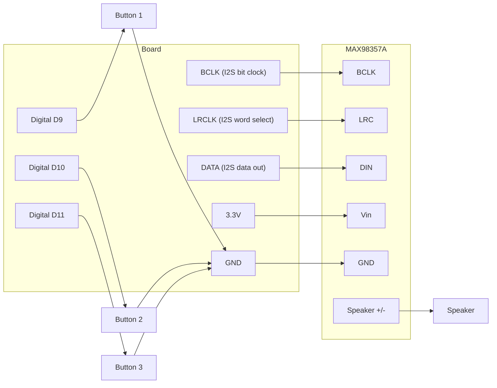

# Soundboard Speaker

!!! info "Works with"
    Any CircuitPython board with I2S audio — Feather RP2040, QT Py RP2040, Feather M4

**Level: Builder**

This project is exactly what it sounds like: a box with buttons that each trigger a different sound effect through a real speaker. Motorcycle engine, air horn, laser blast, crowd cheering — whatever WAV files you drop onto the board. It is a good introduction to I2S digital audio and working with files from the CIRCUITPY filesystem.

## What you'll build

A panel with arcade-style push buttons connected to a microcontroller and a small speaker. Pressing any button plays the corresponding audio file immediately, interrupting whatever was playing before. The board's CIRCUITPY drive holds the WAV files directly — no SD card needed for short clips.

## What you'll need

- Feather RP2040, Feather M4, or any CircuitPython board with I2S support
- I2S audio amplifier breakout — the Adafruit MAX98357A is a good choice (~$4)
- Small 4-ohm or 8-ohm speaker (1–3 W)
- Two or more momentary push buttons (arcade buttons feel great for this)
- Short WAV files in 16-bit, 22050 Hz mono format (convert with Audacity or ffmpeg)
- Breadboard and jumper wires

Keep your WAV files small — the Feather RP2040 has 8 MB of flash, and CIRCUITPY only gets a portion of that. Mono 22 kHz audio at 16-bit is about 44 KB per second. Ten seconds of audio per sound effect is plenty.

## Wiring

The I2S amplifier needs three signal lines (BCLK, LRCLK, DATA) plus power. Each button connects between a digital input pin and GND.



Check the pinout diagram for your specific board to find the I2S BCLK, LRCLK, and DATA pins — they are labeled differently on different boards (sometimes BCLK/WSEL/DOUT, sometimes I2S_BCLK/I2S_WS/I2S_TX).

## The code

```python
import board
import time
import digitalio
import audiobusio
import audiocore

# I2S amplifier setup — adjust pins for your board
i2s = audiobusio.I2SOut(board.I2S_BCLK, board.I2S_WS, board.I2S_DATA)

# Sound files on the CIRCUITPY drive
SOUNDS = [
    "sounds/engine.wav",
    "sounds/horn.wav",
    "sounds/laser.wav",
]

# Button setup
BUTTON_PINS = [board.D9, board.D10, board.D11]
buttons = []
for pin in BUTTON_PINS:
    b = digitalio.DigitalInOut(pin)
    b.direction = digitalio.Direction.INPUT
    b.pull = digitalio.Pull.UP
    buttons.append(b)

prev_states = [True] * len(buttons)

def play_sound(filename):
    if i2s.playing:
        i2s.stop()
    wave = audiocore.WaveFile(open(filename, "rb"))
    i2s.play(wave)

while True:
    for i, button in enumerate(buttons):
        current = button.value
        if prev_states[i] and not current:
            # Button just pressed
            if i < len(SOUNDS):
                play_sound(SOUNDS[i])
        prev_states[i] = current
    time.sleep(0.01)
```

Create a `sounds/` folder on your CIRCUITPY drive and copy your WAV files there. Use Audacity or `ffmpeg -i input.mp3 -ar 22050 -ac 1 -acodec pcm_s16le output.wav` to convert files to the right format.

## How it works

**I2S protocol for digital audio.** I2S (Inter-IC Sound) is a serial bus protocol designed specifically for transmitting digital audio between chips. Three wires carry all the information: BCLK (bit clock, which ticks once per bit), LRCLK (left/right clock, which marks whether the current sample is for the left or right channel), and DATA (the actual audio samples, one bit per BCLK tick). The MAX98357A receives these digital samples, converts them to an analog signal internally, and drives the speaker directly. Because the conversion happens on the amplifier chip rather than on the microcontroller, the audio quality is much better than PWM output.

**Loading WAV files from the CIRCUITPY drive.** CircuitPython mounts the board's flash storage as a USB drive called CIRCUITPY. Files you copy there are accessible from Python using normal file I/O — `open("sounds/engine.wav", "rb")` works exactly as you would expect. The `audiocore.WaveFile` class wraps the open file handle and handles all the WAV header parsing for you. The I2S output then streams samples from the file in real time, so you are not loading the entire file into memory at once.

**Button-triggered playback.** The code uses edge detection (watching for the transition from `True` to `False`) rather than level detection (`if not button.value`) so each press triggers exactly one sound, not a continuous stream of triggers. Calling `i2s.stop()` before starting a new sound ensures clean interruption — pressing button 2 while button 1's sound is playing stops the first sound immediately.

## Installing the libraries

`audiocore` and `audiobusio` are built into CircuitPython firmware for supported boards — no separate library installation is needed. If you see an import error, verify that your board's firmware version supports I2S output (most RP2040 and SAMD51 boards do).

## Remix ideas

!!! tip "Remix idea"
    Trigger sounds from motion instead of buttons. The [Motion Alarm](../sensors/builder-motion-alarm.md) project uses a PIR sensor — replace its LED alert with a `play_sound()` call to create an audio burglar alarm.

!!! tip "Remix idea"
    Add NeoPixel flashes synchronized to each sound. See [NeoPixel Animations](../lights/builder-animations.md) for the animation patterns, then fire an animation in `play_sound()` alongside the audio.

!!! tip "Remix idea"
    Outgrow the soundboard and build a generative synthesizer. The [Euclidean Synthesizer](hacker-euclidean-synth.md) project uses CircuitPython's `synthio` to create new sounds on the fly — no WAV files needed at all.

## Go deeper

- [Audio reference (VS1053 and I2S)](../../reference/audio/vs1053.md)
- Adafruit guide: [https://learn.adafruit.com/soundboard-speaker-for-bikes-scooters](https://learn.adafruit.com/soundboard-speaker-for-bikes-scooters)

*Credit: Adafruit Learning System*
