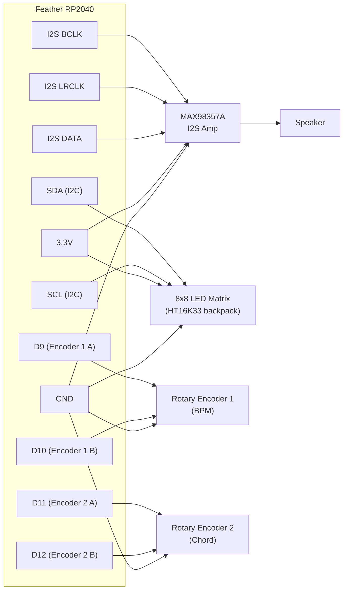

# Euclidean Synthesizer

!!! info "Works with"
    Any CircuitPython board with synthio support — RP2040 boards (Feather RP2040, QT Py RP2040, Pico), SAMD51 boards (Feather M4, Grand Central)

**Level: Hacker**

This project builds a generative synthesizer entirely in CircuitPython. No audio files. No samples. The microcontroller computes every waveform from scratch, in real time, using CircuitPython's `synthio` module. Four synthesizer voices play chords derived from the circle of fifths while Euclidean rhythm patterns determine when each voice triggers — creating music that evolves without ever repeating in quite the same way twice.

It is one of the most technically ambitious things you can build with a CircuitPython board. It is also genuinely musical. Give yourself time with this one.

## What you'll build

A standalone synthesizer box with:

- Four `synthio` voices generating sustained, enveloped notes
- Euclidean rhythm patterns that determine which voices play on which beats
- Two rotary encoders: one controls BPM, one shifts the chord progression
- An 8x8 LED matrix displaying the current rhythm pattern in real time
- I2S audio output to a speaker

The sound is ambient and evolving — closer to a Brian Eno record than a drum machine, but the underlying math is the same as what you find in modular synthesis.

## What you'll need

- Feather RP2040 or Feather M4 Express (RP2040 recommended — more RAM)
- I2S audio DAC or amplifier breakout (MAX98357A, PCM5102, or UDA1334A)
- Small speaker (4–8 ohm, 1–3 W)
- 8x8 LED matrix with I2C backpack (Adafruit HT16K33 matrix)
- Two rotary encoders with push buttons
- Breadboard and jumper wires (or custom PCB if you want to go all the way)

Tod Kurt's `circuitpython-synthio-tricks` repository at [https://github.com/todbot/circuitpython-synthio-tricks](https://github.com/todbot/circuitpython-synthio-tricks) is an essential companion. It contains working examples of every `synthio` technique used here, plus dozens more. Read it before and after building this project.

## Wiring



## The code

This is condensed for readability. The full working version is linked in the Go deeper section.

```python
import board
import time
import math
import audiobusio
import audiocore
import synthio
import rotaryio
import adafruit_ht16k33.matrix

# --- Audio output ---
i2s = audiobusio.I2SOut(board.I2S_BCLK, board.I2S_WS, board.I2S_DATA)
synth = synthio.Synthesizer(sample_rate=44100)
i2s.play(synth)

# --- Encoders ---
enc_bpm = rotaryio.IncrementalEncoder(board.D9, board.D10)
enc_chord = rotaryio.IncrementalEncoder(board.D11, board.D12)

# --- LED Matrix ---
import busio
i2c = busio.I2C(board.SCL, board.SDA)
matrix = adafruit_ht16k33.matrix.Matrix8x8(i2c)

# --- Circle of fifths (MIDI note numbers, root notes) ---
CIRCLE_OF_FIFTHS = [60, 67, 62, 69, 64, 71, 66, 61, 68, 63, 70, 65]
# Major chord intervals: root, major third, perfect fifth
CHORD_INTERVALS = [0, 4, 7, 12]

# --- Euclidean rhythm generator ---
def euclidean_rhythm(beats, steps):
    """Distribute 'beats' as evenly as possible across 'steps'."""
    pattern = []
    remainder = 0
    for _ in range(steps):
        remainder += beats
        if remainder >= steps:
            pattern.append(1)
            remainder -= steps
        else:
            pattern.append(0)
    return pattern

# Four voices: different beat/step combinations create polyrhythm
VOICES = [
    {"beats": 3, "steps": 8},
    {"beats": 5, "steps": 8},
    {"beats": 2, "steps": 8},
    {"beats": 7, "steps": 16},
]

patterns = [euclidean_rhythm(v["beats"], v["steps"]) for v in VOICES]

# --- Synth voice setup ---
envelope = synthio.Envelope(
    attack_time=0.05,
    decay_time=0.1,
    sustain_level=0.7,
    release_time=0.4,
)

# --- Main loop ---
bpm = 120
chord_idx = 0
step = 0
last_bpm_pos = enc_bpm.position
last_chord_pos = enc_chord.position

while True:
    beat_duration = 60.0 / bpm / 2  # eighth-note subdivisions

    # Read encoders
    bpm_delta = enc_bpm.position - last_bpm_pos
    last_bpm_pos = enc_bpm.position
    bpm = max(40, min(240, bpm + bpm_delta))

    chord_delta = enc_chord.position - last_chord_pos
    last_chord_pos = enc_chord.position
    chord_idx = (chord_idx + chord_delta) % len(CIRCLE_OF_FIFTHS)

    # Root note for current chord position
    root = CIRCLE_OF_FIFTHS[chord_idx]

    # Update matrix display — show all four patterns on rows 0–3
    matrix.fill(0)
    for voice_idx, pattern in enumerate(patterns):
        pat_len = len(pattern)
        for col in range(8):
            pat_step = col % pat_len
            if pattern[pat_step]:
                matrix[col, voice_idx] = 1
    matrix.show()

    # Trigger notes for active voices on this step
    active_notes = []
    for voice_idx, pattern in enumerate(patterns):
        pat_step = step % len(pattern)
        if pattern[pat_step]:
            # Each voice plays a different chord tone
            midi_note = root + CHORD_INTERVALS[voice_idx % len(CHORD_INTERVALS)]
            freq = 440.0 * math.pow(2, (midi_note - 69) / 12.0)
            note = synthio.Note(frequency=freq, envelope=envelope)
            active_notes.append(note)

    if active_notes:
        synth.press(active_notes)
        time.sleep(beat_duration * 0.8)
        synth.release(active_notes)
        time.sleep(beat_duration * 0.2)
    else:
        time.sleep(beat_duration)

    step += 1
```

## How it works

**`synthio` — pure CircuitPython software synthesis.** Added in CircuitPython 8, `synthio` is a real-time audio synthesis engine that runs entirely on the microcontroller. It generates PCM audio samples on the fly and streams them to the I2S output. A `synthio.Note` object specifies a frequency, amplitude, waveform, and envelope. The `Synthesizer` object mixes up to twelve simultaneous voices. No samples are loaded from disk — the waveforms are computed mathematically, which means you can change pitch, amplitude, and envelope parameters in real time by modifying the Note objects while they are playing. Tod Kurt's synthio tricks repository documents every parameter in detail and includes dozens of ready-to-run examples covering tremolo, vibrato, filter-like effects, and FM synthesis.

**Euclidean rhythms — evenly distributing beats across a measure.** A Euclidean rhythm answers the question: what is the most even way to place *k* beats into *n* time slots? The algorithm (originally described by Godfried Toussaint in 2005 and implemented simply with a running remainder) produces patterns that appear naturally in musical traditions worldwide. Five beats in eight steps produces the clave rhythm. Seven beats in sixteen steps produces a common Afro-Cuban pattern. Three beats in eight steps is a basic snare pattern. When you layer four of these patterns with different beat and step counts, the result is a polyrhythm that feels musically coherent because each individual layer is evenly spaced.

**The circle of fifths for chord generation.** The circle of fifths is a sequence of twelve pitches in which each note is a perfect fifth (seven semitones) higher than the previous one. Moving around the circle by one step at a time produces chord progressions that sound harmonically related — the same relationships that appear in jazz, classical music, and pop. Here, the chord encoder lets you shift the root note one step around the circle, so the entire synthesizer retunes in a musically meaningful direction with each click. The four voices always play the root, major third, perfect fifth, and octave of the current chord — a basic major chord voiced across the four `synthio` notes.

## Installing the libraries

- `synthio`, `audiocore`, and `audiobusio` are built into CircuitPython firmware for RP2040 and SAMD51 boards — no installation needed.
- `adafruit_ht16k33` (for the LED matrix) and `rotaryio` (for the encoders) are available in the Adafruit CircuitPython Bundle at [circuitpython.org/libraries](https://circuitpython.org/libraries). Copy the `adafruit_ht16k33` folder and `rotaryio` into your `lib` folder.

Make sure you are running CircuitPython 8.x or later — `synthio` was added in version 8 and is not available in 7.x.

## Remix ideas

!!! tip "Remix idea"
    Start simpler and work up. The [Make It Sound](starter-make-it-sound.md) project introduces PWM tones with `simpleio`, which builds the mental model you need for understanding frequency and duration before tackling `synthio`.

!!! tip "Remix idea"
    Sync NeoPixel or LED animations to the beat. The [MIDI Visualizer](../lights/hacker-midi-visualizer.md) project builds a beat-reactive light display — the same step counter driving the synth can drive the lights.

!!! tip "Remix idea"
    Send MIDI output to control external synthesizers or record the note data in a DAW. The [MIDI reference](../usb-tricks/builder-midi-controller.md) explains how to add USB MIDI output alongside `synthio` so your Euclidean patterns become MIDI sequences.

## Go deeper

- [MIDI and audio reference](../../reference/audio/midi.md)
- Adafruit guide: [https://learn.adafruit.com/circle-of-fifths-euclidean-synth-with-synthio-and-circuitpython](https://learn.adafruit.com/circle-of-fifths-euclidean-synth-with-synthio-and-circuitpython)

*Credit: Adafruit Learning System*

- Tod Kurt's synthio tricks repository: [https://github.com/todbot/circuitpython-synthio-tricks](https://github.com/todbot/circuitpython-synthio-tricks)

*Credit: Tod Kurt*
