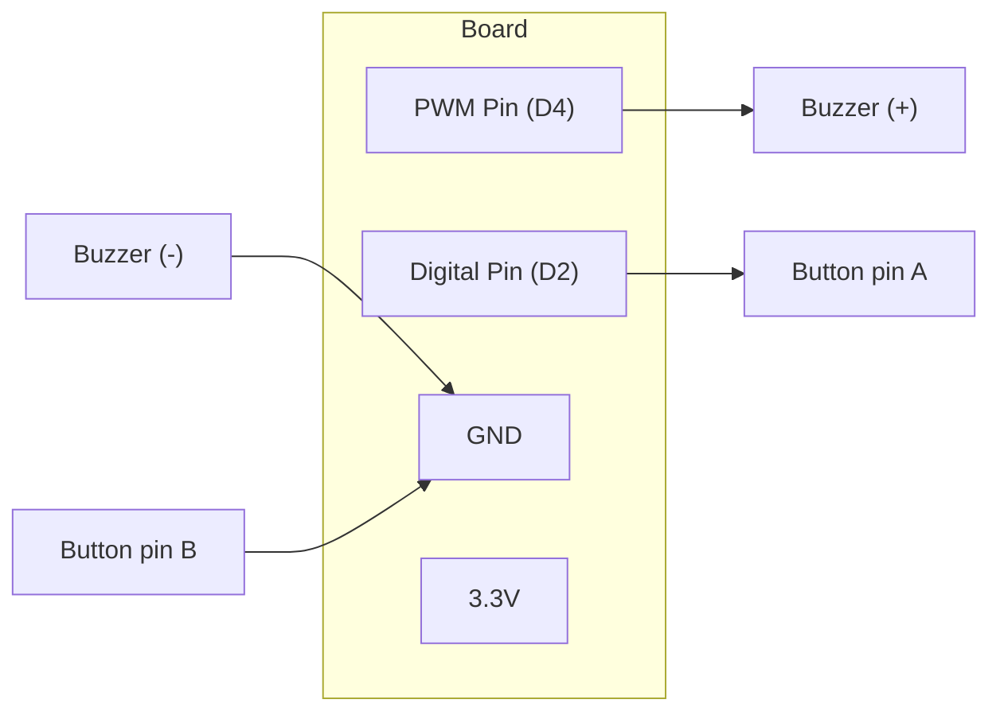

# Make It Sound

!!! info "Works with"
    Any CircuitPython board with a PWM pin — Trinket M0, Feather, Circuit Playground, Pico W, etc.

**Level: Starter**

Sound is the fastest way to make a project feel interactive. This project gets you from silence to melody in under ten minutes, using nothing but your board, a piezo buzzer, and a two-wire connection.

## What you'll build

A board that plays a C major scale at startup, then plays a 440 Hz tone every time you press a button. Once you have the pattern down, you can map any data — sensor readings, timers, game states — to sound.

## What you'll need

- Any CircuitPython board with at least one PWM-capable pin
- Piezo buzzer **or** small 8-ohm speaker (piezo is simpler; speaker sounds better)
- Momentary push button (optional, but recommended)
- Breadboard and jumper wires

If you are using a speaker instead of a piezo, add a 100-ohm resistor in series to protect the pin.

## Wiring

Connect the buzzer between a PWM pin and GND. Connect the button between a digital input pin and GND — the code uses the internal pull-up resistor, so no external resistor is needed.



Both the buzzer and the button share the same GND rail on the breadboard.

## The code

```python
import board
import time
import simpleio
import digitalio

button = digitalio.DigitalInOut(board.D2)
button.direction = digitalio.Direction.INPUT
button.pull = digitalio.Pull.UP

# Frequencies for a C major scale
notes = [262, 294, 330, 349, 392, 440, 494, 523]

# Play a startup melody
for freq in notes:
    simpleio.tone(board.D4, freq, duration=0.15)

while True:
    if not button.value:  # button pressed (pulled up, so False = pressed)
        simpleio.tone(board.D4, 440, duration=0.3)
        time.sleep(0.1)
```

Save this as `code.py` on your CIRCUITPY drive. The scale plays once at startup, then the button triggers a tone on every press.

## How it works

**PWM and sound.** PWM stands for Pulse Width Modulation. Instead of a constant voltage, the pin switches on and off rapidly. When you connect a buzzer to that pin, the physical element inside the buzzer vibrates at the same frequency as the switching. Human hearing detects that vibration as pitch. At 440 Hz — the note A4 — the pin switches 440 times per second.

**`simpleio.tone()`.** This function from the `simpleio` library handles the PWM setup for you. You give it three arguments: the pin, the frequency in Hz, and the duration in seconds. It blocks — meaning the code pauses while the tone plays — which is exactly what you want for simple melodies but something to think around when you need the board to do other things simultaneously.

**Pull-up buttons.** The button is wired between the digital pin and GND, with no resistor to any voltage source. Enabling `Pull.UP` internally connects the pin to 3.3V through a large resistor inside the microcontroller. When the button is open, the pin reads `True`. When you press the button and connect the pin to GND, it reads `False`. This is the standard "active low" pattern and you will see it everywhere in CircuitPython projects.

## Installing the library

You need `simpleio.mpy` from the Adafruit CircuitPython Bundle. Download the bundle for your CircuitPython version from [circuitpython.org/libraries](https://circuitpython.org/libraries), find `simpleio.mpy` in the `lib` folder, and copy it to the `lib` folder on your CIRCUITPY drive.

## Remix ideas

!!! tip "Remix idea"
    Map a distance sensor reading to pitch for a theremin. The closer your hand, the higher the note. See the [Distance Alert](../sensors/starter-distance-alert.md) project to learn the sensor side, then replace the LED with a `simpleio.tone()` call.

!!! tip "Remix idea"
    Graduate to Nokia-style RTTTL ringtones. The [Dial-a-Song](builder-dial-a-song.md) project uses the `adafruit_rtttl` library to play full tunes stored as text strings — no audio files needed.

!!! tip "Remix idea"
    Add lights that pulse with the music. Wire up a NeoPixel strip (see [First NeoPixel](../lights/starter-first-neopixel.md)) and change the pixel color each time a new note plays.

## Go deeper

- [simpleio tones reference](../../reference/audio/simpleio-tones.md)
- Adafruit guide: [https://learn.adafruit.com/make-it-sound](https://learn.adafruit.com/make-it-sound)

*Credit: Adafruit Learning System*
