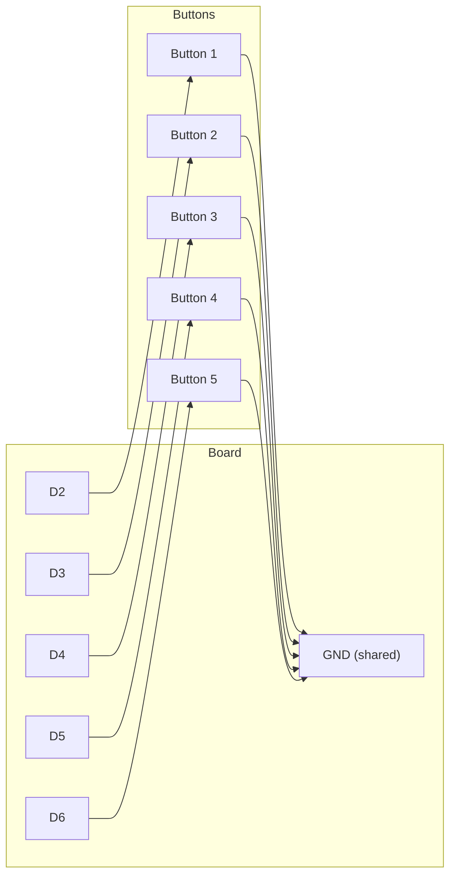

# Customizing USB Devices

!!! info "Works with"
    Any CircuitPython board with native USB

You already know your board can act as a keyboard. This project goes further: you
choose exactly which USB devices your board presents, lock down the CIRCUITPY drive so
the host computer cannot see or modify your code, and wire up several buttons each
sending a different key combination. The result is a dedicated macropad — a small,
purpose-built input device that belongs at any desk.

---

## What you will build

A multi-button macropad where each button fires a different shortcut or media command.
A `boot.py` file controls what USB interfaces the board exposes, and in its final form
the CIRCUITPY storage drive is hidden from the host so the device looks and acts exactly
like commercial hardware.

Example button layout:

| Button | Action |
|---|---|
| Button 1 | Ctrl+C (copy) |
| Button 2 | Ctrl+V (paste) |
| Button 3 | Ctrl+Z (undo) |
| Button 4 | Play / Pause (media key) |
| Button 5 | Volume Up |

---

## What you will need

- Any supported CircuitPython board with native USB
- 4-6 tactile push buttons
- Jumper wires
- Breadboard

---

## Wiring

Wire each button between a unique digital pin and GND. The code uses internal pull-up
resistors, so no external resistors are needed.



---

## The code

This project uses two files: `boot.py` runs once at startup before USB is initialized,
and `code.py` runs the main loop.

### boot.py

```python
import usb_hid
import storage

# Disable the CIRCUITPY USB drive so the host sees only HID devices.
# Remove or comment out the storage line during development — you need
# the drive visible to edit your files.
storage.disable_usb_drive()

# Enable only keyboard and consumer control (media keys).
# Remove Mouse if you do not need it to keep the device descriptor clean.
usb_hid.enable(
    (usb_hid.Device.KEYBOARD, usb_hid.Device.CONSUMER_CONTROL)
)
```

!!! warning "Hiding the drive locks you out of editing"
    Once `storage.disable_usb_drive()` is active, you cannot drag files onto CIRCUITPY
    from your computer. To re-enable it, hold a specific button while plugging in (add
    that logic to `boot.py` before disabling), or use the CircuitPython REPL over serial
    to delete `boot.py`. A safe pattern: check if a "safe mode" button is held at boot,
    and only disable the drive when it is not.

### code.py

```python
import board
import digitalio
import time
import usb_hid
from adafruit_hid.keyboard import Keyboard
from adafruit_hid.keycode import Keycode
from adafruit_hid.consumer_control import ConsumerControl
from adafruit_hid.consumer_control_code import ConsumerControlCode

keyboard = Keyboard(usb_hid.devices)
consumer = ConsumerControl(usb_hid.devices)

PINS = [board.D2, board.D3, board.D4, board.D5, board.D6]

buttons = []
for pin in PINS:
    btn = digitalio.DigitalInOut(pin)
    btn.direction = digitalio.Direction.INPUT
    btn.pull = digitalio.Pull.UP
    buttons.append(btn)

# Map each button index to an action.
# Each action is a tuple: ("keyboard", [modifier, key]) or ("consumer", code)
ACTIONS = [
    ("keyboard", [Keycode.CONTROL, Keycode.C]),           # Ctrl+C
    ("keyboard", [Keycode.CONTROL, Keycode.V]),           # Ctrl+V
    ("keyboard", [Keycode.CONTROL, Keycode.Z]),           # Ctrl+Z
    ("consumer", ConsumerControlCode.PLAY_PAUSE),         # Play/Pause
    ("consumer", ConsumerControlCode.VOLUME_INCREMENT),   # Volume Up
]

was_pressed = [False] * len(buttons)

while True:
    for i, btn in enumerate(buttons):
        pressed = not btn.value
        if pressed and not was_pressed[i]:
            action_type, action = ACTIONS[i]
            if action_type == "keyboard":
                keyboard.press(*action)
                keyboard.release_all()
            elif action_type == "consumer":
                consumer.press(action)
                consumer.release()
        was_pressed[i] = pressed
    time.sleep(0.02)
```

---

## How it works

### What boot.py is and why it runs before code.py

CircuitPython separates startup into two phases. `boot.py` runs before USB is
initialized — this is the only window in which you can change what USB devices the
board presents. By the time `code.py` runs, USB is already enumerated and the host has
been told what it is talking to. If you try to call `usb_hid.enable()` from `code.py`,
CircuitPython raises an error. Think of `boot.py` as the firmware configuration file
and `code.py` as the application.

### Why you might want to hide the CIRCUITPY drive

By default, your board appears as a USB drive alongside the HID interface. That is
useful during development, but it has two downsides for a finished device. First, the
OS may show a "new drive connected" dialog every time you plug in, which is annoying
for something used as a daily tool. Second, anyone with physical access to the computer
could browse or modify your code. Calling `storage.disable_usb_drive()` in `boot.py`
makes those files invisible to the host. The drive still exists — you can still access
it over the serial REPL — but from the USB enumeration perspective, the device is
purely HID. The result feels like a commercial product.

### Consumer Control codes for media keys

Standard keyboard keycodes cover letters, numbers, and modifier keys, but media
controls — volume, playback, brightness — live in a separate HID usage table called
Consumer Control. The `adafruit_hid` library exposes these through the
`ConsumerControl` class and `ConsumerControlCode` constants. You send them the same
way as regular keys: `press()` followed by `release()`. Common codes include
`PLAY_PAUSE`, `VOLUME_INCREMENT`, `VOLUME_DECREMENT`, `MUTE`, `SCAN_NEXT_TRACK`, and
`SCAN_PREVIOUS_TRACK`. Because Consumer Control is a separate HID interface, it needs
its own object — you cannot mix `ConsumerControlCode` values into a `Keyboard.press()`
call.

---

## Installing the library

Copy the entire `adafruit_hid` folder from the CircuitPython library bundle into
`CIRCUITPY/lib/`. You need these files inside that folder at minimum:

```
CIRCUITPY/lib/adafruit_hid/
├── keyboard.py
├── keycode.py
├── consumer_control.py
└── consumer_control_code.py
```

Get the bundle at [circuitpython.org/libraries](https://circuitpython.org/libraries)
and match the version to your installed CircuitPython.

---

## Remix ideas

!!! tip "Remix idea"
    Add a small OLED display that shows which "layer" the macropad is in — editing mode,
    browser mode, gaming mode. Holding a mode button shifts all the other buttons to a
    new set of shortcuts. See [OLED Hello World](../displays/starter-oled-hello.md) to
    get the display running first.

!!! tip "Remix idea"
    Replace the mechanical buttons with capacitive touch pads for a sleeker build. The
    wiring is simpler — no breadboard required. See
    [Touch to Keyboard](../sensors/starter-touch-keyboard.md) for how to read touch
    inputs with `touchio`.

!!! tip "Remix idea"
    Go further down the rabbit hole and define a custom HID report descriptor so your
    device presents axes and buttons in a layout that game engines can map directly.
    See [Custom HID Device](hacker-custom-hid.md).

---

## Go deeper

- [USB HID Reference](../../reference/usb/hid.md) — full `adafruit_hid` API, all
  Keycode and ConsumerControlCode values, and notes on `boot.py` restrictions
- [Customizing USB Devices in CircuitPython](https://learn.adafruit.com/customizing-usb-devices-in-circuitpython/overview)
  *Credit: Adafruit Learning System*
