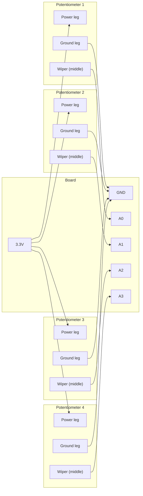

# USB MIDI Controller

!!! info "Works with"
    Any CircuitPython board with native USB — Feather M0/M4, Grand Central, RP2040 boards

Plug in your board, open GarageBand or Ableton, and your knobs are already mapped. No
driver installation. No pairing process. Just USB MIDI showing up exactly the way a
commercial controller would. This project wires up potentiometers to analog pins and
turns them into MIDI CC messages — the standard protocol that every DAW uses to record
and automate parameters.

---

## What you will build

A bank of knobs, each one controlling a MIDI CC channel. Turn knob 1 and it might
control reverb send. Turn knob 2 and it controls filter cutoff. What each CC number
does depends on how you configure your DAW, which means this controller works with any
software without modification. The board appears as a USB MIDI device the moment you
plug it in.

---

## What you will need

- CircuitPython board with at least 4 analog input pins (Feather M0/M4, Grand Central,
  RP2040 Feather, and many others work well; more analog pins means more knobs)
- 4-8 potentiometers (10k ohm linear taper recommended)
- Jumper wires
- Breadboard
- DAW software on your computer (GarageBand is free on macOS; LMMS is free on Windows
  and Linux; the browser-based MIDI monitor at webmiditest.com works for quick testing)

---

## Wiring

Each potentiometer has three pins: power (3.3V), ground, and the wiper (the middle
pin). The wiper connects to an analog input on your board. As you turn the knob, the
wiper voltage sweeps between 0 V and 3.3 V, and `analogio` reads that as a value from
0 to 65535.



---

## The code

Save this as `code.py`. It reads all four potentiometers, scales their values to the
MIDI CC range (0-127), and sends a CC message whenever a knob moves enough to matter.

```python
import board
import analogio
import time
import usb_midi
import adafruit_midi
from adafruit_midi.control_change import ControlChange

# Set up MIDI on USB
midi = adafruit_midi.MIDI(midi_out=usb_midi.ports[1], out_channel=0)

# Analog pins for the potentiometers
ANALOG_PINS = [board.A0, board.A1, board.A2, board.A3]

# MIDI CC numbers assigned to each knob (0-127 are valid CC numbers)
CC_NUMBERS = [74, 71, 91, 93]  # filter cutoff, resonance, reverb, chorus

# Initialize analog inputs
knobs = [analogio.AnalogIn(pin) for pin in ANALOG_PINS]

def read_cc(analog_in):
    """Read an analog pin and return a MIDI CC value 0-127."""
    return analog_in.value >> 9  # scale 0-65535 down to 0-127

# Track last-sent values to avoid flooding with identical messages
last_values = [None] * len(knobs)

while True:
    for i, knob in enumerate(knobs):
        value = read_cc(knob)
        if value != last_values[i]:
            midi.send(ControlChange(CC_NUMBERS[i], value))
            last_values[i] = value
    time.sleep(0.01)  # 100 Hz polling — fast enough, not excessive
```

---

## How it works

### MIDI CC messages: controller number and value

MIDI Control Change is a message type that carries two numbers: a controller number
(0-127) and a value (0-127). The controller number identifies what you are controlling
— CC 74 is traditionally filter cutoff, CC 7 is channel volume, CC 64 is sustain pedal
— but most DAWs let you override these mappings. When your DAW receives a CC message,
it looks up whether any parameter is "listening" on that controller number on that
channel and updates accordingly. This is how every hardware knob controller on the
market works, from budget units to expensive studio gear. Your CircuitPython board uses
the exact same protocol.

### Reading analog pins and scaling to 0-127

`analogio.AnalogIn.value` returns a 16-bit integer: 0 when the pin is at 0 V and 65535
when it is at the reference voltage (3.3 V on most boards). MIDI CC values are 7-bit
(0-127). To convert, you right-shift by 9 bits: `value >> 9` divides by 512, mapping
0-65535 to 0-127. This is equivalent to `value * 127 // 65535` but faster. The
conversion is lossy in the sense that 512 raw ADC steps map to each CC step, but for
knob control that resolution is more than enough — the human ear cannot distinguish
adjacent CC values on most parameters.

### Sending smooth MIDI without flooding

MIDI runs at 31,250 bits per second. A Control Change message is 3 bytes, so the
channel can handle roughly 1,000 CC messages per second before it starts backing up.
Polling 4 knobs at 100 Hz (100 times per second) generates at most 400 messages per
second in the worst case, which is well within budget. The real optimization in this
code is the `last_values` check: if the knob has not moved since the last poll, no
message is sent at all. This matters because analog reads are never perfectly stable —
the ADC will fluctuate by 1-2 counts even on a stationary knob, which would otherwise
produce a constant stream of identical messages. Only sending when the value actually
changes keeps the MIDI bus clean.

---

## Installing the library

You need two items from the CircuitPython library bundle:

- `adafruit_midi/` folder — copy the entire folder to `CIRCUITPY/lib/`

`usb_midi` is built into CircuitPython and does not need to be installed.

```
CIRCUITPY/lib/
└── adafruit_midi/
    ├── __init__.py
    ├── control_change.py
    ├── note_on.py
    ├── note_off.py
    └── ...
```

Get the bundle at [circuitpython.org/libraries](https://circuitpython.org/libraries).

---

## Remix ideas

!!! tip "Remix idea"
    Replace the potentiometers with a distance sensor, accelerometer, or flex sensor.
    Tilt the board to sweep a filter. Wave your hand over an ultrasonic sensor to control
    reverb amount. See [Gesture Control](../sensors/builder-gesture-control.md) for sensor
    wiring and reading techniques you can feed directly into the CC send loop.

!!! tip "Remix idea"
    Cut the cable. Boards with Bluetooth LE can send BLE MIDI, which iOS and macOS
    GarageBand support natively. The `adafruit_midi` library works the same way — you just
    swap the transport. See
    [BLE MIDI Controller](../wireless/ble/hacker-ble-midi-controller.md).

!!! tip "Remix idea"
    Add LEDs that pulse in sync with the parameter values you are sending — brighter as the
    CC value goes up, dimmer as it goes down. See
    [MIDI Visualizer](../lights/hacker-midi-visualizer.md) for integrating NeoPixels with
    the MIDI data stream.

---

## Go deeper

- [MIDI Reference](../../reference/audio/midi.md) — full `adafruit_midi` API, CC number
  reference chart, channel configuration, and SysEx notes
- [Grand Central USB MIDI Controller in CircuitPython](https://learn.adafruit.com/grand-central-usb-midi-controller-in-circuitpython/overview)
  *Credit: Adafruit Learning System*
