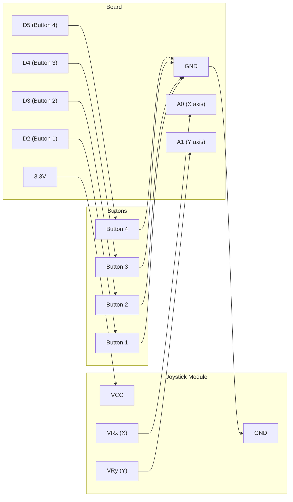

# Custom HID Device

!!! info "Works with"
    Any CircuitPython board with native USB — Feather M0/M4, RP2040 boards, Grand Central

The pre-built `adafruit_hid` classes cover keyboards, mice, gamepads, and media keys.
When you need something none of those describe — a 6-axis flight controller, a dial
with 64 detents, a button matrix that a game engine maps directly, a proprietary data
channel to a custom desktop app — you write your own HID report descriptor. This is
the lowest level of USB HID available in CircuitPython, and it gives you complete
control over what the OS sees.

---

## What you will build

A custom gamepad with two analog axes (left stick X and Y) and four buttons, defined
entirely by a descriptor you write in `boot.py`. Windows and macOS recognize it
natively through their generic HID drivers. No driver installation, no INF file, no
kernel module. The OS reads the descriptor you provide and knows exactly how to
interpret every byte your board sends.

---

## What you will need

- Any supported CircuitPython board with native USB
- 1 analog joystick module (two potentiometers on perpendicular axes, usually sold as
  a breakout or mounted on a small PCB with a click button)
- 4 tactile push buttons
- Jumper wires
- Breadboard

---

## Wiring

The joystick module exposes VCC, GND, X axis (analog), Y axis (analog), and an
optional SW (switch/click) pin. Wire both analog outputs to analog pins on your board.
Buttons go between digital pins and GND with internal pull-ups enabled in code.



---

## The code

This project requires two files. `boot.py` defines and registers the custom HID
descriptor. `code.py` reads the hardware and sends reports.

### boot.py

```python
import usb_hid

# HID report descriptor for a custom gamepad:
#   - 2 axes (X and Y), each 8-bit signed (-128 to 127)
#   - 4 buttons, packed into the low 4 bits of one byte
#   - 4 padding bits to fill the byte
#
# This descriptor tells the OS exactly how to parse every report your board sends.
GAMEPAD_DESCRIPTOR = bytes([
    0x05, 0x01,        # Usage Page (Generic Desktop)
    0x09, 0x05,        # Usage (Gamepad)
    0xA1, 0x01,        # Collection (Application)
    0x85, 0x04,        #   Report ID (4)  -- avoid conflicts with built-in devices

    # Buttons: 4 buttons, 1 bit each
    0x05, 0x09,        #   Usage Page (Button)
    0x19, 0x01,        #   Usage Minimum (Button 1)
    0x29, 0x04,        #   Usage Maximum (Button 4)
    0x15, 0x00,        #   Logical Minimum (0)
    0x25, 0x01,        #   Logical Maximum (1)
    0x75, 0x01,        #   Report Size (1 bit)
    0x95, 0x04,        #   Report Count (4)
    0x81, 0x02,        #   Input (Data, Variable, Absolute)

    # Padding: 4 bits to fill the byte
    0x75, 0x04,        #   Report Size (4 bits)
    0x95, 0x01,        #   Report Count (1)
    0x81, 0x03,        #   Input (Constant) -- padding

    # Axes: X and Y, 8-bit signed
    0x05, 0x01,        #   Usage Page (Generic Desktop)
    0x09, 0x30,        #   Usage (X)
    0x09, 0x31,        #   Usage (Y)
    0x15, 0x81,        #   Logical Minimum (-127)
    0x25, 0x7F,        #   Logical Maximum (127)
    0x75, 0x08,        #   Report Size (8 bits)
    0x95, 0x02,        #   Report Count (2)
    0x81, 0x02,        #   Input (Data, Variable, Absolute)

    0xC0,              # End Collection
])

custom_gamepad = usb_hid.Device(
    report_descriptor=GAMEPAD_DESCRIPTOR,
    usage_page=0x01,        # Generic Desktop
    usage=0x05,             # Gamepad
    report_ids=(4,),        # Must match Report ID in descriptor
    in_report_lengths=(3,), # 1 byte buttons + 2 bytes axes = 3 bytes
    out_report_lengths=(0,),
)

# Enable only our custom device (plus keyboard if you want both)
usb_hid.enable((custom_gamepad,))
```

### code.py

```python
import board
import analogio
import digitalio
import time
import usb_hid

# Find our custom device by usage page and usage
def find_device(usage_page, usage):
    for device in usb_hid.devices:
        if device.usage_page == usage_page and device.usage == usage:
            return device
    raise ValueError("Custom HID device not found — check boot.py")

gamepad = find_device(0x01, 0x05)

# Analog axes
x_axis = analogio.AnalogIn(board.A0)
y_axis = analogio.AnalogIn(board.A1)

# Buttons
BUTTON_PINS = [board.D2, board.D3, board.D4, board.D5]
buttons = []
for pin in BUTTON_PINS:
    btn = digitalio.DigitalInOut(pin)
    btn.direction = digitalio.Direction.INPUT
    btn.pull = digitalio.Pull.UP
    buttons.append(btn)

def read_axis(analog_in):
    """Scale 0-65535 to -127..127 (signed 8-bit)."""
    return (analog_in.value >> 8) - 127

def build_report():
    # Byte 0: button bits in low nibble, padding in high nibble
    btn_byte = 0
    for i, btn in enumerate(buttons):
        if not btn.value:          # active low
            btn_byte |= (1 << i)

    x = read_axis(x_axis) & 0xFF  # mask to unsigned byte for packing
    y = read_axis(y_axis) & 0xFF

    return bytes([btn_byte, x, y])

last_report = None

while True:
    report = build_report()
    if report != last_report:
        gamepad.send_report(report, report_id=4)
        last_report = report
    time.sleep(0.01)
```

---

## How it works

### What an HID report descriptor is and why it matters

When a USB HID device enumerates, it sends the host a report descriptor — a compact
binary document that describes every piece of data the device will send and receive.
The descriptor uses a tag-length-value encoding defined by the USB HID specification.
It declares things like: "I have 4 buttons, each is 1 bit, values 0 or 1" and "I have
2 axes, each is 8 bits signed, ranging from -127 to 127." The OS parses this once at
connection time and uses it to interpret every subsequent report without any further
negotiation. This is why HID devices need no drivers: the host already knows the
protocol from the descriptor alone. Writing your own descriptor means you control
exactly how many bytes each report is, what each bit means, and how the OS labels
each control in its device manager.

### The boot.py / code.py split for USB configuration

USB enumeration happens before any user code runs. The moment the board gets power
(or is reset), the USB controller negotiates with the host and presents its device
descriptors. By the time `code.py` starts executing, that negotiation is complete and
cannot be changed. `boot.py` runs in the narrow window before USB is initialized,
which makes it the only place you can call `usb_hid.enable()` with a custom device.
If you change `boot.py`, you must unplug and replug the board (or fully reset it) for
the new descriptor to take effect — a soft reboot from the REPL is not sufficient
because the USB controller does not re-enumerate on soft reset.

### Reading the HID specification

The HID descriptor byte sequences look cryptic, but each pair of bytes follows a
simple pattern: a one-byte tag that names what is being described, followed by the
value. The USB HID usage tables document (freely available from usb.org) lists every
valid Usage Page and Usage number. A tool like `hidapitester` or the online HID
descriptor tool at usb.org lets you paste descriptor bytes and see a human-readable
breakdown of what they mean. When something is not working — the OS sees the device
but axes are reversed, or buttons do not map correctly — compare your descriptor to the
decoded output and look for mismatched logical minimum/maximum values or incorrect
report counts. The descriptor is the source of truth; the OS will faithfully
misinterpret your data if your descriptor is wrong.

---

## Installing libraries

No additional libraries are required beyond what is built into CircuitPython. The
`usb_hid` module is part of the core firmware. If you want to combine this with
keyboard output, copy `adafruit_hid/` to `CIRCUITPY/lib/` as described in the
[keyboard project](starter-hid-keyboard.md).

---

## Remix ideas

!!! tip "Remix idea"
    Add a small motor driver and send force feedback data from the game engine back to
    your board over the HID output report. This requires adding an output report to the
    descriptor. See [Haptic Feedback](../motors/hacker-haptic-feedback.md) for the
    motor side of that project.

!!! tip "Remix idea"
    Use your custom gamepad descriptor as a data channel to a desktop app written in
    Python (using the `hid` PyPI package) or in any language with USB HID support.
    The [USB HID Reference](../../reference/usb/hid.md) has notes on reading HID reports
    from the host side.

!!! tip "Remix idea"
    Combine HID over BLE instead of USB. The descriptor format is identical — you use
    the same bytes — but the transport is Bluetooth. Boards with a BTLE radio can
    present a wireless gamepad to phones, tablets, and computers that support BLE HID.
    See [BLE Keyboard](../wireless/ble/builder-ble-keyboard.md) for the BLE transport
    setup, then swap in your custom descriptor.

---

## Go deeper

- [USB HID Reference](../../reference/usb/hid.md) — descriptor encoding details,
  `usb_hid.Device` API, report ID rules, and links to the official HID usage tables
- [Custom HID Devices in CircuitPython](https://learn.adafruit.com/custom-hid-devices-in-circuitpython/overview)
  *Credit: Adafruit Learning System*
