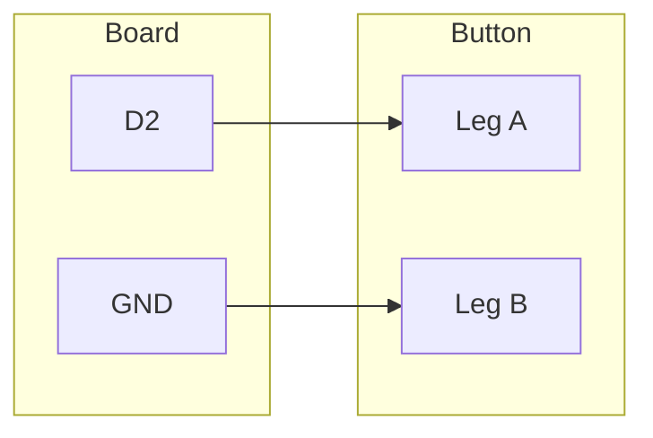

# Your Board as a Keyboard

!!! info "Works with"
    Any CircuitPython board with native USB — Trinket M0, Feather M0/M4, Circuit Playground
    Express, ItsyBitsy, RP2040 boards

Plug your board into a computer, press a button, and watch it type. That is the whole
idea. It sounds like a party trick, but the moment you see it work you start thinking
about everything else it unlocks: shortcut launchers, accessibility devices, automated
form fillers, prank keyboards. This project gets you there in under 30 minutes.

---

## What you will build

A single tactile button wired to your board. Press it and the board types a phrase into
whatever application is active — a text editor, a browser URL bar, a chat window.
Release and press again and it types again. The computer has no idea a microcontroller
is involved; it just sees a USB keyboard.

---

## What you will need

- Any supported CircuitPython board (see the board list on the [USB Tricks overview](index.md))
- 1x tactile push button
- Jumper wires
- Breadboard (optional but recommended)
- USB cable
- A computer with a text editor open to test

---

## Wiring

Connect one leg of the button to a digital pin on your board and the other leg to GND.
The code enables the internal pull-up resistor, so no external resistor is needed.

The diagram below uses pin D2, but any digital pin works — just update `board.D2` in
the code to match.



---

## The code

Save this as `code.py` on your CIRCUITPY drive.

```python
import board
import digitalio
import time
import usb_hid
from adafruit_hid.keyboard import Keyboard
from adafruit_hid.keyboard_layout_us import KeyboardLayoutUS

keyboard = Keyboard(usb_hid.devices)
layout = KeyboardLayoutUS(keyboard)

button = digitalio.DigitalInOut(board.D2)
button.direction = digitalio.Direction.INPUT
button.pull = digitalio.Pull.UP

while True:
    if not button.value:
        layout.write("Hello from CircuitPython!")
        time.sleep(0.5)  # debounce
```

Open a text editor on your computer before running this. Click into the editor so it
has focus, then press the button. You should see the phrase appear instantly.

---

## How it works

### USB HID and how the OS sees your board

When CircuitPython starts, it initializes USB and announces to the operating system what
kind of device it is. By default, every native-USB CircuitPython board includes a HID
interface alongside the CIRCUITPY storage drive and the serial console. The HID interface
declares itself as a combination keyboard and mouse, which is why the OS does not need
any driver — it already has a generic HID driver loaded for your actual keyboard.

From the computer's perspective, a second keyboard appeared when you plugged in the
board. Everything you send through `adafruit_hid` gets delivered to the focused
application exactly as if a person typed it.

### `keyboard_layout.write()` vs `Keyboard.press()` and `release()`

`layout.write("Hello!")` is the convenient high-level method. It takes a string, figures
out which keys to press and release (including shift for capital letters and symbols),
and sends the whole sequence. It handles the translation from characters to keycodes
for you.

`Keyboard.press(Keycode.A)` and `Keyboard.release(Keycode.A)` are the low-level
primitives. They give you precise control: you can hold down modifier keys like Ctrl or
Cmd while pressing another key, which is how you send shortcuts like Ctrl+C or
Cmd+Tab. For typing plain text, `layout.write()` is easier. For shortcuts and key
combinations, use `press()` and `release()` directly.

### Debouncing

Mechanical buttons do not switch cleanly. When you press one, the contacts bounce
against each other several times in the first millisecond, producing a burst of
on/off signals instead of one clean transition. Without debouncing, a single press
could register as dozens of keystrokes. The `time.sleep(0.5)` after each write pauses
the loop long enough that the button has settled and your finger has likely lifted
before the code checks again. Half a second is conservative; for a faster-feeling
response you can drop it to 0.2 seconds. For more sophisticated debouncing that
detects the press edge rather than polling in a loop, look into the
`keypad` module built into CircuitPython.

---

## Installing the library

The `adafruit_hid` library is a folder, not a single file. Copy the entire
`adafruit_hid` folder from the CircuitPython library bundle into the `lib` folder on
your CIRCUITPY drive.

Download the library bundle for your CircuitPython version from
[circuitpython.org/libraries](https://circuitpython.org/libraries). Unzip it, find
`adafruit_hid`, and drag it to `CIRCUITPY/lib/`.

Your drive structure should look like this:

```
CIRCUITPY/
├── code.py
└── lib/
    └── adafruit_hid/
        ├── __init__.py
        ├── keyboard.py
        ├── keyboard_layout_us.py
        ├── keycode.py
        └── ...
```

---

## Remix ideas

!!! tip "Remix idea"
    Wire up three or four buttons and map each one to a different keyboard shortcut —
    Ctrl+C, Ctrl+V, Ctrl+Z, and a custom phrase. That is the foundation of a macropad.
    The next step is [Customizing USB Devices](builder-customizing-usb.md), which shows
    you how to add modifier keys and media controls.

!!! tip "Remix idea"
    Skip the button entirely and trigger keystrokes from a touch pad or capacitive sensor.
    See [Touch to Keyboard](../sensors/starter-touch-keyboard.md) for the wiring and code.

!!! tip "Remix idea"
    Cut the USB cable and do this wirelessly. Boards with Bluetooth LE can act as BLE HID
    keyboards. See [BLE Keyboard](../wireless/ble/builder-ble-keyboard.md) when you are
    ready to go cordless.

---

## Go deeper

- [USB HID Reference](../../reference/usb/hid.md) — full API documentation for
  `adafruit_hid`, all Keycode values, Consumer Control codes, and report descriptor details
- [Adafruit Trinket M0: CircuitPython HID Keyboard and Mouse](https://learn.adafruit.com/adafruit-trinket-m0-circuitpython-arduino/circuitpython-hid-keyboard-and-mouse)
  *Credit: Adafruit Learning System*
- [CircuitPython Essentials: HID Keyboard and Mouse](https://learn.adafruit.com/circuitpython-essentials/circuitpython-hid-keyboard-and-mouse)
  *Credit: Adafruit Learning System*
