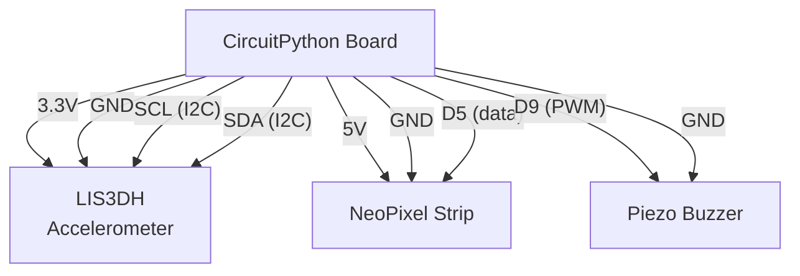

# Motion-Triggered Alarm System

!!! info "Works with"
    Any CircuitPython board with I2C and PWM — Feather M0/M4, ItsyBitsy M4, Trinket M0, RP2040 boards, Circuit Playground Express/Bluefruit

**Libraries used:** `adafruit_lis3dh` · `adafruit_led_animation` · `simpleio`

---

## What you will build

A small box that sits quietly until something disturbs it — a tap, a knock, or someone picking it up. The moment the LIS3DH accelerometer detects movement above a threshold, NeoPixels erupt into a strobing red animation and a buzzer screams a repeating tone. Reset it with the reset button or add a key switch for a more theatrical effect.

This is not a toy sensor demo. It is a complete, deployed alarm — the kind of thing you could tape inside a locker, mount on a door, or install on a project box at a science fair to deter tampering.

---

## Parts list

| Part | Notes |
|------|-------|
| CircuitPython board with I2C and PWM | Feather M4 Express recommended |
| LIS3DH accelerometer breakout | Adafruit #2809 |
| NeoPixel strip or ring | 8–16 pixels works well |
| Passive piezo buzzer | 3–5V, any generic |
| STEMMA QT / Qwiic cable or breadboard jumpers | For I2C wiring |
| Small enclosure or project box | Optional but satisfying |
| USB cable + power source | |

---

## Wiring



!!! tip
    The LIS3DH can also connect via STEMMA QT if your board has a QT port — no breadboard needed.

---

## Complete code

```python
import time
import board
import busio
import neopixel
import simpleio
import adafruit_lis3dh
from adafruit_led_animation.animation.strobe import Strobe
from adafruit_led_animation.color import RED, BLACK
from adafruit_led_animation.sequence import AnimationSequence

# --- Hardware setup ---
i2c = busio.I2C(board.SCL, board.SDA)
lis3dh = adafruit_lis3dh.LIS3DH_I2C(i2c)

# Sensitivity: 0 = most sensitive, higher = less sensitive
# Try values between 10 and 40 — start at 20 and adjust
MOTION_THRESHOLD = 20
lis3dh.set_tap(1, MOTION_THRESHOLD)  # single tap detection

PIXEL_PIN = board.D5
NUM_PIXELS = 8
BUZZER_PIN = board.D9

pixels = neopixel.NeoPixel(PIXEL_PIN, NUM_PIXELS, brightness=1.0, auto_write=False)

# LED animation
strobe = Strobe(pixels, speed=0.05, color=RED, period=0.5)

# Alarm state
alarm_active = False
alarm_start = 0
ALARM_DURATION = 5  # seconds


def trigger_alarm():
    global alarm_active, alarm_start
    alarm_active = True
    alarm_start = time.monotonic()
    print("ALARM TRIGGERED")


def silence_alarm():
    global alarm_active
    alarm_active = False
    pixels.fill(BLACK)
    pixels.show()


print("Alarm system armed. Waiting...")

while True:
    # Check for tap / motion
    if lis3dh.tapped and not alarm_active:
        trigger_alarm()

    if alarm_active:
        elapsed = time.monotonic() - alarm_start

        # Drive the strobe animation
        strobe.animate()

        # Buzzer: 880 Hz tone in 0.1 s bursts
        simpleio.tone(BUZZER_PIN, 880, duration=0.1)
        time.sleep(0.05)
        simpleio.tone(BUZZER_PIN, 1100, duration=0.1)
        time.sleep(0.05)

        # Auto-silence after ALARM_DURATION seconds
        if elapsed >= ALARM_DURATION:
            silence_alarm()
            print("Alarm silenced. Re-arming...")
            time.sleep(2)  # brief pause before re-arming

    else:
        # Idle: check sensor frequently
        time.sleep(0.05)
```

---

## How it works

### Motion detection with LIS3DH

The LIS3DH is a three-axis accelerometer that can detect both continuous motion and discrete tap events in hardware. Calling `set_tap(1, threshold)` programs the chip to raise an interrupt flag whenever a single-tap acceleration spike exceeds the threshold value. In CircuitPython, you read that flag by checking `lis3dh.tapped` — it returns `True` once per tap event and then resets. The threshold is in raw units from 0 to 127; lower values mean the sensor fires on gentler disturbances. A value around 20 detects a firm tap on the desk but ignores ordinary vibration.

### LED animation with adafruit_led_animation

The `adafruit_led_animation` library manages animations as objects you create once and then call `.animate()` on inside your main loop. The `Strobe` animation flashes the pixels on and off at a rate controlled by `speed` and `period`. Because `.animate()` is non-blocking and tracks its own timing with `time.monotonic()`, you can call it on every iteration of the loop without using `time.sleep()` — which is important here because the buzzer also needs to run at the same time.

### Tone generation with simpleio

`simpleio.tone(pin, frequency, duration)` drives a PWM signal at the given frequency for the given duration in seconds. It blocks for that duration, which is why the tones are kept short (0.1 s each). The alternating 880 Hz and 1100 Hz tones create a classic two-note alarm pattern. Any passive piezo buzzer will work; active buzzers have a fixed internal frequency and will not respond to the frequency argument.

---

## Remix ideas

!!! tip "Remix idea"
    **Send an SMS alert over WiFi.** When the alarm triggers, post to Adafruit IO over WiFi and use IFTTT or Adafruit IO actions to send yourself a text message. See [Adafruit IO Basics](../wireless/wifi/starter-adafruit-io-basics.md) to get started.

!!! tip "Remix idea"
    **Silence the alarm from your phone.** Add BLE so you can send a "disarm" command wirelessly. The [BLE Keyboard / HID builder](../wireless/ble/builder-ble-keyboard.md) shows you how to set up a BLE UART service that you can repurpose for any command.

!!! tip "Remix idea"
    **Start simpler.** If this project feels like a lot at once, the [Motion Alarm builder page](../sensors/builder-motion-alarm.md) walks through just the LIS3DH side of things — no animation library, no buzzer — so you can get comfortable with the sensor first.

---

## Go deeper

All three libraries used in this project have their own reference pages with additional examples, configuration options, and troubleshooting tips.

- [LIS3DH accelerometer reference](../../reference/sensors/lis3dh.md)
- [adafruit_led_animation reference](../../reference/lights/led-animation.md)
- [simpleio reference](../../reference/audio/simpleio-tones.md)
