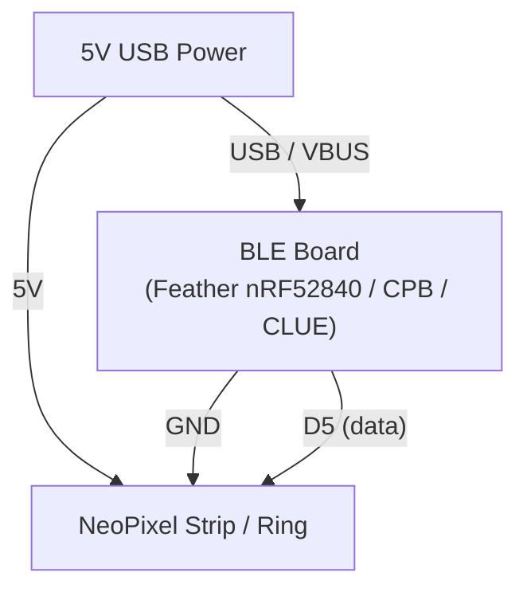

# BLE Light Controller

!!! info "Works with"
    BLE-capable boards — Adafruit Feather nRF52840 Express, Circuit Playground Bluefruit, CLUE

**Libraries used:** `adafruit_ble` · `adafruit_led_animation` · `adafruit_bluefruit_connect`

---

## What you will build

A NeoPixel controller you run entirely from your phone. Open the free Bluefruit LE Connect app (iOS or Android), connect to your board, and use the Color Picker to set any color or the Control Pad to switch between animation effects — all over Bluetooth Low Energy. No USB cable, no WiFi, no server. Just two devices talking directly to each other.

The board runs a BLE UART service and listens for structured "packets" that the Bluefruit app sends. When it receives a color packet, the pixels change color. When it receives a button packet, the animation switches. The whole thing runs in a tight, responsive main loop.

---

## Parts list

| Part | Notes |
|------|-------|
| BLE-capable CircuitPython board | Feather nRF52840, Circuit Playground Bluefruit, or CLUE |
| NeoPixel strip, ring, or strand | 8–30 pixels, 5V data |
| 5V power source | USB power or LiPo + regulator for portable use |
| Level shifter (optional) | Some strips need 5V data; most work fine from 3.3V |
| Bluefruit LE Connect app | Free — iOS App Store or Google Play |

---

## Wiring



!!! tip
    If you are using a Circuit Playground Bluefruit, the 10 onboard NeoPixels are already wired — use `board.NEOPIXEL` as the pixel pin and set `NUM_PIXELS = 10`. No external wiring needed.

---

## Complete code

```python
import board
import neopixel
from adafruit_ble import BLERadio
from adafruit_ble.advertising.standard import ProvideServicesAdvertisement
from adafruit_ble.services.nordic import UARTService
from adafruit_bluefruit_connect.packet import Packet
from adafruit_bluefruit_connect.color_packet import ColorPacket
from adafruit_bluefruit_connect.button_packet import ButtonPacket
from adafruit_led_animation.animation.solid import Solid
from adafruit_led_animation.animation.blink import Blink
from adafruit_led_animation.animation.chase import Chase
from adafruit_led_animation.animation.rainbow import Rainbow
from adafruit_led_animation.animation.rainbowchase import RainbowChase
from adafruit_led_animation.sequence import AnimationSequence
from adafruit_led_animation.color import RED, WHITE

# --- NeoPixel setup ---
PIXEL_PIN = board.D5
NUM_PIXELS = 8
pixels = neopixel.NeoPixel(PIXEL_PIN, NUM_PIXELS, brightness=0.3, auto_write=False)

# --- Animations ---
solid      = Solid(pixels, color=RED)
blink_anim = Blink(pixels, speed=0.5, color=RED)
chase      = Chase(pixels, speed=0.1, color=RED, size=3)
rainbow    = Rainbow(pixels, speed=0.1, period=2)
rainbow_ch = RainbowChase(pixels, speed=0.1)

ANIMATIONS = [solid, blink_anim, chase, rainbow, rainbow_ch]
current_anim_index = 0
current_color = RED

# --- BLE setup ---
ble = BLERadio()
uart_service = UARTService()
advertisement = ProvideServicesAdvertisement(uart_service)


def set_color(color):
    """Apply a new color to all color-aware animations."""
    global current_color
    current_color = color
    solid.color      = color
    blink_anim.color = color
    chase.color      = color


def current_animation():
    return ANIMATIONS[current_anim_index]


print("BLE Light Controller ready. Advertising...")

while True:
    # Advertise until a phone connects
    ble.start_advertising(advertisement)
    while not ble.connected:
        pass
    ble.stop_advertising()
    print("Connected!")

    while ble.connected:
        # Run one frame of the active animation
        current_animation().animate()

        # Check for incoming BLE packets (non-blocking)
        if uart_service.in_waiting:
            try:
                packet = Packet.from_stream(uart_service)
            except Exception:
                continue

            if isinstance(packet, ColorPacket):
                set_color(packet.color)
                print(f"Color: {packet.color}")

            elif isinstance(packet, ButtonPacket) and packet.pressed:
                if packet.button == ButtonPacket.BUTTON_1:
                    current_anim_index = 0   # Solid
                elif packet.button == ButtonPacket.BUTTON_2:
                    current_anim_index = 1   # Blink
                elif packet.button == ButtonPacket.BUTTON_3:
                    current_anim_index = 2   # Chase
                elif packet.button == ButtonPacket.BUTTON_4:
                    current_anim_index = 3   # Rainbow
                elif packet.button == ButtonPacket.RIGHT:
                    pixels.brightness = min(1.0, pixels.brightness + 0.1)
                elif packet.button == ButtonPacket.LEFT:
                    pixels.brightness = max(0.05, pixels.brightness - 0.1)
                print(f"Button: {packet.button}")

    print("Disconnected. Re-advertising...")
    pixels.fill((0, 0, 0))
    pixels.show()
```

---

## How it works

### The Bluefruit LE Connect protocol

Bluefruit LE Connect is Adafruit's free companion app that communicates over a Nordic UART BLE service — essentially a transparent serial pipe over Bluetooth. The app sends structured binary "packets" rather than raw text. Each packet starts with a `!` byte and a type byte, followed by payload data and a checksum. The `adafruit_bluefruit_connect` library handles all the parsing: `Packet.from_stream()` reads bytes from the UART service, validates the checksum, and returns a typed packet object. You never have to parse raw bytes yourself.

### ColorPacket and ButtonPacket

`ColorPacket` carries an RGB tuple — exactly the `(r, g, b)` format that NeoPixels and `adafruit_led_animation` expect. `ButtonPacket` carries a button identifier (1–4 or a direction) and a boolean for whether it was pressed or released. The app's Color Picker sends `ColorPacket` whenever you tap a color. The Control Pad sends `ButtonPacket` for each button press and release. By checking `packet.pressed` before acting on a `ButtonPacket`, you respond only to the press event and ignore the release — preventing double-triggers.

### Running animations while polling BLE

The key design choice in the main loop is that `current_animation().animate()` is called on every iteration before checking for BLE input. The `adafruit_led_animation` animations are non-blocking — each call to `.animate()` advances the animation by one frame if enough time has passed (based on `time.monotonic()`), then returns immediately. This means the animation keeps running smoothly even while the board is waiting for input, and BLE input is checked on every loop iteration so latency stays low. The `uart_service.in_waiting` check avoids blocking on an empty receive buffer.

---

## Remix ideas

!!! tip "Remix idea"
    **Build a BLE MIDI controller.** Swap the NeoPixel output for MIDI note messages and turn the phone buttons into instrument triggers. The [BLE MIDI Controller hacker page](../wireless/ble/hacker-ble-midi-controller.md) walks through the MIDI BLE service.

!!! tip "Remix idea"
    **Make a reactive wearable.** Sew the board and a NeoPixel strip into a jacket. The colors respond to phone input while you wear it. The [Reactive Wearable hacker page](../lights/hacker-reactive-wearable.md) covers the wearable construction side.

!!! tip "Remix idea"
    **Add a BLE keyboard shortcut layer.** Use the same BLE UART service to also send keyboard HID events when specific buttons are held. The [BLE Keyboard builder](../wireless/ble/builder-ble-keyboard.md) shows how to layer HID onto a BLE connection.

---

## Go deeper

- [adafruit_ble reference](../../reference/wireless/ble/adafruit-ble.md)
- [adafruit_led_animation reference](../../reference/lights/led-animation.md)
- [adafruit_bluefruit_connect reference](../../reference/wireless/ble/adafruit-ble.md)
