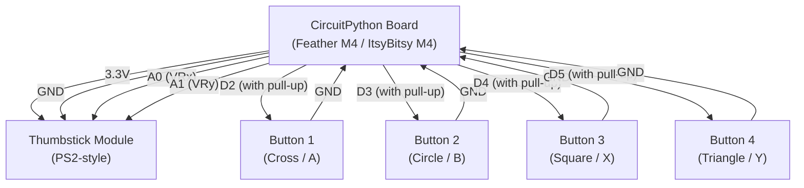

# USB Game Controller

!!! info "Works with"
    Any CircuitPython board with native USB and analog inputs — Feather M0/M4, ItsyBitsy M0/M4, ItsyBitsy RP2040, Feather RP2040

**Libraries used:** `adafruit_hid` · `adafruit_debouncer` · `analogio`

---

## What you will build

A fully custom USB gamepad with a two-axis thumbstick and four buttons. Plug it into any computer and the OS recognizes it instantly as a standard HID gamepad — no drivers, no setup, no configuration. Open a browser game, go to the controller settings, and your axes and buttons are already there.

This is a real gamepad in the sense that matters: Windows, macOS, and Linux all see it as a legitimate input device, calibrate it automatically, and pass its events to any application. You built the hardware, you wrote the firmware, and it just works.

---

## Parts list

| Part | Notes |
|------|-------|
| CircuitPython board with native USB + 2 analog inputs | Feather M4 Express or ItsyBitsy M4 recommended |
| 2-axis thumbstick module | Generic PS2-style, 3.3V compatible |
| Momentary push buttons (×4) | 6mm tactile or arcade-style |
| 10 kΩ resistors (×4) | Pull-downs for buttons (or use internal pull-ups) |
| Breadboard + jumper wires | |
| USB cable | |

---

## Wiring



!!! tip
    Use `digitalio.Direction.INPUT` with `pull=digitalio.Pull.UP` on each button pin — then button pressed = `False`. No external resistors needed.

---

## Complete code

```python
import time
import board
import analogio
import digitalio
import usb_hid
from adafruit_hid.gamepad import Gamepad
from adafruit_debouncer import Debouncer

# --- Gamepad HID device ---
gp = Gamepad(usb_hid.devices)

# --- Thumbstick (analog) ---
axis_x = analogio.AnalogIn(board.A0)
axis_y = analogio.AnalogIn(board.A1)

# --- Buttons (digital with debouncer) ---
BUTTON_PINS = [board.D2, board.D3, board.D4, board.D5]
raw_buttons = []
for pin in BUTTON_PINS:
    p = digitalio.DigitalInOut(pin)
    p.direction = digitalio.Direction.INPUT
    p.pull = digitalio.Pull.UP
    raw_buttons.append(p)

buttons = [Debouncer(b) for b in raw_buttons]

# HID button numbers (1-indexed for adafruit_hid)
BUTTON_NUMS = [1, 2, 3, 4]

DEADZONE = 2000   # Raw ADC units — ignore tiny stick drift near center
CENTER   = 32767  # Midpoint of 16-bit ADC range


def adc_to_joystick(raw):
    """Map 0–65535 ADC reading to -127–127 joystick range with deadzone."""
    offset = raw - CENTER
    if abs(offset) < DEADZONE:
        return 0
    # Scale remaining range to -127..127
    scaled = int(offset / CENTER * 127)
    return max(-127, min(127, scaled))


print("USB Gamepad ready.")

while True:
    # Read and map analog axes
    x = adc_to_joystick(axis_x.value)
    y = adc_to_joystick(axis_y.value)
    gp.move_joysticks(x=x, y=y)

    # Update debouncers and send button events
    for i, btn in enumerate(buttons):
        btn.update()
        num = BUTTON_NUMS[i]
        if btn.fell:        # just pressed (active-low: fell = pressed)
            gp.press_buttons(num)
            print(f"Button {num} pressed")
        elif btn.rose:      # just released
            gp.release_buttons(num)
            print(f"Button {num} released")

    time.sleep(0.01)   # ~100 Hz polling rate
```

---

## How it works

### USB HID gamepad descriptor

When CircuitPython boots on a native-USB board, the `usb_hid` module advertises a set of HID descriptors to the host computer. The `adafruit_hid` library includes a pre-built `Gamepad` descriptor that declares two analog axes and eight buttons. The host OS reads this descriptor during enumeration and creates a gamepad device entry — that is why you see it in Windows Game Controllers or macOS's USB device list without installing anything. `gp.move_joysticks()` and `gp.press_buttons()` write reports into a 64-byte HID input report buffer that the OS polls at USB full-speed rates (up to 125 Hz).

### Analog thumbstick reading and deadzone

`analogio.AnalogIn` returns a 16-bit unsigned value (0–65535) proportional to the voltage on the pin. A centered thumbstick rests near the midpoint (around 32767) but rarely sits exactly there — electrical noise and mechanical tolerance mean there is always a small drift signal even when you are not touching it. The `adc_to_joystick()` function subtracts the center value, ignores anything smaller than `DEADZONE` raw units, and then scales the remainder to the −127–127 range expected by `Gamepad.move_joysticks()`. Adjust `DEADZONE` up if the cursor drifts, down if the stick feels sluggish near center.

### Debounced buttons

Mechanical buttons bounce — when the contacts close, they make and break contact dozens of times in a few milliseconds before settling. Without debouncing, a single press can register as many rapid presses. `adafruit_debouncer.Debouncer` wraps any digital input and requires the signal to be stable for a short window (default 10 ms) before reporting a state change. `btn.fell` is `True` for exactly one loop iteration when the button transitions from released to pressed (active-low: the pin voltage falls). `btn.rose` is `True` when it transitions back. This gives you clean, single-event press and release detection with no extra hardware.

---

## Remix ideas

!!! tip "Remix idea"
    **Add more axes and buttons.** A real gamepad has triggers, a second thumbstick, bumpers, and a d-pad. The [Custom HID hacker page](../usb-tricks/hacker-custom-hid.md) shows you how to write your own HID descriptor with up to 8 axes and 16 buttons.

!!! tip "Remix idea"
    **Control it with gestures.** Replace the thumbstick with an IMU (accelerometer + gyroscope) and tilt the board to move. The [Gesture Control builder](../sensors/builder-gesture-control.md) covers the sensor setup — swap the joystick output code for the same `gp.move_joysticks()` call.

!!! tip "Remix idea"
    **Go wireless.** Swap to an nRF52840-based board and use BLE HID instead of USB HID. The [BLE Keyboard builder](../wireless/ble/builder-ble-keyboard.md) covers the BLE HID stack — the button and axis reading code carries over unchanged.

---

## Go deeper

- [adafruit_hid reference](../../reference/usb/hid.md)
- [adafruit_debouncer reference](../../reference/utilities/debouncer.md)
- [analogio reference](../../reference/utilities/simpleio.md)
