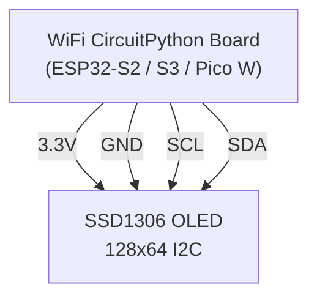

# Internet Clock

!!! info "Works with"
    WiFi-capable boards with a display — Adafruit Feather ESP32-S2/S3 + TFT FeatherWing, Raspberry Pi Pico W + SSD1306, Adafruit PyPortal

**Libraries used:** `wifi` / `adafruit_requests` · `adafruit_ntp` · `adafruit_displayio_ssd1306` · `adafruit_display_text`

---

## What you will build

A clock that is always correct — no RTC chip, no coin cell battery, no manual time-setting. At startup it connects to your WiFi network, queries an NTP time server on the internet, and sets the board's internal real-time clock. From then on it displays hours, minutes, and seconds on an OLED display, updating every second. Once per hour it re-syncs with the NTP server so the time never drifts.

This is the foundation for anything time-aware: alarms, countdowns, data loggers with timestamps, scheduled automations. Get this running and you have a reliable time source for every future project.

---

## Parts list

| Part | Notes |
|------|-------|
| WiFi-capable CircuitPython board | Feather ESP32-S2, Feather ESP32-S3, or Pico W |
| SSD1306 OLED 128×64 (I2C) | Adafruit #326 — or use a TFT FeatherWing on Feather boards |
| STEMMA QT cable or breadboard jumpers | For I2C |
| USB cable + power source | |

---

## Wiring



!!! tip
    If you are using a PyPortal, it has a built-in display and WiFi — no extra wiring at all. Replace the SSD1306 display setup with `board.DISPLAY` and skip the `displayio.I2CDisplay` line.

---

## Complete code

```python
import time
import rtc
import board
import busio
import displayio
import terminalio
import wifi
import socketpool
import adafruit_ntp
import adafruit_displayio_ssd1306
from adafruit_display_text import label

# ----------------------------------------------------------------
# Configuration — edit these for your network and timezone
# ----------------------------------------------------------------
WIFI_SSID     = "YourNetworkName"
WIFI_PASSWORD = "YourPassword"
UTC_OFFSET    = -7   # Hours from UTC: -8 = PST, -7 = PDT/MST, -5 = EST
SYNC_INTERVAL = 3600  # Re-sync every hour (seconds)
# ----------------------------------------------------------------

# --- Connect to WiFi ---
print(f"Connecting to {WIFI_SSID}...")
wifi.radio.connect(WIFI_SSID, WIFI_PASSWORD)
print(f"Connected! IP: {wifi.radio.ipv4_address}")

# --- Sync time via NTP ---
pool = socketpool.SocketPool(wifi.radio)
ntp  = adafruit_ntp.NTP(pool, tz_offset=UTC_OFFSET)

def sync_time():
    print("Syncing time from NTP...")
    rtc.RTC().datetime = ntp.datetime
    print(f"Time synced: {rtc.RTC().datetime}")

sync_time()
last_sync = time.monotonic()

# --- Display setup ---
displayio.release_displays()
i2c     = busio.I2C(board.SCL, board.SDA)
d_bus   = displayio.I2CDisplay(i2c, device_address=0x3C)
display = adafruit_displayio_ssd1306.SSD1306(d_bus, width=128, height=64)

splash = displayio.Group()
display.root_group = splash

# Background
bg_bm  = displayio.Bitmap(128, 64, 1)
bg_pal = displayio.Palette(1)
bg_pal[0] = 0x000000
splash.append(displayio.TileGrid(bg_bm, pixel_shader=bg_pal))

# Title
title = label.Label(terminalio.FONT, text="  INTERNET CLOCK", color=0xFFFFFF, x=0, y=6)
splash.append(title)

# Large time display (scale=2 for bigger text)
time_label = label.Label(
    terminalio.FONT, text="--:--:--",
    color=0xFFFFFF, x=18, y=32, scale=2
)
splash.append(time_label)

# Date line
date_label = label.Label(terminalio.FONT, text="", color=0xFFFFFF, x=14, y=55)
splash.append(date_label)

DAYS   = ("Mon", "Tue", "Wed", "Thu", "Fri", "Sat", "Sun")
MONTHS = ("", "Jan", "Feb", "Mar", "Apr", "May", "Jun",
          "Jul", "Aug", "Sep", "Oct", "Nov", "Dec")

print("Clock running.")

while True:
    now = rtc.RTC().datetime

    # Format time as HH:MM:SS
    time_label.text = f"{now.tm_hour:02d}:{now.tm_min:02d}:{now.tm_sec:02d}"

    # Format date as "Mon  1 Jan 2025"
    day_name  = DAYS[now.tm_wday]
    mon_name  = MONTHS[now.tm_mon]
    date_label.text = f"{day_name} {now.tm_mday:2d} {mon_name} {now.tm_year}"

    # Re-sync NTP once per hour
    if time.monotonic() - last_sync >= SYNC_INTERVAL:
        try:
            sync_time()
            last_sync = time.monotonic()
        except Exception as e:
            print(f"NTP sync failed: {e}")  # Keep running on failure

    time.sleep(1)
```

---

## How it works

### The NTP protocol

Network Time Protocol (NTP) is how computers on the internet agree on what time it is. An NTP server is simply a machine with a very accurate clock that responds to UDP requests with its current timestamp. When `adafruit_ntp.NTP` calls `.datetime`, it sends a small UDP packet to a public NTP server (pool.ntp.org by default), waits for the response, and returns a `time.struct_time` object. The whole exchange takes less than a second on a decent WiFi connection. NTP accounts for network latency in its calculation, so the returned time is accurate to within a few milliseconds — far better than any coin cell RTC you would buy at a hardware store.

### The CircuitPython rtc module

`rtc.RTC()` gives you access to the board's internal real-time clock. Setting `rtc.RTC().datetime = ntp.datetime` programs the hardware clock registers with the NTP-provided time. After that, reading `rtc.RTC().datetime` returns the current time as a `time.struct_time` — a named tuple with fields like `tm_hour`, `tm_min`, `tm_sec`, `tm_mday`, `tm_mon`, and `tm_year`. The hardware clock keeps ticking even when your Python code is in a `time.sleep()`, so `rtc.RTC().datetime` always gives you the actual current time, not just the time at the last loop iteration.

### Timezone offset handling

NTP servers always return time in UTC (Coordinated Universal Time), which is the same everywhere on Earth. To convert to your local time, you pass a `tz_offset` to the `adafruit_ntp.NTP` constructor — an integer number of hours ahead of or behind UTC. San Francisco is UTC−8 in winter (PST) and UTC−7 in summer (PDT). The library applies this offset before returning the `datetime` struct. Daylight saving time is not handled automatically — you will need to update `UTC_OFFSET` twice a year, or add logic to detect the DST transition date yourself.

---

## Remix ideas

!!! tip "Remix idea"
    **Add a countdown.** Subtract the current time from a future target time and display days, hours, minutes, and seconds remaining. The [Countdown Clock builder](../displays/builder-countdown-clock.md) shows the time arithmetic and display formatting in detail.

!!! tip "Remix idea"
    **Show weather alongside the time.** Add a weather API fetch that runs on the same WiFi connection and display the current temperature below the clock. The [Weather Lamp builder](../wireless/wifi/builder-weather-lamp.md) covers the API call and JSON parsing you need.

!!! tip "Remix idea"
    **Combine with the Weather Station.** Wire a BME280 sensor to the same board. Show the NTP-synced time plus live sensor readings on the same display. See the [Desktop Weather Station](weather-station.md) page on this wiki for the sensor code — the display setup is identical.

---

## Go deeper

- [wifi / adafruit_requests reference](../../reference/wireless/wifi-requests.md)
- [adafruit_ntp reference](../../reference/wireless/ntp.md)
- [adafruit_displayio_ssd1306 reference](../../reference/displays/ssd1306.md)
- [adafruit_display_text reference](../../reference/displays/display-text.md)
