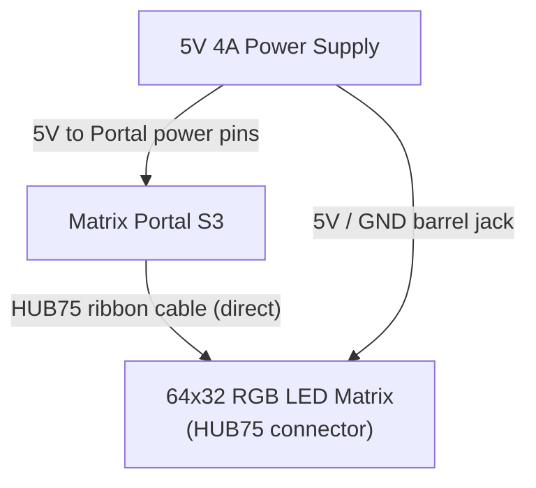
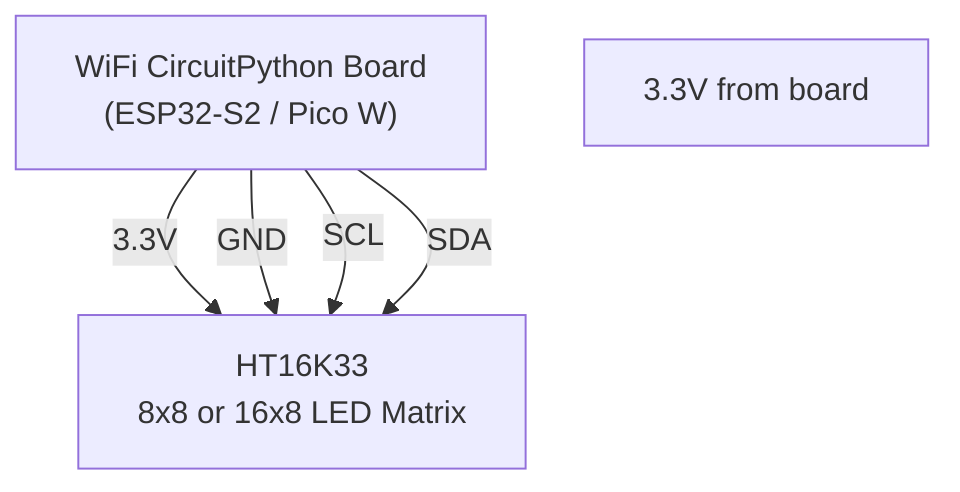

# Live Sports Scoreboard

!!! info "Works with"
    WiFi boards with an LED matrix or display — Adafruit Matrix Portal S3 (recommended), or any WiFi board + HT16K33 matrix or MAX7219 matrix

**Libraries used:** `adafruit_requests` · `adafruit_ht16k33` / `adafruit_matrixportal` · `adafruit_display_text`

---

## What you will build

A live scoreboard that fetches real game data from the ESPN public API over WiFi and scrolls the scores across an LED matrix — no account, no API key, no subscription required. It updates every minute. Every time you glance at it during a match, it has the latest score. Add a buzzer and it screams when the home team scores.

This project is based on the Adafruit LED Matrix FIFA World Cup Scoreboard guide.
*Credit: Adafruit Learning System* — [https://learn.adafruit.com/led-matrix-fifa-world-cup-scoreboard](https://learn.adafruit.com/led-matrix-fifa-world-cup-scoreboard)

The Matrix Portal S3 is the ideal board for this: it has a built-in ESP32-S3 with WiFi, a 64×32 RGB LED matrix connector, and CircuitPython support out of the box. But the core API fetch and JSON parsing code runs on any WiFi CircuitPython board.

---

## Parts list

| Part | Notes |
|------|-------|
| Adafruit Matrix Portal S3 | Adafruit #5778 — includes WiFi and matrix connector |
| 64×32 RGB LED matrix panel | Adafruit #2278 or compatible HUB75 panel |
| 5V 4A power supply | The matrix draws significant current |
| USB-C cable | For flashing firmware |
| **Alternative:** Any WiFi CircuitPython board + HT16K33 8×8 matrix | Adafruit #1080 for the matrix, I2C wiring |

---

## Wiring

### Option A: Matrix Portal S3 (recommended)



### Option B: WiFi board + HT16K33 matrix (I2C)



---

## Complete code

The code below uses the Matrix Portal S3 with `adafruit_matrixportal`. For HT16K33, see the adaptation note after the code.

```python
import time
import board
import wifi
import socketpool
import ssl
import adafruit_requests
import displayio
import terminalio
from adafruit_matrixportal.matrix import Matrix
from adafruit_display_text.scrolling_label import ScrollingLabel

# ----------------------------------------------------------------
# Configuration
# ----------------------------------------------------------------
WIFI_SSID     = "YourNetworkName"
WIFI_PASSWORD = "YourPassword"

# ESPN Soccer/Football scoreboard endpoint
# Change "soccer" to "basketball", "football", "baseball", etc.
# Change the league slug to match your sport:
#   soccer:  "usa.1" (MLS), "eng.1" (Premier League), "esp.1" (La Liga)
#   basketball: "nba"
SPORT   = "soccer"
LEAGUE  = "eng.1"   # English Premier League
ESPN_URL = f"https://site.api.espn.com/apis/site/v2/sports/{SPORT}/{LEAGUE}/scoreboard"

REFRESH_INTERVAL = 60   # seconds between API calls
# ----------------------------------------------------------------

# --- WiFi ---
print(f"Connecting to {WIFI_SSID}...")
wifi.radio.connect(WIFI_SSID, WIFI_PASSWORD)
print(f"Connected. IP: {wifi.radio.ipv4_address}")

pool    = socketpool.SocketPool(wifi.radio)
session = adafruit_requests.Session(pool, ssl.create_default_context())

# --- Matrix Portal display ---
matrix  = Matrix(bit_depth=2)
display = matrix.display
group   = displayio.Group()
display.root_group = group

scroll_label = ScrollingLabel(
    terminalio.FONT,
    text="Fetching scores...",
    color=0x00FF00,
    max_characters=64,
    animate_time=0.04,
)
scroll_label.x = 0
scroll_label.y = 12
group.append(scroll_label)


def fetch_scores():
    """Fetch ESPN scoreboard JSON and return a formatted score string."""
    print("Fetching scores from ESPN...")
    try:
        response = session.get(ESPN_URL, timeout=10)
        data     = response.json()
        response.close()
    except Exception as e:
        print(f"Fetch error: {e}")
        return "Network error"

    events = data.get("events", [])
    if not events:
        return "No games today"

    parts = []
    for event in events:
        # Safely navigate nested JSON
        competitions = event.get("competitions", [])
        if not competitions:
            continue
        comp         = competitions[0]
        competitors  = comp.get("competitors", [])
        if len(competitors) < 2:
            continue

        # ESPN puts home team at index 0 or 1 — use homeAway field
        home = next((c for c in competitors if c.get("homeAway") == "home"), competitors[0])
        away = next((c for c in competitors if c.get("homeAway") == "away"), competitors[1])

        home_name  = home.get("team", {}).get("abbreviation", "???")
        away_name  = away.get("team", {}).get("abbreviation", "???")
        home_score = home.get("score", "-")
        away_score = away.get("score", "-")
        status     = event.get("status", {}).get("type", {}).get("shortDetail", "")

        parts.append(f"{away_name} {away_score}-{home_score} {home_name} ({status})")

    return "  |  ".join(parts) if parts else "No scores available"


last_fetch = -REFRESH_INTERVAL  # force immediate fetch on startup

while True:
    now = time.monotonic()

    # Refresh scores on schedule
    if now - last_fetch >= REFRESH_INTERVAL:
        score_text   = fetch_scores()
        scroll_label.full_text = score_text + "     "   # trailing spaces for clean loop
        last_fetch   = now
        print(f"Scores: {score_text}")

    # Advance the scrolling animation one frame
    scroll_label.update()

    time.sleep(0.02)
```

!!! tip
    **HT16K33 adaptation:** Replace the Matrix Portal / `adafruit_matrixportal` import and display setup with an I2C HT16K33 matrix. Use `adafruit_ht16k33.matrix.Matrix8x8` and write score abbreviations with `matrix.print()`. The WiFi, `adafruit_requests`, and JSON parsing sections are identical.

---

## How it works

### The ESPN public API and JSON structure

ESPN runs a public JSON API that is used by its own website and apps — and which anyone can call without authentication. The scoreboard endpoint returns a JSON object with an `"events"` array. Each event represents one game and contains a `"competitions"` array, which in turn contains a `"competitors"` array with the two teams, their scores, and their `"homeAway"` designation. The `"status"` object tells you whether the game is live, scheduled, or final. This structure is consistent across sports — the same parsing logic works for basketball, baseball, and American football by changing the `SPORT` and `LEAGUE` constants.

### Parsing nested JSON safely with .get()

API responses are not always structured exactly as you expect — fields can be missing if a game has not started yet, or the API changes slightly between seasons. Using `.get("key", default)` instead of `["key"]` means your code returns the default value instead of crashing with a `KeyError` when a field is absent. The pattern `event.get("status", {}).get("type", {}).get("shortDetail", "")` chains three `.get()` calls: if any level of nesting is missing, the chain short-circuits to an empty string. This is the correct way to traverse unknown or partially populated JSON in any language.

### Scrolling text on a matrix

A 64×32 LED matrix can only show a few characters at a time at a readable size. `adafruit_display_text.scrolling_label.ScrollingLabel` handles the animation: you set `full_text` to however long a string you like, and each call to `.update()` advances the scroll position by one pixel if enough time has passed (controlled by `animate_time`). Calling `.update()` in a tight loop with a short `time.sleep()` gives smooth scrolling without blocking the main program. Because the scroll position persists between API refreshes, you can update `full_text` mid-scroll and the display will seamlessly transition to the new content.

---

## Remix ideas

!!! tip "Remix idea"
    **Sound the alarm when the home team scores.** Track the home team's score between fetches. If it increases, trigger a buzzer tone. See the [simpleio tones reference](../../reference/audio/simpleio-tones.md) for the one-line `simpleio.tone()` call you need.

!!! tip "Remix idea"
    **Show standings instead of live scores.** ESPN's API also has a standings endpoint: swap `scoreboard` for `standings` in the URL and parse the `standings` array instead of `events`. Display each team's win/loss record in the scroll.

!!! tip "Remix idea"
    **Push scores to a TV or smart home display.** Send the score string to an MQTT broker and subscribe to it from Home Assistant or Node-RED to display on a dashboard. The [MQTT and Home Assistant builder](../wireless/wifi/builder-mqtt-home-assistant.md) covers the full MQTT setup.

---

## Go deeper

- [adafruit_requests reference](../../reference/wireless/wifi/requests.md)
- [adafruit_ht16k33 reference](../../reference/displays/ht16k33.md)
- [adafruit_matrixportal reference](../../reference/displays/ht16k33.md)
- [adafruit_display_text reference](../../reference/displays/display-text.md)
