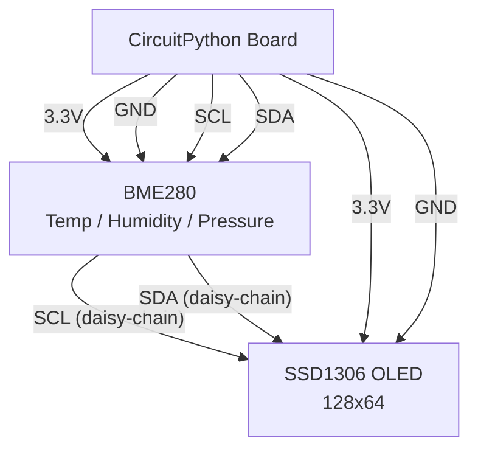

# Desktop Weather Station

!!! info "Works with"
    Any CircuitPython board with I2C — Feather M0/M4, ItsyBitsy, QT Py, Trinket M0, RP2040 boards

**Libraries used:** `adafruit_bme280` · `adafruit_displayio_ssd1306` · `adafruit_display_text`

---

## What you will build

A compact desk gadget that reads temperature, humidity, and barometric pressure from a BME280 sensor, calculates a "feels like" heat index, and displays all four values on a crisp OLED screen. The display refreshes every five seconds. Leave it running on your desk and you will have a real-time microclimate snapshot of wherever you are building.

Both the BME280 and the SSD1306 OLED share the same two-wire I2C bus — no extra wiring complexity, just daisy-chain them with STEMMA QT cables or a short breadboard run.

---

## Parts list

| Part | Notes |
|------|-------|
| CircuitPython board with I2C | Any board works |
| BME280 temperature / humidity / pressure breakout | Adafruit #2652 |
| SSD1306 OLED display, 128×64 | Adafruit #326 or #938 |
| STEMMA QT cables (×2) or breadboard jumpers | I2C daisy-chain |
| USB cable + power source | |

---

## Wiring



!!! tip
    The BME280 defaults to I2C address `0x77`. The SSD1306 defaults to `0x3C`. They coexist on the same bus without any configuration changes.

---

## Complete code

```python
import time
import board
import busio
import displayio
import terminalio
import adafruit_bme280.basic as adafruit_bme280
import adafruit_displayio_ssd1306
from adafruit_display_text import label

# --- Release any previous display ---
displayio.release_displays()

# --- I2C and sensor setup ---
i2c = busio.I2C(board.SCL, board.SDA)
bme280 = adafruit_bme280.Adafruit_BME280_I2C(i2c)

# Sea-level pressure for your location in hPa
# Standard atmosphere = 1013.25; adjust for your altitude
bme280.sea_level_pressure = 1013.25

# --- Display setup ---
display_bus = displayio.I2CDisplay(i2c, device_address=0x3C)
display = adafruit_displayio_ssd1306.SSD1306(display_bus, width=128, height=64)

# --- Build the display layout ---
splash = displayio.Group()
display.root_group = splash

# Background fill
bg_bitmap = displayio.Bitmap(128, 64, 1)
bg_palette = displayio.Palette(1)
bg_palette[0] = 0x000000
bg_sprite = displayio.TileGrid(bg_bitmap, pixel_shader=bg_palette, x=0, y=0)
splash.append(bg_sprite)

# Four text labels
title_label = label.Label(terminalio.FONT, text="  WEATHER STATION", color=0xFFFFFF, x=0, y=4)
temp_label  = label.Label(terminalio.FONT, text="Temp:  --.-  F",    color=0xFFFFFF, x=0, y=18)
hum_label   = label.Label(terminalio.FONT, text="Humid: --.-%",      color=0xFFFFFF, x=0, y=32)
pres_label  = label.Label(terminalio.FONT, text="Press: ---.- hPa",  color=0xFFFFFF, x=0, y=46)
feel_label  = label.Label(terminalio.FONT, text="Feels: --.-  F",    color=0xFFFFFF, x=0, y=60)

for lbl in (title_label, temp_label, hum_label, pres_label, feel_label):
    splash.append(lbl)


def heat_index(temp_f, humidity):
    """Rothfusz regression — accurate above 80 F and 40% RH."""
    if temp_f < 80 or humidity < 40:
        # Simple formula for mild conditions
        return 0.5 * (temp_f + 61.0 + ((temp_f - 68.0) * 1.2) + (humidity * 0.094))
    hi = (
        -42.379
        + 2.04901523 * temp_f
        + 10.14333127 * humidity
        - 0.22475541 * temp_f * humidity
        - 0.00683783 * temp_f ** 2
        - 0.05481717 * humidity ** 2
        + 0.00122874 * temp_f ** 2 * humidity
        + 0.00085282 * temp_f * humidity ** 2
        - 0.00000199 * temp_f ** 2 * humidity ** 2
    )
    return hi


print("Weather station running...")

while True:
    temp_c    = bme280.temperature
    humidity  = bme280.relative_humidity
    pressure  = bme280.pressure

    temp_f    = temp_c * 9 / 5 + 32
    feels_f   = heat_index(temp_f, humidity)

    temp_label.text  = f"Temp:  {temp_f:5.1f} F"
    hum_label.text   = f"Humid: {humidity:5.1f}%"
    pres_label.text  = f"Press: {pressure:6.1f} hPa"
    feel_label.text  = f"Feels: {feels_f:5.1f} F"

    print(f"T={temp_f:.1f}F  H={humidity:.1f}%  P={pressure:.1f}hPa  HI={feels_f:.1f}F")

    time.sleep(5)
```

---

## How it works

### Reading the BME280

The BME280 is a combined sensor that measures three environmental quantities over I2C in a single chip. After instantiating `Adafruit_BME280_I2C`, you access `bme280.temperature` (in Celsius), `bme280.relative_humidity` (percent), and `bme280.pressure` (hectopascals) as simple properties — the library handles all the register reads and compensation math internally. Setting `bme280.sea_level_pressure` lets the library also calculate altitude, though this project does not use that feature.

### Driving the SSD1306 with displayio

`adafruit_displayio_ssd1306` integrates with CircuitPython's `displayio` subsystem, which means you work with high-level `Group`, `Label`, and `TileGrid` objects rather than drawing pixels manually. You build a `Group` (a list of layers), attach `Label` objects at specific x/y positions, assign that group to `display.root_group`, and the display driver handles all rendering automatically. To update the screen you simply change a label's `.text` property — no redraw call needed.

### The heat index calculation

The Rothfusz regression is the formula used by the US National Weather Service to calculate apparent temperature (what the air "feels like" accounting for humidity). At lower temperatures and humidity it simplifies to a linear approximation. The function in the code returns the same value in Fahrenheit that you would see on a weather app's "feels like" field. It is only meaningful above about 70 F — below that, humidity matters much less to perceived comfort.

---

## Remix ideas

!!! tip "Remix idea"
    **Log readings to the cloud.** Add a WiFi-capable board (or swap to a Feather ESP32) and push temperature and humidity to Adafruit IO every minute. Then view charts and set up alerts from any browser. Start with [Adafruit IO Basics](../wireless/wifi/starter-adafruit-io-basics.md).

!!! tip "Remix idea"
    **Upgrade to a color TFT display.** A 240×135 color TFT has room for large digits, a color-coded comfort scale, and a trend graph. See [TFT Graphics builder](../displays/builder-tft-graphics.md) for the display setup — the BME280 code stays identical.

!!! tip "Remix idea"
    **Add air quality.** Pair a PM2.5 particulate sensor or a SGP30 VOC sensor alongside the BME280 on the same I2C bus and add a fifth line to the display. The [Air Quality Dashboard hacker page](../sensors/hacker-air-quality-dash.md) shows how to combine multiple environmental sensors.

---

## Go deeper

- [adafruit_bme280 reference](../../reference/sensors/environmental/bme280.md)
- [adafruit_displayio_ssd1306 reference](../../reference/displays/ssd1306.md)
- [adafruit_display_text reference](../../reference/displays/display-text.md)
