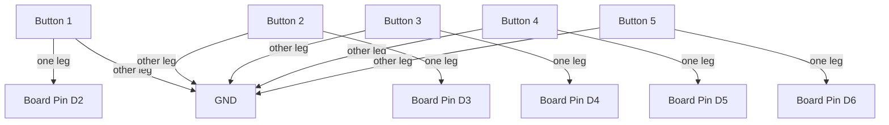

# Wireless BLE Keyboard

!!! info "Works with"
    BLE boards — Feather nRF52840, ItsyBitsy nRF52840, Circuit Playground Bluefruit

---

## What you will build

Five tactile buttons wired to your board send keystrokes wirelessly over Bluetooth to any phone, tablet, or computer. No USB dongle, no receiver — just standard Bluetooth HID, the same protocol your wireless keyboard uses. Once paired, it reconnects automatically. Use it to control a slide presentation, trigger shortcuts in video editing software, or build a completely custom controller for any application.

---

## What you will need

- A BLE-capable CircuitPython board (Feather nRF52840 or ItsyBitsy nRF52840 recommended)
- 5 tactile push buttons
- 5 x 10k ohm resistors (pull-downs) — or enable internal pull-ups in code
- Breadboard and jumper wires
- Optional: LiPo battery + switch for portable use
- Libraries: `adafruit_ble` and `adafruit_hid`

---

## Wiring

Each button connects between a GPIO pin and GND. Internal pull-ups are enabled in the code, so no external resistors are required (though they do not hurt).



---

## The code

```python
import time
import board
import digitalio
from adafruit_ble import BLERadio
from adafruit_ble.advertising.standard import ProvideServicesAdvertisement
from adafruit_ble.services.standard.hid import HIDService
from adafruit_ble.services.standard.device_info import DeviceInfoService
from adafruit_hid.keyboard import Keyboard
from adafruit_hid.keyboard_layout_us import KeyboardLayoutUS
from adafruit_hid.keycode import Keycode

# -- BLE HID setup --
hid = HIDService()
device_info = DeviceInfoService(software_revision="CircuitPython", manufacturer="Adafruit")
advertisement = ProvideServicesAdvertisement(hid)
advertisement.appearance = 961  # keyboard appearance code

ble = BLERadio()
ble.name = "BLE Keyboard"

keyboard = Keyboard(hid.devices)
keyboard_layout = KeyboardLayoutUS(keyboard)

# -- button setup --
BUTTON_PINS = [board.D2, board.D3, board.D4, board.D5, board.D6]
KEYCODES = [Keycode.A, Keycode.B, Keycode.C, Keycode.D, Keycode.E]

buttons = []
for pin in BUTTON_PINS:
    btn = digitalio.DigitalInOut(pin)
    btn.direction = digitalio.Direction.INPUT
    btn.pull = digitalio.Pull.UP
    buttons.append(btn)

prev_states = [True] * len(buttons)

print("Advertising as BLE Keyboard...")
ble.start_advertising(advertisement)

while True:
    if not ble.connected:
        ble.start_advertising(advertisement)

    while ble.connected:
        for i, btn in enumerate(buttons):
            current = btn.value  # True = not pressed (pull-up)
            if not current and prev_states[i]:  # falling edge = press
                print(f"Button {i} pressed, sending keycode")
                keyboard.press(KEYCODES[i])
            elif current and not prev_states[i]:  # rising edge = release
                keyboard.release(KEYCODES[i])
            prev_states[i] = current
        time.sleep(0.01)
```

To customize, change the `KEYCODES` list. Common useful keycodes include `Keycode.SPACE`, `Keycode.RIGHT_ARROW`, `Keycode.LEFT_ARROW`, `Keycode.F5`, and `Keycode.COMMAND` (Mac) or `Keycode.CONTROL` (Windows/Linux).

---

## How it works

**BLE HID vs USB HID.**
HID stands for Human Interface Device — the USB protocol that keyboards, mice, and gamepads use. BLE HID is the same logical profile carried over Bluetooth instead of a wire. From the operating system's perspective, a BLE HID keyboard is indistinguishable from a wired one. The `adafruit_hid` library gives you the same `Keyboard`, `Mouse`, and `Gamepad` classes whether you are using USB or BLE — you just swap the transport underneath.

**Bonding and why the first pairing matters.**
When your phone or computer pairs with the keyboard for the first time, both sides exchange cryptographic keys and store them. This is called *bonding*. On subsequent connections, the devices recognize each other and reconnect without prompting. If you flash new code to the board or clear the bond, you need to forget the device on the phone/computer side and pair again — otherwise the host will keep sending the old keys and the connection will fail silently. Delete the pairing on your phone if you ever get stuck in a loop of failed reconnects.

**Battery-powered use.**
The nRF52840 is well-suited for battery operation. At idle (connected, waiting for button presses), current draw is very low. Add a 3.7V LiPo and a power switch to the enable pin on the Feather and you have a fully wireless controller that lasts days on a small battery. The `adafruit_ble` library also gives you access to the battery level service, which lets your phone display the charge state in its Bluetooth menu.

---

## Installing libraries

Copy the following into your `lib` folder:

```
CIRCUITPY/
  lib/
    adafruit_ble/
    adafruit_hid/
  code.py
```

Both are in the CircuitPython Library Bundle at [circuitpython.org/libraries](https://circuitpython.org/libraries).

---

## Remix it

!!! tip "Remix idea"
    - Swap the buttons for capacitive touch pads: [Touch Keyboard](../../sensors/starter-touch-keyboard.md)
    - Add MIDI over BLE for a wireless instrument: [BLE MIDI Controller](hacker-ble-midi-controller.md)
    - Build the wired USB version first as a stepping stone: [USB HID Keyboard](../../usb-tricks/starter-hid-keyboard.md)

---

## Go deeper

- Reference: [adafruit_ble library](../../reference/wireless/ble/adafruit-ble.md)
- [BLE HID Keyboard Buttons with CircuitPython](https://learn.adafruit.com/ble-hid-keyboard-buttons-with-circuitpython) — *Credit: Adafruit Learning System*
