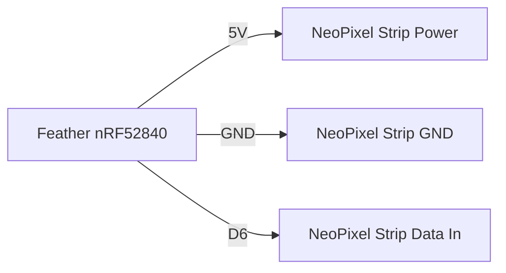

# BLE Heart Rate Display

!!! info "Works with"
    BLE boards — Feather nRF52840, Circuit Playground Bluefruit, CLUE

---

## What you will build

Your board will scan for a Bluetooth LE heart rate monitor chest strap (the kind athletes wear while training), connect to it, and read your live beats-per-minute. NeoPixels pulse in sync with your heartbeat — faster pulse at a higher BPM, slower at rest. It is a wearable biofeedback display that works with any standard BLE heart rate monitor.

---

## What you will need

- A BLE-capable CircuitPython board (Feather nRF52840 recommended for battery use)
- A Bluetooth LE heart rate monitor chest strap that broadcasts the standard Heart Rate Service (Polar H7, H10, Wahoo TICKR, or similar)
- NeoPixels — the Circuit Playground Bluefruit has 10 built in; add a strip or ring for other boards
- Optional: LiPo battery for portable use
- Libraries: `adafruit_ble` and `adafruit_ble_heart_rate`

---

## Wiring

For the Circuit Playground Bluefruit, no wiring is needed — NeoPixels are built in.

For a Feather nRF52840 with an external NeoPixel strip:



!!! info "Level shifter"
    NeoPixels technically want 5V logic, but the nRF52840's 3.3V signal works reliably with most strips when the strip is powered from 5V. If you have problems, add a 74AHCT125 level shifter on the data line.

---

## The code

```python
import time
import board
import neopixel
from adafruit_ble import BLERadio
from adafruit_ble.advertising.standard import ProvideServicesAdvertisement
from adafruit_ble_heart_rate import HeartRateService

# -- hardware setup --
pixels = neopixel.NeoPixel(board.NEOPIXEL, 10, brightness=0.3, auto_write=False)
ble = BLERadio()

def pulse_color(bpm):
    """Map BPM to a color: slow = blue, resting = green, elevated = red."""
    if bpm < 60:
        return (0, 0, 200)
    elif bpm < 100:
        return (0, 200, 0)
    else:
        return (200, 0, 0)

def pulse_pixels(bpm, color):
    """Flash pixels on the beat."""
    beat_interval = 60 / bpm
    pixels.fill(color)
    pixels.show()
    time.sleep(0.1)
    pixels.fill((0, 0, 0))
    pixels.show()
    time.sleep(beat_interval - 0.1)

print("Scanning for heart rate monitors...")

while True:
    # Scan for a device advertising the HeartRateService
    for advertisement in ble.start_scan(ProvideServicesAdvertisement, timeout=10):
        if HeartRateService in advertisement.services:
            print(f"Found: {advertisement.complete_name}")
            ble.stop_scan()
            connection = ble.connect(advertisement)
            print("Connected!")

            hr_service = connection[HeartRateService]

            while connection.connected:
                measurement = hr_service.measurement_values
                if measurement is not None:
                    bpm = measurement.heart_rate
                    print(f"BPM: {bpm}")
                    color = pulse_color(bpm)
                    pulse_pixels(bpm, color)

            print("Disconnected. Scanning again...")
```

---

## How it works

**BLE services and characteristics.**
BLE organizes data into *services* and *characteristics*. A service is a logical grouping of related data — think of it like a folder. A characteristic is a single data value inside that folder. The Heart Rate Service is a standardized Bluetooth profile (UUID 0x180D) that any compliant heart rate monitor must implement. Inside it, the Heart Rate Measurement characteristic (UUID 0x2A37) holds the current BPM reading. Because this is a standard profile, the same code works with any manufacturer's chest strap.

**The Heart Rate Measurement characteristic.**
The measurement is encoded as a binary packet: the first byte is a flags field that tells you whether the BPM value uses 8 or 16 bits, whether contact is detected, and whether energy expenditure is included. The `adafruit_ble_heart_rate` library handles all of this parsing for you and gives you a clean `measurement.heart_rate` integer. You just read and display it.

**Scanning vs connecting.**
Scanning is passive — your board listens for advertisement packets without committing to a connection. Once you spot a device advertising the Heart Rate Service, you call `ble.connect()` to establish a full bidirectional link. After connecting, you can subscribe to notifications from the Heart Rate Measurement characteristic, which means the chest strap pushes new BPM values to your board automatically — you do not have to poll. The code above reads the latest value in a loop, which is slightly simpler but functionally equivalent for this project.

---

## Installing libraries

Copy both of the following into your `lib` folder:

```
CIRCUITPY/
  lib/
    adafruit_ble/
    adafruit_ble_heart_rate.mpy
  code.py
```

Both are in the CircuitPython Library Bundle at [circuitpython.org/libraries](https://circuitpython.org/libraries).

---

## Remix it

!!! tip "Remix idea"
    - Log your BPM to a cloud dashboard: [Adafruit IO Basics](../wifi/starter-adafruit-io-basics.md) (requires a WiFi board as a second device)
    - Display the numeric BPM on a screen: [OLED Hello World](../../displays/starter-oled-hello.md)
    - Go further with wireless instruments: [BLE MIDI Controller](hacker-ble-midi-controller.md)

---

## Go deeper

- Reference: [BLE Heart Rate library](../../reference/wireless/ble/ble-heart-rate.md)
- [BLE Heart Rate Display Pendant](https://learn.adafruit.com/ble-heart-rate-display-pendant) — *Credit: Adafruit Learning System*
- [CircuitPython BLE Heart Rate Monitor Gizmo](https://learn.adafruit.com/circuitpython-ble-heart-rate-monitor-gizmo) — *Credit: Adafruit Learning System*
