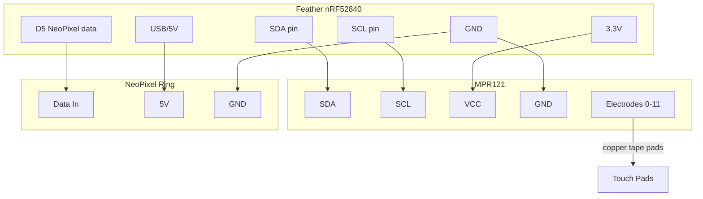

# BLE MIDI Controller

!!! info "Works with"
    BLE boards — Feather nRF52840, CLUE, ItsyBitsy nRF52840

---

## What you will build

An MPR121 capacitive touch breakout gives you 12 touch-sensitive pads. A NeoPixel ring lights up each pad as you touch it. The whole thing transmits MIDI notes wirelessly over Bluetooth to GarageBand on an iPad or iPhone — no cables, no audio interface, no MIDI dongle. Tap the pads to play notes, swap instrument patches in GarageBand, and add the NeoPixel ring as live visual feedback. Run it on a LiPo battery and you have a completely wireless instrument.

---

## What you will need

- Feather nRF52840 Express (or CLUE / ItsyBitsy nRF52840)
- MPR121 capacitive touch breakout (I2C)
- NeoPixel ring (12 pixels recommended — one per touch pad)
- Conductive material for touch pads: copper tape, bare wire, or conductive fabric
- 3.7V LiPo battery
- Libraries: `adafruit_ble`, `adafruit_ble_midi`, `adafruit_midi`, `adafruit_mpr121`, `neopixel`

---

## Wiring

The MPR121 uses I2C. The NeoPixel ring uses a single data line.



!!! info "I2C address"
    The MPR121 default I2C address is 0x5A. If you need to connect a second MPR121, tie the ADDR pin to 3V3 to get 0x5B.

---

## The code

```python
import board
import busio
import neopixel
import adafruit_mpr121
from adafruit_ble import BLERadio
from adafruit_ble.advertising.standard import ProvideServicesAdvertisement
import adafruit_ble_midi
import adafruit_midi
from adafruit_midi.note_on import NoteOn
from adafruit_midi.note_off import NoteOff

# -- NeoPixel setup --
pixels = neopixel.NeoPixel(board.D5, 12, brightness=0.3, auto_write=False)

# -- MPR121 setup --
i2c = busio.I2C(board.SCL, board.SDA)
mpr121 = adafruit_mpr121.MPR121(i2c)

# -- BLE MIDI setup --
midi_service = adafruit_ble_midi.MIDIService()
advertisement = ProvideServicesAdvertisement(midi_service)

ble = BLERadio()
ble.name = "CircuitPy MIDI"

midi = adafruit_midi.MIDI(midi_out=midi_service, out_channel=0)

# -- note map: 12 pads -> 12 chromatic notes starting at middle C --
NOTE_MAP = [60, 62, 64, 65, 67, 69, 71, 72, 74, 76, 77, 79]
PAD_COLORS = [
    (200, 0, 0), (200, 80, 0), (200, 200, 0), (0, 200, 0),
    (0, 200, 200), (0, 0, 200), (80, 0, 200), (200, 0, 200),
    (200, 100, 100), (100, 200, 100), (100, 100, 200), (200, 200, 100),
]

prev_touched = mpr121.touched_pins

print("Advertising as BLE MIDI device...")
ble.start_advertising(advertisement)

while True:
    if not ble.connected:
        pixels.fill((10, 0, 0))  # dim red when not connected
        pixels.show()
        ble.start_advertising(advertisement)

    while ble.connected:
        current_touched = mpr121.touched_pins

        for i in range(12):
            was = prev_touched[i]
            now = current_touched[i]

            if now and not was:
                # pad just touched
                midi.send(NoteOn(NOTE_MAP[i], 100))
                pixels[i] = PAD_COLORS[i]
                pixels.show()
                print(f"Note ON: {NOTE_MAP[i]}")

            elif was and not now:
                # pad just released
                midi.send(NoteOff(NOTE_MAP[i], 0))
                pixels[i] = (0, 0, 0)
                pixels.show()
                print(f"Note OFF: {NOTE_MAP[i]}")

        prev_touched = current_touched
```

---

## How it works

**BLE MIDI profile.**
Bluetooth MIDI (also called BLE-MIDI or MIDI over Bluetooth Low Energy) is a standard profile defined by the MIDI Manufacturers Association. It wraps standard MIDI messages in BLE packets with a small timestamp header. The `adafruit_ble_midi` library handles this framing, and the `adafruit_midi` library handles encoding and decoding the MIDI messages themselves. The split keeps the two concerns separate: one library speaks BLE, the other speaks MIDI.

**Pairing with iOS and macOS GarageBand.**
On iPhone or iPad, open GarageBand, choose any instrument, then open the Settings (spanner icon) > Advanced > Bluetooth MIDI Devices. Your board will appear there as "CircuitPy MIDI." Tap to connect. On macOS, open the Audio MIDI Setup app, click the Bluetooth icon in the MIDI Studio window, and connect from there. Once connected, any DAW on the Mac (GarageBand, Logic, Ableton) will see it as a MIDI input. Note that BLE MIDI has slightly higher latency than USB MIDI — typically 5-15ms — which is imperceptible for most playing.

**NeoPixel visual feedback on note events.**
The NeoPixels serve two purposes: they confirm which pad you are touching (useful when pads are unlabeled copper tape), and they give the instrument a visual presence during performance. Each pad gets a unique color. The pixel lights on note-on and goes dark on note-off, so the light duration matches the note duration. A fun extension is to change brightness with velocity — the harder a human presses (measured by the MPR121's electrode data value), the brighter the pixel.

---

## Installing libraries

Copy the following into your `lib` folder:

```
CIRCUITPY/
  lib/
    adafruit_ble/
    adafruit_ble_midi.mpy
    adafruit_midi/
    adafruit_mpr121.mpy
    neopixel.mpy
  code.py
```

All are in the CircuitPython Library Bundle at [circuitpython.org/libraries](https://circuitpython.org/libraries).

---

## Remix it

!!! tip "Remix idea"
    - Build a sequencer and generative music tool: [Euclidean Synth](../../sound/hacker-euclidean-synth.md)
    - Visualize incoming MIDI with lights: [MIDI Visualizer](../../lights/hacker-midi-visualizer.md)
    - Build the wired USB MIDI version: [USB MIDI Controller](../../usb-tricks/builder-midi-controller.md)

---

## Go deeper

- Reference: [BLE MIDI library](../../reference/wireless/ble/ble-midi.md)
- [Bluetooth LE MIDI Controller](https://learn.adafruit.com/bluetooth-le-midi-controller) — *Credit: Adafruit Learning System*
- [MIDI for Makers: BLE MIDI Sequencer](https://learn.adafruit.com/midi-for-makers/ble-midi-sequencer) — *Credit: Adafruit Learning System*
