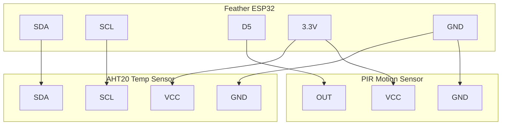

# MQTT Dashboard with Home Assistant

!!! info "Works with"
    WiFi boards — PyPortal, Feather ESP32, Metro M4 AirLift

---

## What you will build

A PyPortal touchscreen (or any WiFi board with a display) reads temperature, light level, and motion from its onboard or attached sensors and publishes them to Home Assistant via MQTT every 10 seconds. A Home Assistant dashboard shows live readings from every sensor node in your space. In the other direction, Home Assistant can send commands back to the board over MQTT — toggle a relay, change a light color, trigger a sound. Two-way communication over a local network, no cloud required.

---

## What you will need

- PyPortal, Feather ESP32-S2/S3, or Metro M4 AirLift
- A computer running [Home Assistant](https://www.home-assistant.io) on your local network (or a Raspberry Pi running Home Assistant OS)
- The Mosquitto MQTT broker add-on installed in Home Assistant
- Temperature sensor (AHT20 or AHT10 via I2C — or use the onboard ADT7410 on PyPortal)
- Light sensor (APDS-9960 or analog LDR)
- Optional: PIR motion sensor, relay module
- Libraries: `adafruit_minimqtt`, `adafruit_connection_manager`, `adafruit_requests`

---

## Wiring

For a Feather ESP32 with external sensors:



---

## The code

### settings.toml

```toml
CIRCUITPY_WIFI_SSID = "your-network-name"
CIRCUITPY_WIFI_PASSWORD = "your-wifi-password"
MQTT_BROKER = "192.168.1.xxx"
MQTT_PORT = "1883"
MQTT_USERNAME = "your-ha-mqtt-username"
MQTT_PASSWORD = "your-ha-mqtt-password"
DEVICE_ID = "sensor_node_1"
```

### code.py

```python
import os
import time
import board
import busio
import digitalio
import wifi
import socketpool
import adafruit_minimqtt.adafruit_minimqtt as MQTT
import adafruit_ahtx0

# -- credentials --
ssid = os.getenv("CIRCUITPY_WIFI_SSID")
password = os.getenv("CIRCUITPY_WIFI_PASSWORD")
broker = os.getenv("MQTT_BROKER")
port = int(os.getenv("MQTT_PORT"))
mqtt_user = os.getenv("MQTT_USERNAME")
mqtt_pass = os.getenv("MQTT_PASSWORD")
device_id = os.getenv("DEVICE_ID")

# -- sensor setup --
i2c = busio.I2C(board.SCL, board.SDA)
aht = adafruit_ahtx0.AHTx0(i2c)

motion_pin = digitalio.DigitalInOut(board.D5)
motion_pin.direction = digitalio.Direction.INPUT

# -- MQTT topic structure --
BASE_TOPIC = f"circuitpy/{device_id}"
TEMP_TOPIC = f"{BASE_TOPIC}/temperature"
HUMIDITY_TOPIC = f"{BASE_TOPIC}/humidity"
MOTION_TOPIC = f"{BASE_TOPIC}/motion"
COMMAND_TOPIC = f"{BASE_TOPIC}/command"

# -- MQTT callbacks --
def connected(client, userdata, flags, rc):
    print(f"Connected to MQTT broker: {broker}")
    client.subscribe(COMMAND_TOPIC)
    print(f"Subscribed to {COMMAND_TOPIC}")

def disconnected(client, userdata, rc):
    print("Disconnected from MQTT broker")

def message_received(client, topic, message):
    print(f"Received [{topic}]: {message}")
    if message == "blink":
        print("Blink command received — add LED blink code here")
    elif message.startswith("color:"):
        color_hex = message.split(":")[1]
        print(f"Color command: #{color_hex}")

# -- connect to WiFi --
print(f"Connecting to {ssid}...")
wifi.radio.connect(ssid, password)
print(f"Connected. IP: {wifi.radio.ipv4_address}")

pool = socketpool.SocketPool(wifi.radio)

# -- set up MQTT client --
mqtt_client = MQTT.MQTT(
    broker=broker,
    port=port,
    username=mqtt_user,
    password=mqtt_pass,
    socket_pool=pool,
)

mqtt_client.on_connect = connected
mqtt_client.on_disconnect = disconnected
mqtt_client.on_message = message_received

print(f"Connecting to MQTT broker at {broker}...")
mqtt_client.connect()

PUBLISH_INTERVAL = 10
last_publish = time.monotonic()

while True:
    # Process incoming messages
    mqtt_client.loop(timeout=1)

    now = time.monotonic()
    if now - last_publish >= PUBLISH_INTERVAL:
        try:
            temp_c = aht.temperature
            temp_f = temp_c * 9 / 5 + 32
            humidity = aht.relative_humidity
            motion = 1 if motion_pin.value else 0

            mqtt_client.publish(TEMP_TOPIC, f"{temp_f:.1f}")
            mqtt_client.publish(HUMIDITY_TOPIC, f"{humidity:.1f}")
            mqtt_client.publish(MOTION_TOPIC, str(motion))

            print(f"Published: {temp_f:.1f}F, {humidity:.1f}% RH, motion={motion}")
            last_publish = now

        except Exception as e:
            print(f"Publish error: {e}")
```

### Home Assistant configuration

In your Home Assistant `configuration.yaml`, add MQTT sensors:

```yaml
mqtt:
  sensor:
    - name: "Node 1 Temperature"
      state_topic: "circuitpy/sensor_node_1/temperature"
      unit_of_measurement: "°F"
      device_class: temperature

    - name: "Node 1 Humidity"
      state_topic: "circuitpy/sensor_node_1/humidity"
      unit_of_measurement: "%"
      device_class: humidity

    - name: "Node 1 Motion"
      state_topic: "circuitpy/sensor_node_1/motion"
```

---

## How it works

**What MQTT is and why it is better than HTTP for frequent updates.**
HTTP is a request-response protocol — your board asks for something, the server responds, and the connection closes. For frequent sensor updates this is wasteful: each update requires a full TCP handshake and HTTP header overhead. MQTT is a publish-subscribe protocol designed for exactly this use case. The broker (Mosquitto, running inside Home Assistant) maintains persistent connections. Your board publishes to a topic; any subscriber instantly receives it. For a sensor updating every 10 seconds, MQTT uses far less bandwidth and far less CPU on the microcontroller than repeated HTTP POST requests.

**The publish-subscribe model.**
In MQTT, every message is sent to a *topic* — a string that acts like an address, organized with forward slashes (`circuitpy/sensor_node_1/temperature`). Publishers send messages to topics without knowing who is listening. Subscribers register interest in topics (with optional wildcards like `circuitpy/+/temperature` to hear all nodes' temperatures) without knowing who is publishing. This decoupling makes it easy to add new sensor nodes, new dashboards, or new automation rules without changing any existing code. The broker is the only party that needs to know about everyone.

**Home Assistant integration.**
Home Assistant's MQTT integration can consume any MQTT topic as a sensor entity. Once defined in `configuration.yaml`, the sensor appears on dashboards, triggers automations, and is stored in the history database. The reverse also works: Home Assistant can publish to your board's command topic when an automation fires — for example, "flash the light when motion is detected in another room." This two-way channel is what separates MQTT-based projects from simple one-way data loggers.

---

## Installing libraries

```
CIRCUITPY/
  lib/
    adafruit_minimqtt/
    adafruit_ahtx0.mpy
    adafruit_connection_manager.mpy
  code.py
  settings.toml
```

All are in the CircuitPython Library Bundle at [circuitpython.org/libraries](https://circuitpython.org/libraries).

---

## Remix it

!!! tip "Remix idea"
    - Start with a simpler cloud integration: [Adafruit IO Basics](starter-adafruit-io-basics.md)
    - Add plant monitoring to your Home Assistant setup: [IoT Plant Monitor](hacker-plant-monitor.md)
    - Add an air quality sensor node: [Air Quality Dashboard](../../sensors/hacker-air-quality-dash.md)

---

## Go deeper

- Reference: [adafruit_minimqtt library](../../reference/wireless/wifi/minimqtt.md)
- [PyPortal MQTT Sensor Node / Control Pad for Home Assistant](https://learn.adafruit.com/pyportal-mqtt-sensor-node-control-pad-home-assistant) — *Credit: Adafruit Learning System*
