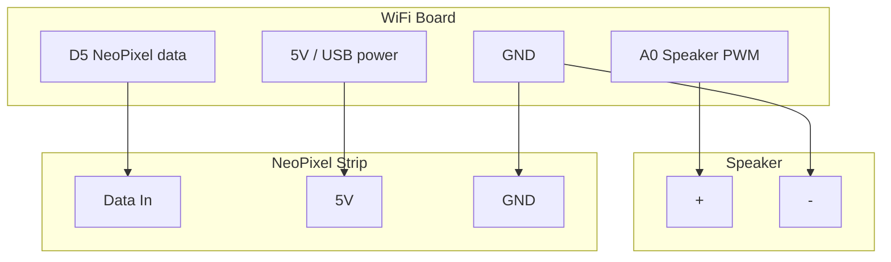

# Connected Weather Lamp

!!! info "Works with"
    WiFi boards — Feather ESP32, Pico W, Metro M4 AirLift, PyPortal

---

## What you will build

A cloud-shaped enclosure (or any enclosure you like) holds a NeoPixel strip and a small speaker or piezo buzzer. The lamp fetches live weather data from the OpenWeather API every few minutes and changes the NeoPixel color and plays a brief tone based on current conditions — blue and a low tone for rain, yellow and a bright chime for sun, white and a rising sweep for snow. It is a glanceable ambient display for the weather outside without looking at a screen.

---

## What you will need

- A WiFi-capable CircuitPython board (Feather ESP32-S2/S3 or Pico W recommended)
- NeoPixel strip or ring (8-30 pixels)
- Small speaker or piezo buzzer wired to an analog output pin
- 3D printed or craft-foam cloud enclosure (optional but great)
- Free [OpenWeather API key](https://openweathermap.org/api) (sign up, then generate a key under API Keys)
- Libraries: `adafruit_requests`, `adafruit_connection_manager`, `neopixel`

---

## Wiring



!!! info "Piezo vs speaker"
    A passive piezo buzzer wired directly to a PWM pin works fine for simple tones. For louder sound or better audio quality, add a small audio amplifier breakout between the pin and a speaker cone.

---

## The code

### settings.toml

```toml
CIRCUITPY_WIFI_SSID = "your-network-name"
CIRCUITPY_WIFI_PASSWORD = "your-wifi-password"
OPENWEATHER_KEY = "your-openweather-api-key"
OPENWEATHER_CITY = "San Francisco"
OPENWEATHER_COUNTRY = "US"
```

### code.py

```python
import os
import time
import board
import pwmio
import neopixel
import wifi
import socketpool
import adafruit_requests

# -- hardware --
pixels = neopixel.NeoPixel(board.D5, 12, brightness=0.4, auto_write=False)
buzzer = pwmio.PWMOut(board.A0, variable_frequency=True)

# -- credentials --
ssid = os.getenv("CIRCUITPY_WIFI_SSID")
password = os.getenv("CIRCUITPY_WIFI_PASSWORD")
api_key = os.getenv("OPENWEATHER_KEY")
city = os.getenv("OPENWEATHER_CITY")
country = os.getenv("OPENWEATHER_COUNTRY")

URL = (
    f"https://api.openweathermap.org/data/2.5/weather"
    f"?q={city},{country}&appid={api_key}&units=imperial"
)

# -- weather condition code -> (color, tone_hz) --
# OpenWeather condition codes: https://openweathermap.org/weather-conditions
CONDITION_MAP = {
    "thunderstorm": ((80, 0, 80), 200),   # purple, low rumble
    "drizzle":      ((0, 50, 200), 330),  # blue, soft tone
    "rain":         ((0, 0, 200), 293),   # blue, lower tone
    "snow":         ((200, 200, 255), 523), # white-blue, high chime
    "mist":         ((100, 100, 100), 392), # grey, mid tone
    "clear":        ((255, 200, 0), 659), # yellow, bright tone
    "clouds":       ((80, 80, 80), 440),  # grey, neutral
}
DEFAULT_COLOR = (100, 100, 100)
DEFAULT_TONE = 440

def play_tone(frequency, duration=0.3):
    buzzer.frequency = frequency
    buzzer.duty_cycle = 32768  # 50%
    time.sleep(duration)
    buzzer.duty_cycle = 0

def set_weather(condition_main):
    """Look up the condition and apply color + sound."""
    key = condition_main.lower()
    color, tone = CONDITION_MAP.get(key, (DEFAULT_COLOR, DEFAULT_TONE))
    pixels.fill(color)
    pixels.show()
    play_tone(tone)
    print(f"Condition: {condition_main} -> color {color}, tone {tone}Hz")

# -- connect to WiFi --
print(f"Connecting to {ssid}...")
wifi.radio.connect(ssid, password)
print(f"Connected. IP: {wifi.radio.ipv4_address}")

pool = socketpool.SocketPool(wifi.radio)
requests = adafruit_requests.Session(pool)

UPDATE_INTERVAL = 300  # 5 minutes

while True:
    try:
        print("Fetching weather...")
        response = requests.get(URL)
        data = response.json()
        response.close()

        # Navigate nested JSON: data["weather"] is a list; take the first item
        condition_main = data["weather"][0]["main"]
        temp_f = data["main"]["temp"]
        description = data["weather"][0]["description"]

        print(f"{city}: {temp_f:.1f}F, {description}")
        set_weather(condition_main)

    except Exception as e:
        print(f"Error: {e}")
        pixels.fill((50, 0, 0))  # dim red = error state
        pixels.show()

    time.sleep(UPDATE_INTERVAL)
```

---

## How it works

**The OpenWeather API — free tier and API key.**
OpenWeather provides a free API tier that allows 60 calls per minute and 1,000 calls per day. The Current Weather endpoint (`/data/2.5/weather`) returns a JSON object with temperature, humidity, wind, and a `weather` array containing the condition code, main label (like "Rain" or "Clear"), and a longer description. Sign up at openweathermap.org/api to get an API key — it activates within about an hour of registration. Store the key in `settings.toml`, never in `code.py`.

**Parsing nested JSON.**
The OpenWeather response nests arrays inside objects: `data["weather"]` is a list (because sometimes multiple conditions are active simultaneously), and each element is a dictionary with `id`, `main`, `description`, and `icon`. You access the first condition's label with `data["weather"][0]["main"]`. The `data["main"]` object (confusingly named) holds the temperature, humidity, and pressure. Getting comfortable reading the raw JSON — paste it into [jsonformatter.curiousconcept.com](https://jsonformatter.curiousconcept.com) to explore it visually — is a core skill for any API project.

**Mapping weather condition codes to colors.**
OpenWeather's condition codes are integers in groups: 2xx = thunderstorm, 3xx = drizzle, 5xx = rain, 6xx = snow, 7xx = atmosphere (fog, mist), 800 = clear, 8xx = clouds. The code above uses the `main` string label (which is more readable) rather than the integer codes. Both approaches work. The `CONDITION_MAP` dictionary is your creative space — change the colors to whatever makes sense to you, add new conditions, or add animations instead of solid fills.

---

## Installing libraries

```
CIRCUITPY/
  lib/
    adafruit_connection_manager.mpy
    adafruit_requests.mpy
    neopixel.mpy
  code.py
  settings.toml
```

All are in the CircuitPython Library Bundle at [circuitpython.org/libraries](https://circuitpython.org/libraries).

---

## Remix it

!!! tip "Remix idea"
    - Add animations between weather states: [Light Animations](../../lights/builder-animations.md)
    - Layer in audio synthesis: [Make it Sound](../../sound/starter-make-it-sound.md)
    - Connect to Home Assistant for smart home integration: [MQTT Dashboard](builder-mqtt-home-assistant.md)

---

## Go deeper

- Reference: [adafruit_requests library](../../reference/wireless/wifi/requests.md)
- [CircuitPython Connected Weather Cloud](https://learn.adafruit.com/circuitpython-connected-weather-cloud) — *Credit: Adafruit Learning System*
