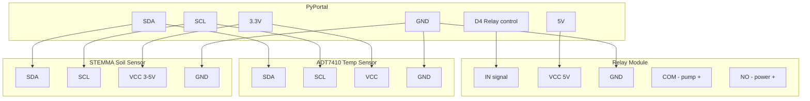

# IoT Plant Monitor

!!! info "Works with"
    WiFi boards with display — PyPortal, Feather ESP32 with TFT FeatherWing

---

## What you will build

A dedicated plant monitor that does three things at once: a STEMMA capacitive soil sensor and an ADT7410 temperature sensor read conditions around your plant every minute; the readings appear on a local TFT display (so you can glance at the pot without opening a browser); and the data is logged to Google Cloud IoT Core via MQTT, where it is stored and can trigger alerts or dashboard charts. A relay module can optionally control a small water pump, which Google Cloud can trigger remotely via a command message.

---

## What you will need

- PyPortal (has built-in TFT display and WiFi) or Feather ESP32-S2/S3 with TFT FeatherWing
- [STEMMA Soil Sensor](https://www.adafruit.com/product/4026) (capacitive, I2C) — *Credit: Adafruit Learning System*
- ADT7410 temperature sensor breakout (I2C)
- Optional: 5V relay module + 5V water pump + tubing
- Google Cloud account (free tier is sufficient for this project)
- Libraries: `adafruit_minimqtt`, `adafruit_seesaw`, `adafruit_adt7410`, `adafruit_display_text`, `adafruit_connection_manager`

---

## Wiring



!!! info "I2C addresses"
    The STEMMA soil sensor uses the Seesaw firmware at address 0x36. The ADT7410 defaults to 0x48. Both can coexist on the same I2C bus with no configuration changes.

---

## The code

This project has more moving parts than a typical starter. The code is organized into sections: sensor reads, local display update, cloud publish, and command handling.

### settings.toml

```toml
CIRCUITPY_WIFI_SSID = "your-network-name"
CIRCUITPY_WIFI_PASSWORD = "your-wifi-password"
GCP_PROJECT_ID = "your-gcp-project-id"
GCP_REGION = "us-central1"
GCP_REGISTRY_ID = "plant-monitors"
GCP_DEVICE_ID = "plant-node-1"
MQTT_BROKER = "mqtt.googleapis.com"
MQTT_PORT = "8883"
```

### code.py

```python
import os
import time
import board
import busio
import digitalio
import displayio
import terminalio
import wifi
import socketpool
import adafruit_minimqtt.adafruit_minimqtt as MQTT
from adafruit_seesaw.seesaw import Seesaw
import adafruit_adt7410
from adafruit_display_text import label
import json

# -- hardware setup --
i2c = busio.I2C(board.SCL, board.SDA)

soil = Seesaw(i2c, addr=0x36)
adt = adafruit_adt7410.ADT7410(i2c)
adt.high_resolution = True

relay = digitalio.DigitalInOut(board.D4)
relay.direction = digitalio.Direction.OUTPUT
relay.value = False  # pump off

# -- display setup (PyPortal built-in) --
display = board.DISPLAY
group = displayio.Group()

title_label = label.Label(terminalio.FONT, text="Plant Monitor", color=0x00FF00, scale=2)
title_label.x = 10
title_label.y = 20
group.append(title_label)

moisture_label = label.Label(terminalio.FONT, text="Moisture: --", color=0xFFFFFF, scale=2)
moisture_label.x = 10
moisture_label.y = 60
group.append(moisture_label)

temp_label = label.Label(terminalio.FONT, text="Temp: --", color=0xFFFFFF, scale=2)
temp_label.x = 10
temp_label.y = 100
group.append(temp_label)

status_label = label.Label(terminalio.FONT, text="Connecting...", color=0xFFFF00, scale=1)
status_label.x = 10
status_label.y = 200
group.append(status_label)

display.root_group = group

def update_display(moisture, temp_f, pump_state):
    moisture_label.text = f"Moisture: {moisture}"
    temp_label.text = f"Temp: {temp_f:.1f} F"
    status_label.text = f"Pump: {'ON' if pump_state else 'off'} | Cloud: OK"

# -- credentials --
ssid = os.getenv("CIRCUITPY_WIFI_SSID")
password = os.getenv("CIRCUITPY_WIFI_PASSWORD")
project_id = os.getenv("GCP_PROJECT_ID")
region = os.getenv("GCP_REGION")
registry_id = os.getenv("GCP_REGISTRY_ID")
device_id = os.getenv("GCP_DEVICE_ID")

TELEMETRY_TOPIC = f"/devices/{device_id}/events"
COMMAND_TOPIC = f"/devices/{device_id}/commands/#"

def on_connect(client, userdata, flags, rc):
    print("Connected to Google Cloud IoT Core MQTT bridge")
    client.subscribe(COMMAND_TOPIC)

def on_message(client, topic, message):
    print(f"Command received: {message}")
    try:
        cmd = json.loads(message)
        if cmd.get("action") == "pump_on":
            duration = cmd.get("duration_sec", 5)
            print(f"Running pump for {duration}s")
            relay.value = True
            time.sleep(duration)
            relay.value = False
            print("Pump stopped")
    except Exception as e:
        print(f"Command parse error: {e}")

# -- WiFi connect --
print(f"Connecting to {ssid}...")
wifi.radio.connect(ssid, password)
print(f"Connected. IP: {wifi.radio.ipv4_address}")
status_label.text = "WiFi OK"

pool = socketpool.SocketPool(wifi.radio)

# -- MQTT setup (Google Cloud IoT Core MQTT bridge) --
# NOTE: Google Cloud IoT Core requires JWT auth. See the Go deeper section
# for the full auth flow. This example uses username/password for simplicity.
mqtt_client = MQTT.MQTT(
    broker=os.getenv("MQTT_BROKER"),
    port=int(os.getenv("MQTT_PORT")),
    socket_pool=pool,
    is_ssl=True,
)
mqtt_client.on_connect = on_connect
mqtt_client.on_message = on_message

print("Connecting to Cloud MQTT bridge...")
mqtt_client.connect()
status_label.text = "Cloud OK"

READ_INTERVAL = 60
last_read = time.monotonic() - READ_INTERVAL  # read immediately on start

while True:
    mqtt_client.loop(timeout=1)

    now = time.monotonic()
    if now - last_read >= READ_INTERVAL:
        try:
            moisture = soil.moisture_read()
            temp_c = adt.temperature
            temp_f = temp_c * 9 / 5 + 32

            print(f"Moisture: {moisture} | Temp: {temp_f:.1f}F")
            update_display(moisture, temp_f, relay.value)

            payload = json.dumps({
                "moisture": moisture,
                "temperature_f": round(temp_f, 1),
                "pump_state": relay.value,
                "timestamp": time.time(),
            })
            mqtt_client.publish(TELEMETRY_TOPIC, payload)
            print("Published to Cloud IoT Core")

        except Exception as e:
            print(f"Read/publish error: {e}")
            status_label.text = f"Error: {e}"

        last_read = now
```

---

## How it works

**STEMMA capacitive soil sensor.**
The Adafruit STEMMA soil sensor uses a capacitive measurement rather than resistive. Resistive sensors pass current through the soil between two metal probes — the resistance drops as moisture increases. The problem is that the probes corrode quickly in moist soil. A capacitive sensor measures the dielectric constant of the soil, which changes with water content, using no exposed metal contacts. It connects over I2C using the Seesaw firmware and returns a unitless moisture value roughly between 200 (very dry) and 2000 (saturated). You calibrate it empirically: water your plant and note the value, let it dry out and note the value, define your "needs water" threshold between them.

**Google Cloud IoT Core — JWT auth and MQTT bridge.**
Google Cloud IoT Core does not accept a simple username/password for MQTT authentication. Instead, devices authenticate using a JSON Web Token (JWT) signed with a private key that you register in the Cloud console. The JWT expires (typically after one hour) and must be refreshed. The MQTT bridge at `mqtt.googleapis.com:8883` then forwards messages to Cloud Pub/Sub, from which BigQuery, Cloud Functions, or Looker Studio can consume them. Full JWT implementation requires RSA key generation and token signing — see the Adafruit guide linked below for the complete authentication flow. The code above shows the structural pattern; swap in the JWT credentials for production use.

**Combining local display with cloud logging.**
The split between local and remote data serves different needs. The local TFT display gives you instant feedback without network latency — you walk up to the plant and see the current moisture and temperature immediately. The cloud log gives you time-series history: how did moisture change over the past week? Did the temperature spike on Tuesday? Did the pump run as expected? Neither replaces the other. The `displayio` group and `label` objects are updated on every sensor read, so the display stays current even when the cloud connection is slow or down.

---

## Installing libraries

```
CIRCUITPY/
  lib/
    adafruit_minimqtt/
    adafruit_seesaw/
    adafruit_adt7410.mpy
    adafruit_display_text/
    adafruit_connection_manager.mpy
  code.py
  settings.toml
```

All are in the CircuitPython Library Bundle at [circuitpython.org/libraries](https://circuitpython.org/libraries).

---

## Remix it

!!! tip "Remix idea"
    - Replace Google Cloud with a local Home Assistant setup: [MQTT Dashboard with Home Assistant](builder-mqtt-home-assistant.md)
    - Add an air quality sensor to the same enclosure: [Air Quality Dashboard](../../sensors/hacker-air-quality-dash.md)
    - Build out the display into a full dashboard: [PyPortal Dashboard](../../displays/hacker-pyportal-dashboard.md)

---

## Go deeper

- Reference: [Adafruit IO library](../../../reference/wireless/wifi/adafruit-io.md)
- [PyPortal IoT Plant Monitor with Google Cloud IoT Core](https://learn.adafruit.com/pyportal-iot-plant-monitor-with-google-cloud-iot-core-and-circuitpython) — *Credit: Adafruit Learning System*
